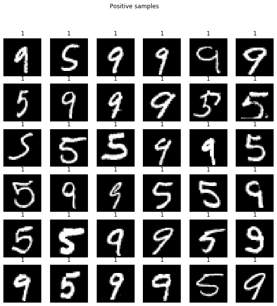
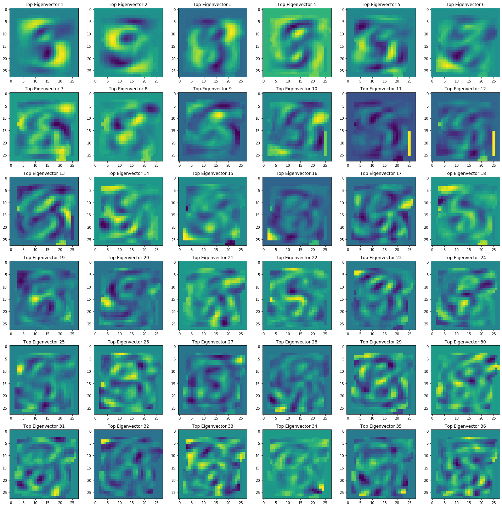
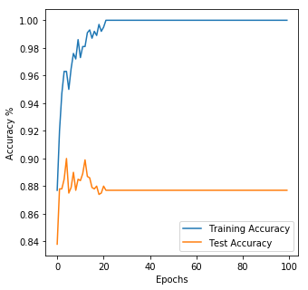
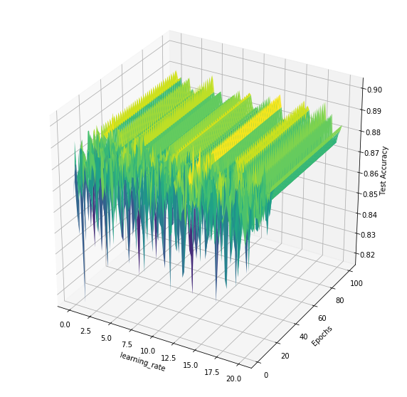
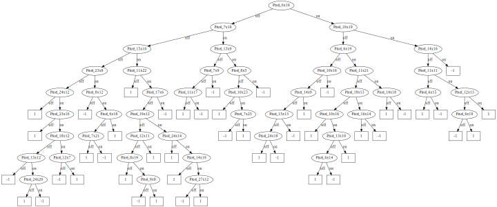
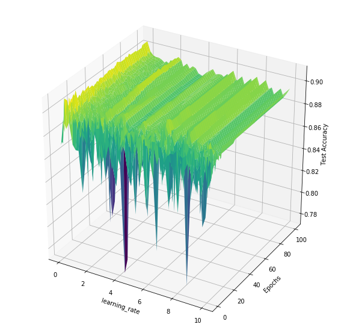
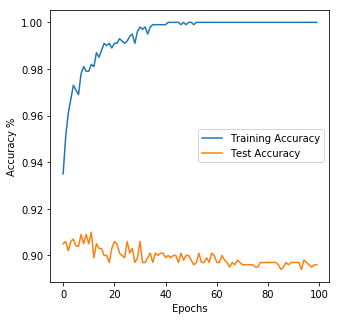
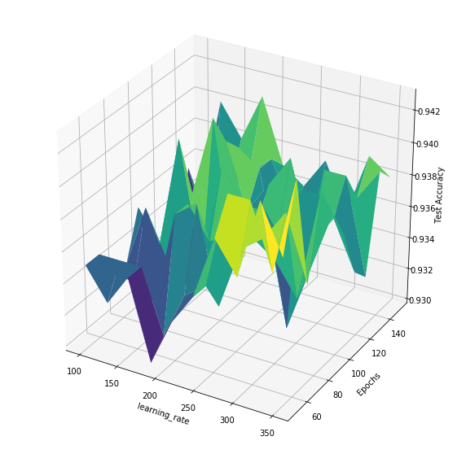
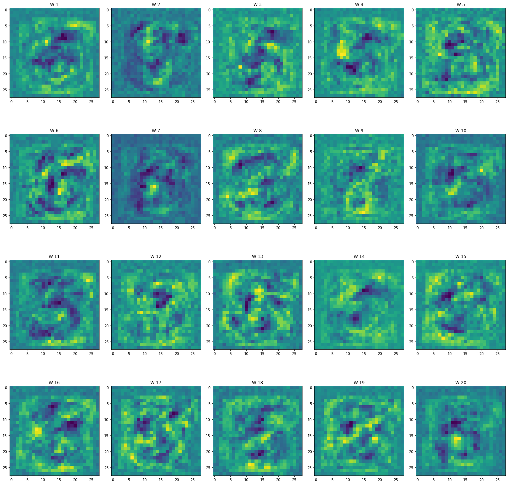

# Compte rendu Projet analyse de donnée MNIST
## Etudiant : *Mounib Benimam*

Dans ce projet, nous allons contruire un model performant pour predire la classe d'un chiffre manuscrit pour en arriver, nous devons experimenter avec plusieurs models (et plusieurs parametres et methode

d'entrainement, et processing) on utilisera notamment : PCA, KNN, Decision tree, Random forest, Logistic regression , mlp

# Chargement des librairies


```python
import numpy as np # Bibliotheque d'algébre lineaire
from PIL import Image # bibliotheque de manipulation d'images
import matplotlib.pyplot as plt # bibliotheque de visualisation
import pandas as pd # bibliotheque d'analyse de données
import seaborn
from sklearn import decomposition # PCA pour la reduction de dimensionalité et visualisation
```


```python
import sys
sys.path.append("./")

%load_ext autoreload

%autoreload 2

import iads as iads
# importation de Classifiers
from iads import Classifiers as cl

# importation de utils
from iads import utils as ut

# importation de evaluation
from iads import evaluation as ev
```

    The autoreload extension is already loaded. To reload it, use:
      %reload_ext autoreload
    


```python
from IPython.display import display, HTML

%matplotlib inline

### Stylisation des output

display(HTML("""
    <style>
        .output{
            display: table-cell;
            text-align: center;
            vertical-align: middle;
        }
    </style>
"""));
```


    <style>
        .output{
            display: table-cell;
            text-align: center;
            vertical-align: middle;
        }
    </style>


# Chargement des données


```python
# lecture des fichiers csv
train_set = pd.read_csv("data/train.csv", sep=';', header=None)
test_set = pd.read_csv("data/test.csv", sep=';', header=None)
eval_set = pd.read_csv("data/eval.csv", sep=';', header=None)

# fichier contenant les noms des columns
names = pd.read_csv("data/names.csv", sep=';')
```


```python
# ajout des labels de column au sets
train_set.columns = names.columns
test_set.columns = names.columns
eval_set.columns = names.columns
# creation d'index pour optimisation
train_set.set_index("ident", inplace=True);
test_set.set_index("ident", inplace=True);
eval_set.set_index("ident", inplace=True);
```


```python
# variable utile plustard
mean_train = train_set.iloc[:, :-1].mean(axis=0).values.reshape(1, -1)
var_train  = train_set.iloc[:, :-1].var(axis=0).values.reshape(1, -1) + 1e-8

x_normal = (train_set.iloc[:, :-1].values - mean_train) / np.sqrt(var_train)
print(var_train.shape)
```

    (1, 784)
    


```python
def getcopy_dataframe(dataset="train", categoriel=False, normaliser=False, pca=0, proba=False):
    """
        retourner une copie des data_frame
        
        @param dataset ["train", "test", "eval"]
        @param categoriel Binariser les images de [0 - 255] => ["on", "off"]
        @param normaliser Centrer les image en 0, et la variance à 1
        @param proba label 0 ou 1
        @param pca Projection dans une dimension inferieur
    """
    
    data = train_set if dataset == "train" else (test_set if dataset == "test" else eval_set)
    
    # copie de Données brut 
    x, y = data.iloc[:, :-1].copy(), data["label"].copy()
    
    
    if categoriel: 
        
        x = x.astype(str)

        x[x != "0"] = "on"
        x[x == "0"] = "off"

        x = x.values
        y = y.values

        return x, y
    
    if normaliser == True:
        
        # on normalise en utilisant la moyenne et la variance du train set

        x = x.values
        y = y.values

        x = (x - mean_train)/np.sqrt(var_train)

        if proba:
            #print(f"proba {y.shape}")
            y[y == -1] = 0
            y = y.reshape(-1, 1)
            
        if pca > 0:
            
            pca_train = decomposition.PCA(pca)
            pca_train.fit(x_normal)
            
            x = pca_train.transform(x)
            
            return x, y, pca_train.components_
        
        return x, y
    
    return x.values, y.values
        
    
```


```python
def eval(model, eval_df, x_transformed, filename="resultats.csv"):
    """
        Evaluer un model et produire un fichier csv.
    """
    
    out = eval_df[["label"]].copy()
    
    labels = model.predict(x_transformed)
    
    out["label"] = labels.astype(int)
    
    out.to_csv(filename)
```

# Exploration de données


```python
train_set.head()
```


<div>
<style scoped>
    .dataframe tbody tr th:only-of-type {
        vertical-align: middle;
    }

    .dataframe tbody tr th {
        vertical-align: top;
    }

    .dataframe thead th {
        text-align: right;
    }
</style>
<table border="1" class="dataframe">
  <thead>
    <tr style="text-align: right;">
      <th></th>
      <th>1x1</th>
      <th>1x2</th>
      <th>1x3</th>
      <th>1x4</th>
      <th>1x5</th>
      <th>1x6</th>
      <th>1x7</th>
      <th>1x8</th>
      <th>1x9</th>
      <th>1x10</th>
      <th>...</th>
      <th>28x20</th>
      <th>28x21</th>
      <th>28x22</th>
      <th>28x23</th>
      <th>28x24</th>
      <th>28x25</th>
      <th>28x26</th>
      <th>28x27</th>
      <th>28x28</th>
      <th>label</th>
    </tr>
    <tr>
      <th>ident</th>
      <th></th>
      <th></th>
      <th></th>
      <th></th>
      <th></th>
      <th></th>
      <th></th>
      <th></th>
      <th></th>
      <th></th>
      <th></th>
      <th></th>
      <th></th>
      <th></th>
      <th></th>
      <th></th>
      <th></th>
      <th></th>
      <th></th>
      <th></th>
      <th></th>
    </tr>
  </thead>
  <tbody>
    <tr>
      <th>10001</th>
      <td>0</td>
      <td>0</td>
      <td>0</td>
      <td>0</td>
      <td>0</td>
      <td>0</td>
      <td>0</td>
      <td>0</td>
      <td>0</td>
      <td>0</td>
      <td>...</td>
      <td>0</td>
      <td>0</td>
      <td>0</td>
      <td>0</td>
      <td>0</td>
      <td>0</td>
      <td>0</td>
      <td>0</td>
      <td>0</td>
      <td>-1</td>
    </tr>
    <tr>
      <th>10002</th>
      <td>0</td>
      <td>0</td>
      <td>0</td>
      <td>0</td>
      <td>0</td>
      <td>0</td>
      <td>0</td>
      <td>0</td>
      <td>0</td>
      <td>0</td>
      <td>...</td>
      <td>0</td>
      <td>0</td>
      <td>0</td>
      <td>0</td>
      <td>0</td>
      <td>0</td>
      <td>0</td>
      <td>0</td>
      <td>0</td>
      <td>-1</td>
    </tr>
    <tr>
      <th>10003</th>
      <td>0</td>
      <td>0</td>
      <td>0</td>
      <td>0</td>
      <td>0</td>
      <td>0</td>
      <td>0</td>
      <td>0</td>
      <td>0</td>
      <td>0</td>
      <td>...</td>
      <td>0</td>
      <td>0</td>
      <td>0</td>
      <td>0</td>
      <td>0</td>
      <td>0</td>
      <td>0</td>
      <td>0</td>
      <td>0</td>
      <td>-1</td>
    </tr>
    <tr>
      <th>10004</th>
      <td>0</td>
      <td>0</td>
      <td>0</td>
      <td>0</td>
      <td>0</td>
      <td>0</td>
      <td>0</td>
      <td>0</td>
      <td>0</td>
      <td>0</td>
      <td>...</td>
      <td>0</td>
      <td>0</td>
      <td>0</td>
      <td>0</td>
      <td>0</td>
      <td>0</td>
      <td>0</td>
      <td>0</td>
      <td>0</td>
      <td>-1</td>
    </tr>
    <tr>
      <th>10005</th>
      <td>0</td>
      <td>0</td>
      <td>0</td>
      <td>0</td>
      <td>0</td>
      <td>0</td>
      <td>0</td>
      <td>0</td>
      <td>0</td>
      <td>0</td>
      <td>...</td>
      <td>0</td>
      <td>0</td>
      <td>0</td>
      <td>0</td>
      <td>0</td>
      <td>0</td>
      <td>0</td>
      <td>0</td>
      <td>0</td>
      <td>-1</td>
    </tr>
  </tbody>
</table>
<p>5 rows × 785 columns</p>
</div>


```python
eval_set.head()
```


<div>
<style scoped>
    .dataframe tbody tr th:only-of-type {
        vertical-align: middle;
    }

    .dataframe tbody tr th {
        vertical-align: top;
    }

    .dataframe thead th {
        text-align: right;
    }
</style>
<table border="1" class="dataframe">
  <thead>
    <tr style="text-align: right;">
      <th></th>
      <th>1x1</th>
      <th>1x2</th>
      <th>1x3</th>
      <th>1x4</th>
      <th>1x5</th>
      <th>1x6</th>
      <th>1x7</th>
      <th>1x8</th>
      <th>1x9</th>
      <th>1x10</th>
      <th>...</th>
      <th>28x20</th>
      <th>28x21</th>
      <th>28x22</th>
      <th>28x23</th>
      <th>28x24</th>
      <th>28x25</th>
      <th>28x26</th>
      <th>28x27</th>
      <th>28x28</th>
      <th>label</th>
    </tr>
    <tr>
      <th>ident</th>
      <th></th>
      <th></th>
      <th></th>
      <th></th>
      <th></th>
      <th></th>
      <th></th>
      <th></th>
      <th></th>
      <th></th>
      <th></th>
      <th></th>
      <th></th>
      <th></th>
      <th></th>
      <th></th>
      <th></th>
      <th></th>
      <th></th>
      <th></th>
      <th></th>
    </tr>
  </thead>
  <tbody>
    <tr>
      <th>90001</th>
      <td>0</td>
      <td>0</td>
      <td>0</td>
      <td>0</td>
      <td>0</td>
      <td>0</td>
      <td>0</td>
      <td>0</td>
      <td>0</td>
      <td>0</td>
      <td>...</td>
      <td>0</td>
      <td>0</td>
      <td>0</td>
      <td>0</td>
      <td>0</td>
      <td>0</td>
      <td>0</td>
      <td>0</td>
      <td>0</td>
      <td>0</td>
    </tr>
    <tr>
      <th>90002</th>
      <td>0</td>
      <td>0</td>
      <td>0</td>
      <td>0</td>
      <td>0</td>
      <td>0</td>
      <td>0</td>
      <td>0</td>
      <td>0</td>
      <td>0</td>
      <td>...</td>
      <td>0</td>
      <td>0</td>
      <td>0</td>
      <td>0</td>
      <td>0</td>
      <td>0</td>
      <td>0</td>
      <td>0</td>
      <td>0</td>
      <td>0</td>
    </tr>
    <tr>
      <th>90003</th>
      <td>0</td>
      <td>0</td>
      <td>0</td>
      <td>0</td>
      <td>0</td>
      <td>0</td>
      <td>0</td>
      <td>0</td>
      <td>0</td>
      <td>0</td>
      <td>...</td>
      <td>0</td>
      <td>0</td>
      <td>0</td>
      <td>0</td>
      <td>0</td>
      <td>0</td>
      <td>0</td>
      <td>0</td>
      <td>0</td>
      <td>0</td>
    </tr>
    <tr>
      <th>90004</th>
      <td>0</td>
      <td>0</td>
      <td>0</td>
      <td>0</td>
      <td>0</td>
      <td>0</td>
      <td>0</td>
      <td>0</td>
      <td>0</td>
      <td>0</td>
      <td>...</td>
      <td>0</td>
      <td>0</td>
      <td>0</td>
      <td>0</td>
      <td>0</td>
      <td>0</td>
      <td>0</td>
      <td>0</td>
      <td>0</td>
      <td>0</td>
    </tr>
    <tr>
      <th>90005</th>
      <td>0</td>
      <td>0</td>
      <td>0</td>
      <td>0</td>
      <td>0</td>
      <td>0</td>
      <td>0</td>
      <td>0</td>
      <td>0</td>
      <td>0</td>
      <td>...</td>
      <td>0</td>
      <td>0</td>
      <td>0</td>
      <td>0</td>
      <td>0</td>
      <td>0</td>
      <td>0</td>
      <td>0</td>
      <td>0</td>
      <td>0</td>
    </tr>
  </tbody>
</table>
<p>5 rows × 785 columns</p>
</div>


```python
eval_set[["label"]].head()
```


<div>
<style scoped>
    .dataframe tbody tr th:only-of-type {
        vertical-align: middle;
    }

    .dataframe tbody tr th {
        vertical-align: top;
    }

    .dataframe thead th {
        text-align: right;
    }
</style>
<table border="1" class="dataframe">
  <thead>
    <tr style="text-align: right;">
      <th></th>
      <th>label</th>
    </tr>
    <tr>
      <th>ident</th>
      <th></th>
    </tr>
  </thead>
  <tbody>
    <tr>
      <th>90001</th>
      <td>0</td>
    </tr>
    <tr>
      <th>90002</th>
      <td>0</td>
    </tr>
    <tr>
      <th>90003</th>
      <td>0</td>
    </tr>
    <tr>
      <th>90004</th>
      <td>0</td>
    </tr>
    <tr>
      <th>90005</th>
      <td>0</td>
    </tr>
  </tbody>
</table>
</div>


```python
train_set.describe()
```


<div>
<style scoped>
    .dataframe tbody tr th:only-of-type {
        vertical-align: middle;
    }

    .dataframe tbody tr th {
        vertical-align: top;
    }

    .dataframe thead th {
        text-align: right;
    }
</style>
<table border="1" class="dataframe">
  <thead>
    <tr style="text-align: right;">
      <th></th>
      <th>1x1</th>
      <th>1x2</th>
      <th>1x3</th>
      <th>1x4</th>
      <th>1x5</th>
      <th>1x6</th>
      <th>1x7</th>
      <th>1x8</th>
      <th>1x9</th>
      <th>1x10</th>
      <th>...</th>
      <th>28x20</th>
      <th>28x21</th>
      <th>28x22</th>
      <th>28x23</th>
      <th>28x24</th>
      <th>28x25</th>
      <th>28x26</th>
      <th>28x27</th>
      <th>28x28</th>
      <th>label</th>
    </tr>
  </thead>
  <tbody>
    <tr>
      <th>count</th>
      <td>1000.0</td>
      <td>1000.0</td>
      <td>1000.0</td>
      <td>1000.0</td>
      <td>1000.0</td>
      <td>1000.0</td>
      <td>1000.0</td>
      <td>1000.0</td>
      <td>1000.0</td>
      <td>1000.0</td>
      <td>...</td>
      <td>1000.000000</td>
      <td>1000.00000</td>
      <td>1000.000000</td>
      <td>1000.000000</td>
      <td>1000.0</td>
      <td>1000.0</td>
      <td>1000.0</td>
      <td>1000.0</td>
      <td>1000.0</td>
      <td>1000.0000</td>
    </tr>
    <tr>
      <th>mean</th>
      <td>0.0</td>
      <td>0.0</td>
      <td>0.0</td>
      <td>0.0</td>
      <td>0.0</td>
      <td>0.0</td>
      <td>0.0</td>
      <td>0.0</td>
      <td>0.0</td>
      <td>0.0</td>
      <td>...</td>
      <td>0.071000</td>
      <td>0.25200</td>
      <td>0.253000</td>
      <td>0.050000</td>
      <td>0.0</td>
      <td>0.0</td>
      <td>0.0</td>
      <td>0.0</td>
      <td>0.0</td>
      <td>0.0000</td>
    </tr>
    <tr>
      <th>std</th>
      <td>0.0</td>
      <td>0.0</td>
      <td>0.0</td>
      <td>0.0</td>
      <td>0.0</td>
      <td>0.0</td>
      <td>0.0</td>
      <td>0.0</td>
      <td>0.0</td>
      <td>0.0</td>
      <td>...</td>
      <td>2.245217</td>
      <td>7.96894</td>
      <td>8.000562</td>
      <td>1.581139</td>
      <td>0.0</td>
      <td>0.0</td>
      <td>0.0</td>
      <td>0.0</td>
      <td>0.0</td>
      <td>1.0005</td>
    </tr>
    <tr>
      <th>min</th>
      <td>0.0</td>
      <td>0.0</td>
      <td>0.0</td>
      <td>0.0</td>
      <td>0.0</td>
      <td>0.0</td>
      <td>0.0</td>
      <td>0.0</td>
      <td>0.0</td>
      <td>0.0</td>
      <td>...</td>
      <td>0.000000</td>
      <td>0.00000</td>
      <td>0.000000</td>
      <td>0.000000</td>
      <td>0.0</td>
      <td>0.0</td>
      <td>0.0</td>
      <td>0.0</td>
      <td>0.0</td>
      <td>-1.0000</td>
    </tr>
    <tr>
      <th>25%</th>
      <td>0.0</td>
      <td>0.0</td>
      <td>0.0</td>
      <td>0.0</td>
      <td>0.0</td>
      <td>0.0</td>
      <td>0.0</td>
      <td>0.0</td>
      <td>0.0</td>
      <td>0.0</td>
      <td>...</td>
      <td>0.000000</td>
      <td>0.00000</td>
      <td>0.000000</td>
      <td>0.000000</td>
      <td>0.0</td>
      <td>0.0</td>
      <td>0.0</td>
      <td>0.0</td>
      <td>0.0</td>
      <td>-1.0000</td>
    </tr>
    <tr>
      <th>50%</th>
      <td>0.0</td>
      <td>0.0</td>
      <td>0.0</td>
      <td>0.0</td>
      <td>0.0</td>
      <td>0.0</td>
      <td>0.0</td>
      <td>0.0</td>
      <td>0.0</td>
      <td>0.0</td>
      <td>...</td>
      <td>0.000000</td>
      <td>0.00000</td>
      <td>0.000000</td>
      <td>0.000000</td>
      <td>0.0</td>
      <td>0.0</td>
      <td>0.0</td>
      <td>0.0</td>
      <td>0.0</td>
      <td>0.0000</td>
    </tr>
    <tr>
      <th>75%</th>
      <td>0.0</td>
      <td>0.0</td>
      <td>0.0</td>
      <td>0.0</td>
      <td>0.0</td>
      <td>0.0</td>
      <td>0.0</td>
      <td>0.0</td>
      <td>0.0</td>
      <td>0.0</td>
      <td>...</td>
      <td>0.000000</td>
      <td>0.00000</td>
      <td>0.000000</td>
      <td>0.000000</td>
      <td>0.0</td>
      <td>0.0</td>
      <td>0.0</td>
      <td>0.0</td>
      <td>0.0</td>
      <td>1.0000</td>
    </tr>
    <tr>
      <th>max</th>
      <td>0.0</td>
      <td>0.0</td>
      <td>0.0</td>
      <td>0.0</td>
      <td>0.0</td>
      <td>0.0</td>
      <td>0.0</td>
      <td>0.0</td>
      <td>0.0</td>
      <td>0.0</td>
      <td>...</td>
      <td>71.000000</td>
      <td>252.00000</td>
      <td>253.000000</td>
      <td>50.000000</td>
      <td>0.0</td>
      <td>0.0</td>
      <td>0.0</td>
      <td>0.0</td>
      <td>0.0</td>
      <td>1.0000</td>
    </tr>
  </tbody>
</table>
<p>8 rows × 785 columns</p>
</div>


```python
train_set.info()
```

    <class 'pandas.core.frame.DataFrame'>
    Int64Index: 1000 entries, 10001 to 11000
    Columns: 785 entries, 1x1 to label
    dtypes: int64(785)
    memory usage: 6.0 MB
    


```python
print("Nombre d'instance pour chaque classe")
print(train_set["label"].value_counts())
```

    Nombre d'instance pour chaque classe
     1    500
    -1    500
    Name: label, dtype: int64
    

### Informations aquis dans cette premiere manoeuvre
- les données sont équilibrées dans chaque set
- On compte 1000 instance dans chaque set
- le probleme est un probleme de classification binaire 1 -1
- dimension des features 784

# Visualisation


```python
#afficher les 25 premieres images
def plot_images(df_images, nrows=5, ncols=5, title="title"):
    """
        creer une figure contenant rows / cols subplots
        affichant les images et leurs labels
    """
    fig = plt.figure(figsize=(10, 10))
    fig.suptitle(title, fontsize=12)
    # pour chaque lignes
    for i in range(nrows):
        for j in range(ncols):
            
            current_image = df_images.iloc[i*ncols + j]
            
            label = current_image[-1]
            image = current_image[:-1].values.reshape(28, 28)
            
            ax = plt.subplot(nrows, ncols, i*ncols + j + 1)
            
            ax.set_title(label)
            ax.axis("off")
            
            ax.imshow(image, cmap="gray")
            
            

### iamges positive
positive = train_set[train_set["label"] == 1].sample(frac=1)
plot_images(positive.iloc[:36], 6, 6, "Positive samples")
### images negative
negative = train_set[train_set["label"] == -1].sample(frac=1)
plot_images(negative.iloc[:36], 6, 6, "Negative samples")
plt.show()
```





```python
corr = train_set.corr()
print(corr.shape)
corr = np.nan_to_num(corr)
plt.figure(figsize=(10, 10))
#seaborn.heatmap(corr)
plt.axis("off")
plt.imshow(corr[-1:0:-1, :])
```

    (785, 785)
    


    <matplotlib.image.AxesImage at 0x2048a144eb8>


### Information aquise
- les données semble être des images de (5 ou 9) pour la classe 1, (3 ou 8) pour la classe -1
- en regardant la matrice de covariance, on peut voir ques les pixels proche entre elles sont trées corréle

### Principal Components


```python
# from sklearn import decomposition
# pca = decomposition.PCA()
# PCA for dimensionality redcution (non-visualization)
#x, y = train_set.iloc[:, :-1].values, train_set["label"].values
#normaliser les données
# x = (x-x.mean())/x.var()

# pca.n_components = 100
# x = pca.fit_transform(x)
x, y, pca = getcopy_dataframe("train", normaliser=True, pca=100)
```


```python
fig, axes = plt.subplots(nrows=6, ncols=6, figsize=(20, 20))

for i, ax in enumerate(axes.flat, start=1):
    ax.set_title(f"Top Eigenvector {i}")
    ax.imshow(pca[i-1, :].reshape(28, 28))
    
fig.tight_layout()
plt.show()
```





```python
from mpl_toolkits.mplot3d import Axes3D

colors = np.array(['g', 'r', 'b'])

xs = x[:, 0]
ys = x[:, 1]
zs = x[:, 2]
# print(xs.max(), xs.min())
# print(ys.max(), ys.min())

scalex = 1.0/(xs.max() - xs.min())
scaley = 1.0/(ys.max() - ys.min())
scalez = 1.0/(zs.max() - zs.min())

fig = plt.figure(figsize=(10, 10))
ax = fig.add_subplot(111, projection='3d')
ax.scatter(xs*scalex, ys*scaley, zs*scalez, c=colors[y])
#plt.scatter(xs*scalex, ys*scaley, c=colors[y])
plt.show()

# plt.figure(figsize=(20, 20))
# for i in range(1, 25):
#     ax = plt.subplot(5, 5, i)
#     ax.scatter(x[:, i], x[:, i+1], c=colors[y])
# plt.show()
```


```python
# Experimentations primaires

models = [cl.ClassifierPerceptronKernel(x.shape[1]+1, 0.5, cl.KernelBias(), epochs=5),
          cl.ClassifierPerceptron(x.shape[1], 0.5, epochs=5),
          cl.ClassifierKNN(x.shape[1], 1),
          cl.ClassifierKNN(x.shape[1], 3),
          cl.ClassifierKNN(x.shape[1], 5)]

Resultats = ev.crossvalidation(models, [x, y], 10)


print("\n*****\nAffichage des résultats:")
for k in range(0,len(Resultats)):
    print("Classifieur ", k)
    print("\t(moyenne, std) pour apprentissage :", Resultats[k][0])
    print("\t(moyenne, std) pour test          :", Resultats[k][1])
```

    Il y a  5 classifieurs à comparer.
    
    *****
    Affichage des résultats:
    Classifieur  0
    	(moyenne, std) pour apprentissage : (0.9232560870102583, 0.014767773806536932)
    	(moyenne, std) pour test          : (0.8370000000000001, 0.06753517601961218)
    Classifieur  1
    	(moyenne, std) pour apprentissage : (0.9244804103324682, 0.011356929888666866)
    	(moyenne, std) pour test          : (0.8539999999999999, 0.061024585209569424)
    Classifieur  2
    	(moyenne, std) pour apprentissage : (1.0, 0.0)
    	(moyenne, std) pour test          : (0.906, 0.048414873747640794)
    Classifieur  3
    	(moyenne, std) pour apprentissage : (0.9685235446792732, 0.002864806013407636)
    	(moyenne, std) pour test          : (0.9110000000000001, 0.04346262762420146)
    Classifieur  4
    	(moyenne, std) pour apprentissage : (0.9649648992707947, 0.0028692412149061114)
    	(moyenne, std) pour test          : (0.901, 0.06378871373526825)
    

# Model 1

### K nearest neighbor en utilisant 20 PCA + normalisation 
l'avantage de cette methode c'est de reduire le temps de calcul de KNN tout en preservant une accuracy acceptable


```python
x_train, y_train, _ = getcopy_dataframe("train", normaliser=True, pca=20)
x_test, y_test, _ = getcopy_dataframe("test", normaliser=True, pca=20)

knn = cl.ClassifierKNN(x_train.shape[1], 3)
knn.train(x_train, y_train)
knn.accuracy(x_test, y_test)
```


    0.937


### Experientation hyperparametre


```python
### preprocess
accuracies =[]
best = None
best_accuracy = 0


for k in range(100):
    
    #print(f"test k = {k}")
    
    knn = cl.ClassifierKNN(x_train.shape[1], k)
    knn.train(x_train, y_train)
    
    accuracy = knn.accuracy(x_test, y_test)
    
    accuracies.append(accuracy)
    
    if accuracy > best_accuracy:
        print(f"Best k = {k}, accuracy = {accuracy}")
        best_accuracy = accuracy
        best = knn
    
    #print(f"Accuracy model {k} : {accuracy}")
```

    Best k = 0, accuracy = 0.5
    Best k = 1, accuracy = 0.925
    Best k = 3, accuracy = 0.937
    


```python
plt.figure(figsize=(10, 10))
plt.title("Accuracy in respect to K")

plt.plot(np.arange(1, 100, 1), accuracies[1:])
plt.xlabel("K voisins")
plt.ylabel("Test Accuracy")
```


    Text(0, 0.5, 'Test Accuracy')


```python
print(f"Model K-NN k= {best.k};  Train accuracy : {best.accuracy(x_train, y_train)}; Test accuracy : {best.accuracy(x_test, y_test)}")

model_1 = best
```

    Model K-NN k= 3;  Train accuracy : 0.978; Test accuracy : 0.937
    


```python
x_eval, y_eval, _ = getcopy_dataframe("eval", normaliser=True, pca=20)

eval(model_1, eval_set, x_eval, "resultat-knn-pca20-0.937accuracy.csv")
```


```python
# x_train, y_train = getcopy_dataframe("train")
# x_test, y_test = getcopy_dataframe("test")

# models = [#cl.ClassifierArbreDecision(x.shape[0], 0.5, ["3 ou 8", "5 ou 9"]),
#           cl.ClassifierPerceptronKernel(x_train.shape[1]+1, 2, cl.KernelBias(), epochs=5),
#           cl.ClassifierPerceptron(x_train.shape[1], 2, epochs=5),
#           cl.ClassifierKNN(x_train.shape[1], 3),
#           cl.ClassifierKNN(x.shape[1], 9)]

# for i, model in enumerate(models):
#     print(f'Training du model {i} ...')
#     model.train(x_train, y_train)
#     print(f'Training terminé ...')
    
#     print(f'accuracy train : {model.accuracy(x_train, y_train)}')
#     print(f'accuracy test : {model.accuracy(x_test, y_test)}')
```

# model 2

### K nearest neighbor, raw data


```python
x_train, y_train = getcopy_dataframe("train")
x_test, y_test = getcopy_dataframe("test")

knn_raw = cl.ClassifierKNN(x.shape[1], 9)

knn_raw.train(x_train, y_train)

train_accuracy = knn_raw.accuracy(x_train, y_test)
test_accuracy = knn_raw.accuracy(x_test, y_test)

print(f"Model KNN k=9 raw data, Train_accuracy = {train_accuracy}; Test Accuracy = {test_accuracy}")

model_2 = knn_raw
```

    Model KNN k=9 raw data, Train_accuracy = 0.962; Test Accuracy = 0.944
    


```python
x_eval, y_eval = getcopy_dataframe("eval")
eval(model_2, eval_set, x_eval, "resultat-knn-raw-0.944accuracy.csv")
```

# model 3 
### Perceptron 

#### test avec normalisation et sans normalisation des données (moyenne 0 , variance 1)


```python
x_train, y_train = getcopy_dataframe("train", normaliser=False)
x_test, y_test = getcopy_dataframe("test", normaliser=False)

perceptron_raw = cl.ClassifierPerceptron(x_train.shape[1], learning_rate=0.5, epochs=5)

perceptron_raw.train(x_train, y_train)

train_accuracy = perceptron_raw.accuracy(x_train, y_train)
test_accuracy = perceptron_raw.accuracy(x_test, y_test)

print(f"Model Perceptron lr=0.5 sans Normalisation raw data, Train_accuracy = {train_accuracy}; Test Accuracy = {test_accuracy}")


x_train, y_train = getcopy_dataframe("train", normaliser=True)
x_test, y_test = getcopy_dataframe("test", normaliser=True)

perceptron_raw = cl.ClassifierPerceptron(x_train.shape[1], learning_rate=0.5, epochs=5)

perceptron_raw.train(x_train, y_train)

train_accuracy = perceptron_raw.accuracy(x_train, y_train)
test_accuracy = perceptron_raw.accuracy(x_test, y_test)

print(f"Model Perceptron lr=0.5 Avec normalisation raw data, Train_accuracy = {train_accuracy}; Test Accuracy = {test_accuracy}")
```

    Model Perceptron lr=0.5 sans Normalisation raw data, Train_accuracy = 0.93; Test Accuracy = 0.869
    Model Perceptron lr=0.5 Avec normalisation raw data, Train_accuracy = 0.958; Test Accuracy = 0.875
    

### grid search du learning rate , et du nombre d'epochs (nombre d'iterations sur la dataset)


```python
from IPython.display import clear_output

accuracies =[]
best = None
best_accuracy = 0

best_i = 0
best_j = 0

input_size = x_train.shape[1]
# nous disposons de 2 parametres epoch, et lr

lr_space = np.linspace(0.01, 20, 100) #np.random.rand(50) * (10 - 0.1) 
epoch_space = np.arange(1, 101, 1)


xx, yy = np.meshgrid(lr_space, epoch_space)

z = np.zeros((100, 100))

print("shape : ", z.shape, xx.shape, yy.shape)
for j in range(100):
    
    #print(f"Learning rate {xx[0, j]}")
    
    perceptron = cl.ClassifierPerceptron(input_size, lr, epochs=1)
    
    for i in range(100):
        
        perceptron.train(x_train, y_train)
        
        accuracy = perceptron.accuracy(x_test, y_test)
        
        z[i, j] = accuracy
        
        
        if accuracy > best_accuracy:
            
            best_accuracy = accuracy
            best_i = i
            best_j = j
            #best = perceptron
            print(f"WOW a new best : {best_accuracy}, lr={xx[i, j]}, epochs={yy[i, j]}")
            
            
```

    shape :  (100, 100) (100, 100) (100, 100)
    WOW a new best : 0.864, lr=0.01, epochs=1
    WOW a new best : 0.871, lr=0.01, epochs=2
    WOW a new best : 0.877, lr=0.01, epochs=3
    WOW a new best : 0.891, lr=0.01, epochs=4
    WOW a new best : 0.892, lr=0.8176767676767677, epochs=12
    WOW a new best : 0.894, lr=0.8176767676767677, epochs=33
    WOW a new best : 0.9, lr=2.8368686868686868, epochs=4
    WOW a new best : 0.902, lr=12.932828282828282, epochs=10
    WOW a new best : 0.903, lr=15.557777777777778, epochs=2
    

### visualisation de la convergence du model (sur le trainset et testset pour detecter un eventuelle overfitting)


```python
model = cl.ClassifierPerceptron(x_train.shape[1], xx[best_i, best_j], epochs=1)

accuracies_train = []
accuracies_test = []

epochs = 100

for epoch in range(epochs):
    
    #print(f"Training epoch : {epoch}")
    model.train(x_train, y_train)
    
    accuracies_train.append(model.accuracy(x_train, y_train))
    accuracies_test.append(model.accuracy(x_test, y_test))

plt.figure(figsize=(5, 5))
plt.plot(np.arange(0, epochs, 1), accuracies_train, label="Training Accuracy")

plt.plot(np.arange(0, epochs, 1), accuracies_test, label="Test Accuracy")

plt.xlabel("Epochs")
plt.ylabel("Accuracy %")
plt.legend()

plt.show()
```





```python
print(f"Accuracy Perceptron lr={xx[best_i, best_j]} epoch={yy[best_i, best_j]}: {best_accuracy}")

print(xx.shape, yy.shape)


from mpl_toolkits import mplot3d
from matplotlib import cm


fig = plt.figure(figsize=(10, 10))

ax = fig.gca(projection='3d')
ax.plot_surface(xx, yy, z, cmap=plt.get_cmap("viridis"))


ax.set_xlabel('learning_rate')
ax.set_ylabel('Epochs')
ax.set_zlabel('Test Accuracy')
#plt.show()
```

    Accuracy Perceptron lr=15.557777777777778 epoch=2: 0.903
    (100, 100) (100, 100)
    


    Text(0.5, 0, 'Test Accuracy')





```python
# tester notre model par cross validation

model_3 = cl.ClassifierPerceptron(x_train.shape[1], 15.557777, 2)

models = [model_3]

Resultats = ev.crossvalidation(models, [x_train, y_train], 10)


print("\n*****\nAffichage des résultats:")
for k in range(0,len(Resultats)):
    print("Classifieur ", k)
    print("\t(moyenne, std) pour apprentissage :", Resultats[k][0])
    print("\t(moyenne, std) pour test          :", Resultats[k][1])
    
    
```

    Il y a  1 classifieurs à comparer.
    
    *****
    Affichage des résultats:
    Classifieur  0
    	(moyenne, std) pour apprentissage : (0.9352677048572489, 0.012878360501262714)
    	(moyenne, std) pour test          : (0.853, 0.05514526271584896)
    


```python
x_eval, _ = getcopy_dataframe("eval", normaliser=True)
eval(model_3, eval_set, x_eval, "resultat-perceptron_raw.csv")
```

# model 4

### Decision tree , avec binarisation des images (model categoriel on-off) 

Adaptation du decision tree categoriel a notre probleme numerique en binarisant les pixels de l'image


```python
import graphviz as gv

x_train, y_train = getcopy_dataframe("train", categoriel=True)
x_test, y_test = getcopy_dataframe("test", categoriel=True)

accuracies = []
best = None
best_accuracy = 0

eps_space = np.linspace(0, 2, 100)

for eps in eps_space:
    print("Test epsilon : ", eps)
    
    
    model_4 = cl.ClassifierArbreDecision(x_train.shape[1], eps, labels)
    model_4.train(x_train, y_train)

    accuracy = model_4.accuracy(x_test, y_test)
    
    accuracies.append(accuracy)
    
    if accuracy > best_accuracy:
        print(f"new best {accuracy}")
        best_accuracy = accuracy
        best = model_4
        
print(f"Best model eps = {best.epsilon}, test accuracy : {best_accuracy}")
plt.plot(eps_space, accuracies)
```


```python
model_4 = best
# Construction de la représentation graphique (affichage)
graphe_arbre = gv.Digraph(format='png')
model_4.affiche(graphe_arbre)

# Affichage du graphe obtenu:
graphe_arbre.graph_attr.update(size="10,10")
graphe_arbre
```





```python
x_eval, _ = getcopy_dataframe("eval", categoriel=True)
eval(model_4, eval_set, x_eval, "resultat-decision_tree-0.88accuracy.csv")
```

# model 5

### Regression logistique
La difference de ce model par rapport au perceptron c'est la fonction d'erreur qu'il minimise (Entropie binaire croisé)


```python
x_train, y_train = getcopy_dataframe("train", normaliser=True, proba=True)
x_test, y_test = getcopy_dataframe("test", normaliser=True, proba=True)
#print(f"y shape : {y_train.shape}")

accuracies =[]
best = None
best_accuracy = 0

best_i = 0
best_j = 0

input_size = x_train.shape[1]
# nous disposons de 2 parametres epoch, et lr

lr_space = np.linspace(0.01, 10, 50) #np.random.rand(50) * (10 - 0.1) 
epoch_space = np.arange(1, 101, 1)


xx, yy = np.meshgrid(lr_space, epoch_space)

z = np.zeros((100, 50))

print("shape : ", z.shape, xx.shape, yy.shape)
for j in range(50):
    
    #print(f"Learning rate {xx[0, j]}")

    logistic = cl.ClassifierLogistic(x_train.shape[1], alpha=xx[i, j], epochs=1, minibatch_size=64)
    
    for i in range(100):
        
        logistic.train(x_train, y_train)
        
        accuracy = logistic.accuracy(x_test, y_test)
        
        z[i, j] = accuracy
        
        
        if accuracy > best_accuracy:
            
            best_accuracy = accuracy
            best_i = i
            best_j = j
            #best = perceptron
            print(f"WOW a new best : {best_accuracy}, lr={xx[i, j]}, epochs={yy[i, j]}")
            
```

    shape :  (100, 50) (100, 50) (100, 50)
    WOW a new best : 0.871, lr=0.01, epochs=1
    WOW a new best : 0.873, lr=0.01, epochs=2
    WOW a new best : 0.88, lr=0.01, epochs=4
    WOW a new best : 0.888, lr=0.01, epochs=5
    WOW a new best : 0.89, lr=0.01, epochs=6
    WOW a new best : 0.891, lr=0.01, epochs=7
    WOW a new best : 0.893, lr=0.01, epochs=8
    WOW a new best : 0.894, lr=0.01, epochs=9
    WOW a new best : 0.9, lr=0.01, epochs=10
    WOW a new best : 0.901, lr=0.01, epochs=24
    WOW a new best : 0.902, lr=0.01, epochs=26
    WOW a new best : 0.903, lr=0.01, epochs=44
    WOW a new best : 0.904, lr=0.01, epochs=54
    WOW a new best : 0.906, lr=0.01, epochs=64
    WOW a new best : 0.91, lr=0.21387755102040817, epochs=3
    


```python
print(f"Accuracy Logistic lr={xx[best_i, best_j]} epoch={yy[best_i, best_j]}: {best_accuracy}")

print(xx.shape, yy.shape)


from mpl_toolkits import mplot3d
from matplotlib import cm


fig = plt.figure(figsize=(10, 10))

ax = fig.gca(projection='3d')
ax.plot_surface(xx, yy, z, cmap=plt.get_cmap("viridis"))


ax.set_xlabel('learning_rate')
ax.set_ylabel('Epochs')
ax.set_zlabel('Test Accuracy')
#plt.show()
```

    Accuracy Logistic lr=0.21387755102040817 epoch=3: 0.91
    (100, 50) (100, 50)
    


    Text(0.5, 0, 'Test Accuracy')





```python
logistic = cl.ClassifierLogistic(x_train.shape[1], alpha=xx[best_i, best_j], epochs=1, minibatch_size=64)

accuracies_train = []
accuracies_test = []

epochs = 100

for epoch in range(epochs):
    
    #print(f"Training epoch : {epoch}")
    logistic.train(x_train, y_train)
    
    accuracies_train.append(logistic.accuracy(x_train, y_train))
    accuracies_test.append(logistic.accuracy(x_test, y_test))

plt.figure(figsize=(5, 5))
plt.plot(np.arange(0, epochs, 1), accuracies_train, label="Training Accuracy")

plt.plot(np.arange(0, epochs, 1), accuracies_test, label="Test Accuracy")

plt.xlabel("Epochs")
plt.ylabel("Accuracy %")
plt.legend()

plt.show()


# logistic = cl.ClassifierLogistic(x_train.shape[1], alpha=xx[best_i, best_j], epochs=100, minibatch_size=64)
# losses = logistic.train(x_train, y_train, print_every=10)
# logistic.accuracy(x_test, y_test)

# plt.figure(figsize=(10, 10))
# plt.plot(losses)
```





```python
x_train, y_train = getcopy_dataframe("train", normaliser=True, proba=True)
x_test, y_test = getcopy_dataframe("test", normaliser=True, proba=True)
#print(f"y shape : {y_train.shape}")


accuracies =[]
best = None
best_accuracy = 0

best_i = 0
best_j = 0

input_size = x_train.shape[1]
# nous disposons de 2 parametres epoch, et lr

hidden1 = np.linspace(100, 351, 10) #np.random.rand(50) * (10 - 0.1) 
hidden2 = np.linspace(50, 150, 10)


xx, yy = np.meshgrid(hidden1, hidden2)

z = np.zeros((10, 10))

print("shape : ", z.shape, xx.shape, yy.shape)

for i in range(10):
    for j in range(10):
        
        print(f"Hidden 1 {int(xx[i, j])}, Hidden 2 {int(yy[i, j])}")
        
        mlp = cl.ClassifierMLP(x_train.shape[1], n_hidden1=int(xx[i, j]), n_hidden2=int(yy[i, j]), alpha=0.01, epochs=100, minibatch_size=32, keep_prob=0.4, beta=0.9)
        mlp.train(x_train, y_train, x_test, y_test)
        
        mlp.load_best()
        accuracy = mlp.accuracy(x_test, y_test)
        
        z[i, j] = accuracy
        
        if accuracy > best_accuracy:
            
            best_accuracy = accuracy
            best_i = i
            best_j = j
            #best = perceptron
            print(f"WOW a new best : {best_accuracy}, hidden1={int(xx[i, j])}, hidden2={int(yy[i, j])}")
            

# mlp = cl.ClassifierMLP(x_train.shape[1], n_hidden1=300, n_hidden2=100, alpha=0.01, epochs=500, minibatch_size=32, keep_prob=0.4, beta=0.9)

# losses = mlp.train(x_train, y_train, x_test, y_test, print_every=200)

# print(f"Accuracy = {mlp.accuracy(x_test, y_test)}")

# plt.plot(losses)
                               
```

    shape :  (10, 10) (10, 10) (10, 10)
    Hidden 1 100, Hidden 2 50
    WOW a new best : 0.935, hidden1=100, hidden2=50
    Hidden 1 127, Hidden 2 50
    Hidden 1 155, Hidden 2 50
    Hidden 1 183, Hidden 2 50
    Hidden 1 211, Hidden 2 50
    Hidden 1 239, Hidden 2 50
    Hidden 1 267, Hidden 2 50
    WOW a new best : 0.939, hidden1=267, hidden2=50
    Hidden 1 295, Hidden 2 50
    Hidden 1 323, Hidden 2 50
    WOW a new best : 0.942, hidden1=323, hidden2=50
    Hidden 1 351, Hidden 2 50
    Hidden 1 100, Hidden 2 61
    Hidden 1 127, Hidden 2 61
    Hidden 1 155, Hidden 2 61
    Hidden 1 183, Hidden 2 61
    Hidden 1 211, Hidden 2 61
    Hidden 1 239, Hidden 2 61
    Hidden 1 267, Hidden 2 61
    Hidden 1 295, Hidden 2 61
    Hidden 1 323, Hidden 2 61
    Hidden 1 351, Hidden 2 61
    WOW a new best : 0.943, hidden1=351, hidden2=61
    Hidden 1 100, Hidden 2 72
    Hidden 1 127, Hidden 2 72
    Hidden 1 155, Hidden 2 72
    Hidden 1 183, Hidden 2 72
    Hidden 1 211, Hidden 2 72
    Hidden 1 239, Hidden 2 72
    Hidden 1 267, Hidden 2 72
    Hidden 1 295, Hidden 2 72
    Hidden 1 323, Hidden 2 72
    Hidden 1 351, Hidden 2 72
    Hidden 1 100, Hidden 2 83
    Hidden 1 127, Hidden 2 83
    Hidden 1 155, Hidden 2 83
    Hidden 1 183, Hidden 2 83
    Hidden 1 211, Hidden 2 83
    Hidden 1 239, Hidden 2 83
    Hidden 1 267, Hidden 2 83
    Hidden 1 295, Hidden 2 83
    Hidden 1 323, Hidden 2 83
    Hidden 1 351, Hidden 2 83
    Hidden 1 100, Hidden 2 94
    Hidden 1 127, Hidden 2 94
    Hidden 1 155, Hidden 2 94
    Hidden 1 183, Hidden 2 94
    Hidden 1 211, Hidden 2 94
    Hidden 1 239, Hidden 2 94
    Hidden 1 267, Hidden 2 94
    Hidden 1 295, Hidden 2 94
    Hidden 1 323, Hidden 2 94
    Hidden 1 351, Hidden 2 94
    Hidden 1 100, Hidden 2 105
    Hidden 1 127, Hidden 2 105
    Hidden 1 155, Hidden 2 105
    Hidden 1 183, Hidden 2 105
    Hidden 1 211, Hidden 2 105
    Hidden 1 239, Hidden 2 105
    Hidden 1 267, Hidden 2 105
    Hidden 1 295, Hidden 2 105
    Hidden 1 323, Hidden 2 105
    Hidden 1 351, Hidden 2 105
    Hidden 1 100, Hidden 2 116
    Hidden 1 127, Hidden 2 116
    Hidden 1 155, Hidden 2 116
    Hidden 1 183, Hidden 2 116
    Hidden 1 211, Hidden 2 116
    Hidden 1 239, Hidden 2 116
    Hidden 1 267, Hidden 2 116
    Hidden 1 295, Hidden 2 116
    Hidden 1 323, Hidden 2 116
    Hidden 1 351, Hidden 2 116
    Hidden 1 100, Hidden 2 127
    Hidden 1 127, Hidden 2 127
    Hidden 1 155, Hidden 2 127
    Hidden 1 183, Hidden 2 127
    Hidden 1 211, Hidden 2 127
    Hidden 1 239, Hidden 2 127
    Hidden 1 267, Hidden 2 127
    Hidden 1 295, Hidden 2 127
    Hidden 1 323, Hidden 2 127
    Hidden 1 351, Hidden 2 127
    Hidden 1 100, Hidden 2 138
    Hidden 1 127, Hidden 2 138
    Hidden 1 155, Hidden 2 138
    Hidden 1 183, Hidden 2 138
    Hidden 1 211, Hidden 2 138
    Hidden 1 239, Hidden 2 138
    Hidden 1 267, Hidden 2 138
    Hidden 1 295, Hidden 2 138
    Hidden 1 323, Hidden 2 138
    Hidden 1 351, Hidden 2 138
    Hidden 1 100, Hidden 2 150
    Hidden 1 127, Hidden 2 150
    Hidden 1 155, Hidden 2 150
    Hidden 1 183, Hidden 2 150
    Hidden 1 211, Hidden 2 150
    Hidden 1 239, Hidden 2 150
    Hidden 1 267, Hidden 2 150
    Hidden 1 295, Hidden 2 150
    Hidden 1 323, Hidden 2 150
    Hidden 1 351, Hidden 2 150
    


```python
print(f"Accuracy MLP hidden1={xx[best_i, best_j]} hidden2={yy[best_i, best_j]}: {best_accuracy}")

print(xx.shape, yy.shape)


from mpl_toolkits import mplot3d
from matplotlib import cm


fig = plt.figure(figsize=(10, 10))

ax = fig.gca(projection='3d')
ax.plot_surface(xx, yy, z, cmap=plt.get_cmap("viridis"))


ax.set_xlabel('learning_rate')
ax.set_ylabel('Epochs')
ax.set_zlabel('Test Accuracy')
#plt.show()
```

    Accuracy MLP hidden1=351.0 hidden2=61.111111111111114: 0.943
    (10, 10) (10, 10)
    


    Text(0.5, 0, 'Test Accuracy')





```python
mlp = cl.ClassifierMLP(x_train.shape[1], n_hidden1=300, n_hidden2=100, alpha=0.01, epochs=500, minibatch_size=64, keep_prob=0.6, beta=0.9)

losses = mlp.train(x_train, y_train, x_test, y_test, print_every=5)
mlp.load_best()
print(f"Accuracy = {mlp.accuracy(x_test, y_test)}")

plt.plot(losses)
plt.yscale("log")
```

    New accuracy : 0.897
    New accuracy : 0.906
    New accuracy : 0.927
    New accuracy : 0.928
    New accuracy : 0.933
    New accuracy : 0.937
    New accuracy : 0.938
    New accuracy : 0.943
    New accuracy : 0.945
    New accuracy : 0.946
    Accuracy = 0.946
    


    [<matplotlib.lines.Line2D at 0x204902b2320>]


```python
mlp = cl.ClassifierMLP(x_train.shape[1], n_hidden1=300, n_hidden2=100, alpha=0.01, epochs=1, minibatch_size=64, keep_prob=0.6, beta=0.9)

accuracies_train = []
accuracies_test = []

x_train, y_train = getcopy_dataframe("train", normaliser=True, proba=True)
x_test, y_test = getcopy_dataframe("test", normaliser=True, proba=True)

epochs = 500

for epoch in range(epochs):
    
    if epoch % 100 == 0:
        print(f"Training epoch : {epoch}")
    mlp.train(x_train, y_train, x_test, y_test)
    
    accuracies_train.append(mlp.accuracy(x_train, y_train))
    accuracies_test.append(mlp.accuracy(x_test, y_test))

plt.figure(figsize=(5, 5))
plt.plot(np.arange(0, epochs, 1), accuracies_train, label="Training Accuracy")

plt.plot(np.arange(0, epochs, 1), accuracies_test, label="Test Accuracy")

plt.xlabel("Epochs")
plt.ylabel("Accuracy %")
plt.legend()

plt.show()
```

    Training epoch : 0
    Training epoch : 100
    Training epoch : 200
    Training epoch : 300
    Training epoch : 400
    


```python
#Visualisation des poids appris

fig, axes = plt.subplots(nrows=4, ncols=5, figsize=(20, 20))

for i, ax in enumerate(axes.flat, start=1):
    ax.set_title(f"W {i}")
    ax.imshow(mlp.w1[:, i-1].reshape(28, 28))
    
fig.tight_layout()
plt.show()
```





```python
x_eval, _ = getcopy_dataframe("eval", normaliser=True, proba=True)
eval(mlp, eval_set, x_eval, "resultat-MLP-0.946accuracy.csv")
```

# model 6 

### Bagging knn 


```python
x_train, y_train = getcopy_dataframe("train", categoriel=True)
x_test, y_test = getcopy_dataframe("test", categoriel=True)

nb_models = 10

models = [cl.ClassifierArbreDecision(x_train.shape[1], model_4.epsilon, model_4.LNoms) for i in  range(nb_models)]

# varier epsilon et keep_percent

tree_bag = cl.ClassifierBag(models, keep_percent=0.7)
#train
tree_bag.train(x_train, y_train)
#test
tree_bag.accuracy(x_test, y_test)

x_eval, _ = getcopy_dataframe("eval", categoriel=True)
eval(tree_bag, eval_set, x_eval, "resultat-decision_tree_bagging-0.891accuracy.csv")
```

    Training model 0
    Training model 1
    Training model 2
    Training model 3
    Training model 4
    Training model 5
    Training model 6
    Training model 7
    Training model 8
    Training model 9
    


    0.891


```python
x_train, y_train = getcopy_dataframe("train", normaliser=True)
x_test, y_test = getcopy_dataframe("test", normaliser=True)

nb_models = 10

models = [cl.ClassifierKNN(x.shape[1], 9) for i in  range(nb_models)]

# varier epsilon et keep_percent

knn_bag = cl.ClassifierBag(models, keep_percent=0.7)
#train
knn_bag.train(x_train, y_train)
#test
knn_bag.accuracy(x_test, y_test)

x_eval, _ = getcopy_dataframe("eval", normaliser=True)
eval(knn_bag, eval_set, x_eval, "resultat-knn_bagging-0.934accuracy.csv")
```

    Training model 0
    Training model 1
    Training model 2
    Training model 3
    Training model 4
    Training model 5
    Training model 6
    Training model 7
    Training model 8
    Training model 9
    


    0.934


# Multiclass (optionel)


```python

```
