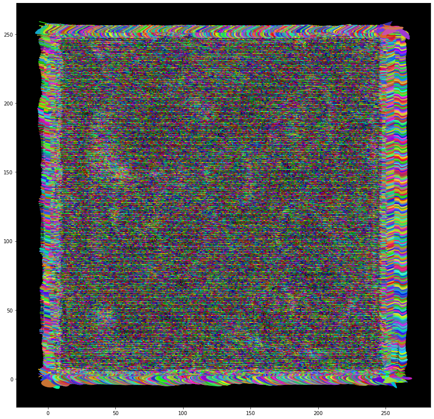

# Improved Dataset with object probabilities, contours, overlap


```python
import torch
import numpy as np
import matplotlib.pyplot as plt
import cv2
import os
import sys
import time
import pytorch_lightning as pl
import torchvision
import random
from scipy.spatial.distance import cdist, directed_hausdorff
from nms import nms
sys.path.append(os.path.join(os.getcwd(), "src"))
#from utils import *
from Models.unet import UNet
from Models.splinedist import *
from utils import *
from Datasets.DSB18 import Nuclie_datamodule
import tqdm
%load_ext autoreload
%autoreload 2
```


```python
# intialize the dataloaders
datamodule = Nuclie_datamodule()
train_loader = datamodule.train_dataloader()
# batch = next(iter(train_loader))
```


```python
# for i, batch in enumerate(train_loader):
#     if i>2:
#         break
#     showBatch(batch)
batch = next(iter(train_loader))
showBatch(batch)
```


    

    


    

    


    

    


    

    


    

    


    

    


    

    


    

    


```python
model = SplineDist()
out = model(batch[0])
objectProbasPredicted, angles, distances = out
```


```python

objectProbas, overlapProba, objectContours, mask = batch[1][3].values()
scores = objectProbas.numpy()
threshold=0.4
# get index of the sorted scores 
# sortedInstances = list(scores.argsort()[::-1])
sortedInstances = np.unravel_index(np.argsort(scores, axis=None)[::-1], scores.shape)
sortedInstances = list(zip(*sortedInstances))
print(len(sortedInstances))
for i, (instance_i, instance_j) in enumerate(sortedInstances):
    if scores[instance_i, instance_j] < threshold:
        sortedInstances = sortedInstances[:i]
        break
print(len(sortedInstances))

```

    65536
    1529
    


```python
scores.shape
```


    (256, 256)


```python

keep = []
B3M = getBsplineMatrix(numSamples=1000, degree=3, numControlPoints=8).float()
controlPoints = convertOutputsToControlPoints(angles, distances)

```


```python
controlPoints.dtype, B3M.dtype
```


    (torch.float32, torch.float32)


```python

#samples = getContourSamples(controlPoints[0], B3M)
# contours = getContourSamples(controlPoints, B3M)
# contours = [getContourSamples(controlPoints[i], B3M) for (i, j) in sortedInstances[:10]]
contours = getContourSamples(controlPoints[0].unsqueeze_(0), B3M).squeeze(1)
contours2 = contours.detach().cpu().numpy().reshape(1000, 2, -1).transpose(2, 0, 1)
```


```python
# contours = np.array(list(map(lambda x: np.array(x), contours)))
# contours = contours.transpose(0, 2, 1)
# contours[0]
#colors = generateColors(len(contours2))
fig = plt.figure(figsize=(15, 15))
ax = fig.add_subplot(111)
ax.set_facecolor("black")
for i in tqdm.tqdm(range(len(contours2))):
    c = list(map(lambda x: x/255, getRandomColor()))
    plt.fill(contours2[i, :, 0], contours2[i, :, 1], color=c)
```

    100%|██████████████████████████████████████████████████████████████████████████████████████████████████████████████████████████████████████████████████████████████| 65536/65536 [00:51<00:00, 1261.45it/s]
    


    

    


```python
x, y = list(zip(*sortedInstances))
x, y = np.array(x), np.array(y)
```


```python
contours3 = contours2[x*256+y]
len(contours3)
```


    1529


```python

fig = plt.figure(figsize=(15, 15))
ax = fig.add_subplot(111)
ax.set_facecolor("black")
for i in tqdm.tqdm(range(len(contours3))):
    c = list(map(lambda x: x/255, getRandomColor()))
    plt.fill(contours3[i, :, 0], contours3[i, :, 1], color=c)
```

    100%|█████████████████████████████████████████████████████████████████████████████████████████████████████████████████████████████████████████████████████████████████| 1529/1529 [00:02<00:00, 622.56it/s]
    


    

    


```python
ids = nms.nms.polygons(contours2[x*256+y], scores.reshape(-1)[x*256+y])
```

    C:\Users\mbenimam\anaconda3\lib\site-packages\nms\malisiewicz.py:99: RuntimeWarning: invalid value encountered in double_scalars
      overlap.append(intersection_area/area[i])
    C:\Users\mbenimam\anaconda3\lib\site-packages\nms\malisiewicz.py:99: RuntimeWarning: divide by zero encountered in double_scalars
      overlap.append(intersection_area/area[i])
    


```python
contours4 = contours3[ids]

fig = plt.figure(figsize=(15, 15))
ax = fig.add_subplot(111)
ax.set_facecolor("black")
for i in tqdm.tqdm(range(len(contours4))):
    c = list(map(lambda x: x/255, getRandomColor()))
    plt.fill(contours4[i, :, 0], contours4[i, :, 1], color=c)
```

    100%|██████████████████████████████████████████████████████████████████████████████████████████████████████████████████████████████████████████████████████████████████| 347/347 [00:00<00:00, 1045.17it/s]
    


    

    


```python

```


```python

```


```python

```


```python

```


```python

```


```python

```


```python

```


```python

```


```python

```


```python

```


```python

```


```python

```


```python

```


```python

```


```python

```


```python

```


```python

```
