```python
import os
import torch
import pandas as pd
from skimage import io, transform
import numpy as np
import matplotlib.pyplot as plt
from torch.utils.data import Dataset, DataLoader
from torchvision import transforms, utils
import h5py
from models.VisualisableModel import VggCam
from utils import plot_batch, train_model
from utils import plot_report
```


```python
import numpy as np # linear algebra library
import cv2 # for image processing methods 
import matplotlib.pyplot as plt # visualisation tool
from matplotlib import gridspec
import seaborn as sns
import pandas as pd
import os # for managing file paths and os operations
import sys # system specefic calls
import time 
import pdb # debug

from sklearn.metrics import confusion_matrix, classification_report

import torch # Deep learning framework
import torch.nn as nn 
import torch.nn.functional as F
import torch.optim as optim

import torchvision # for creating datasets, and pretrained models
from torch.utils.tensorboard import SummaryWriter # visualise the learning
from  torch.utils.data import Dataset, DataLoader # parellel dataset loader
from torchvision import models, datasets, transforms, utils
from torchviz import make_dot

import copy # to create deep copies
import pickle as pk # for serialization
```


```python
root_dir = "../datasets/CAMELYON17"
```


```python

```


```python
class CamelyonDataset(Dataset):
    """Face Landmarks dataset."""

    def __init__(self, root_dir, split="train", transform=None):
        """
        """

        self.root_dir = root_dir
        self.transform = transform
        
        self.x = h5py.File(os.path.join(root_dir, f"camelyonpatch_level_2_split_{split}_x.h5"), 'r')["x"]
        self.y = h5py.File(os.path.join(root_dir, f"camelyonpatch_level_2_split_{split}_y.h5"), 'r')["y"][:].reshape(-1).astype(np.float32)
        print()
        
    def __len__(self):
        return self.x.shape[0]

    def __getitem__(self, idx):
        if torch.is_tensor(idx):
            idx = idx.tolist()

        img = self.x[idx]
        label = self.y[idx]
        if self.transform:
            img = self.transform(img)
    
        return img, label
    
```


```python

```


```python
mean = np.array([0.485, 0.456, 0.406])
std = np.array([0.229, 0.224, 0.225])
normalize = transforms.Normalize(mean, std)
unormalize = transforms.Normalize(-mean/std,1.0/std)


img_transforms = {"train": transforms.Compose([transforms.ToTensor(), transforms.ToPILImage('RGB'),
                                               transforms.RandomHorizontalFlip(),
                                               transforms.RandomRotation(20),
                                               transforms.ToTensor(), normalize]),
                  "valid": transforms.Compose([transforms.ToTensor(), transforms.ToPILImage('RGB'),transforms.ToTensor(), normalize]),
                  "test": transforms.Compose([transforms.ToTensor(), transforms.ToPILImage('RGB'),transforms.ToTensor(), normalize])}

datasets = {x: CamelyonDataset(root_dir, split=x, transform=img_transforms[x])
              for x in ['train', 'valid', 'test']}

dataloaders = {x: torch.utils.data.DataLoader(datasets[x],
                                          batch_size=256,
                                          shuffle=(x == "train"))
          for x in ['train', 'valid', 'test']}
```

    
    
    
    


```python
len(datasets["train"]), len(datasets["valid"]), len(datasets["test"])
```


    (262144, 32768, 32768)


```python
plot_batch(dataloaders["train"], ["0", "1"], cols=32)
```


    
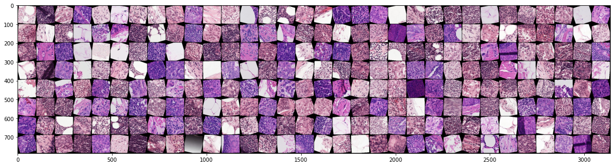
    


```python
plot_batch(dataloaders["valid"], ["0", "1"], cols=32)
```


    

    


```python
device = torch.device("cuda" if torch.cuda.is_available() else "cpu")
print("Using GPU :D !" if device.type == 'cuda' else "Using CPU :( ! ")

model = VggCam(["tumor"])
model.load_from_file("weights.pk")
model = model.to(device)
```

    Using GPU :D !
    


```python
# num_epochs = 25
# optimizer = torch.optim.Adam(model.fc.parameters(), lr=0.01)
# lr_scheduler = optim.lr_scheduler.StepLR(optimizer, step_size=7, gamma=0.1)
# criterion = nn.BCELoss()

#best_model = train_model(model, dataloaders, criterion, optimizer, lr_scheduler, device, num_epochs, binary=True)
```
Epoch 0/24
----------
train Loss: 0.4384 Acc: 0.7962
valid Loss: 0.5960 Acc: 0.7249

Epoch 1/24
----------
train Loss: 0.4296 Acc: 0.8026
valid Loss: 0.4934 Acc: 0.7657

Epoch 2/24
----------
train Loss: 0.4316 Acc: 0.8026
valid Loss: 0.4943 Acc: 0.7603

Epoch 3/24
----------
train Loss: 0.4301 Acc: 0.8026
valid Loss: 0.4809 Acc: 0.7738

Epoch 4/24
----------
train Loss: 0.4300 Acc: 0.8031
valid Loss: 0.5033 Acc: 0.7598

Epoch 5/24
----------
train Loss: 0.4304 Acc: 0.8023
valid Loss: 0.5222 Acc: 0.7519

Epoch 6/24
----------
train Loss: 0.4306 Acc: 0.8022
valid Loss: 0.4697 Acc: 0.7805

Epoch 7/24
----------
train Loss: 0.4209 Acc: 0.8075
valid Loss: 0.5279 Acc: 0.7454

Epoch 8/24
----------
train Loss: 0.4195 Acc: 0.8081
valid Loss: 0.5091 Acc: 0.7543

Epoch 9/24
----------
train Loss: 0.4200 Acc: 0.8078
valid Loss: 0.4954 Acc: 0.7624

Epoch 10/24
----------
train Loss: 0.4191 Acc: 0.8083
valid Loss: 0.5055 Acc: 0.7566

Epoch 11/24
----------
train Loss: 0.4172 Acc: 0.8092
valid Loss: 0.5059 Acc: 0.7566

Epoch 12/24
----------
train Loss: 0.4192 Acc: 0.8078
valid Loss: 0.5124 Acc: 0.7516

Epoch 13/24
----------
train Loss: 0.4192 Acc: 0.8078
valid Loss: 0.4815 Acc: 0.7713

Epoch 14/24
----------
train Loss: 0.4177 Acc: 0.8090
valid Loss: 0.5017 Acc: 0.7591

Epoch 15/24
----------
train Loss: 0.4176 Acc: 0.8086
valid Loss: 0.4975 Acc: 0.7607

Epoch 16/24
----------
train Loss: 0.4176 Acc: 0.8095
valid Loss: 0.5013 Acc: 0.7596

Epoch 17/24
----------
train Loss: 0.4177 Acc: 0.8094
valid Loss: 0.5003 Acc: 0.7592

Epoch 18/24
----------
train Loss: 0.4178 Acc: 0.8095
valid Loss: 0.5018 Acc: 0.7585

Epoch 19/24
----------
train Loss: 0.4173 Acc: 0.8098
valid Loss: 0.5015 Acc: 0.7596

Epoch 20/24
----------
train Loss: 0.4173 Acc: 0.8089
valid Loss: 0.5006 Acc: 0.7596

Epoch 21/24
----------
train Loss: 0.4174 Acc: 0.8086
valid Loss: 0.4992 Acc: 0.7602

Epoch 22/24
----------
train Loss: 0.4171 Acc: 0.8094
valid Loss: 0.5002 Acc: 0.7600

Epoch 23/24
----------
train Loss: 0.4162 Acc: 0.8103
valid Loss: 0.5016 Acc: 0.7594

Epoch 24/24
----------
train Loss: 0.4173 Acc: 0.8088
valid Loss: 0.5011 Acc: 0.7591

Training complete in 260m 41s
Best val Acc: 0.780487

```python
# batch, labels = next(iter(dataloaders["train"]))
# batch = batch.to(device)
# outputs = model(batch)
```


```python
# outputs.shape
```


```python
def test(model, dataloader, datasize, verbose=True):
    """
    

    Parameters
    ----------
    model : TYPE
        DESCRIPTION.
    phase : TYPE, optional
        DESCRIPTION. The default is "test".
    verbose : TYPE, optional
        DESCRIPTION. The default is True.

    Returns
    -------
    y_hat : TYPE
        DESCRIPTION.
    y : TYPE
        DESCRIPTION.

    """
    device = torch.device("cuda" if torch.cuda.is_available() else "cpu")
    print("Using GPU :D !" if device.type == 'cuda' else "Using CPU :( ! ")
    model = model.to(device)
    model.eval()
    
    y_hat = []
    y = []
    running_loss = 0
    
    with torch.no_grad():
        for i, (inputs, labels) in enumerate(dataloader):
            inputs = inputs.to(device)
            labels = labels.to(device)
            
            outputs = model(inputs)
            preds = torch.sigmoid(outputs)
            preds = np.where(preds.cpu().detach().numpy().reshape(-1) > 0.5, 1, 0)
            y_hat = y_hat + list(preds)
            y = y + list(labels.cpu().detach().numpy())
            
            #loss = criterion(outputs, labels)
            
            #running_loss += loss.item() * inputs.size(0)
            
            print(f"iteration {i}")
        
        #running_loss /= datasize
        
    return y_hat, y
```


```python
# yhat, y = test(best_model, dataloaders["test"], 0)
```


```python

```


```python
# plot_report(y, yhat, ["non tumor", "tumor"])
```


```python
batch, labels = next(iter(dataloaders["test"]))
```


```python
from torch.autograd import Variable
green="#689F38"
red="#FF5252"
def visualise_top_k(model, img, label, device, classnames, k=4, subplots=(1,5), figsize=(20,13)):
    """
    """    
    
    img = img.reshape(1, *img.shape)
    img = img.to(device)
    img = Variable(img, requires_grad=True)
    uimg = unormalize(img[0]).cpu().detach().numpy().transpose(1, 2, 0)
    

    feature_maps = model.features(img)[0].cpu().detach().numpy()
    weights = model.fc.weight.cpu().detach().numpy()
    
    out = model(img)
    scores = torch.sigmoid(out)
    preds = np.where(scores.cpu().detach().numpy()>0.5, 1, 0).reshape(-1)
    
    for i in range(k):
        if(img.grad != None):
            img.grad.zero_()
        out[0, 0].backward(retain_graph=True)

        cam = model.return_CAM(feature_maps, weights[0], (img.shape[3], img.shape[2]))
#         cam = np.maximum(cam, 0)[:, :, np.newaxis]
        saliency = np.max(np.abs(img.grad[0].cpu().numpy().transpose(1, 2, 0)), axis=2)  
        
#         plot_imgs([uimg, saliency, cam, cam*saliency, np.clip(uimg*((cam**4)[:, :, np.newaxis]), 0, 1)],
#                   [classnames[preds[i]], "SaliencyMap", "GradCam", "GradCam*SaliencyMap", "visual attention"],
#                   [None, "hot", "jet", "hot", None])
        
        fig, axes = plt.subplots(*subplots, figsize=figsize)
        #fig = plt.figure(figsize=(20, 13))
        #plt.subplot(151)
        axes = axes.reshape(-1)
        axes[0].imshow(uimg)
        axes[0].set_title(f"{classnames[int(preds[i])]}, p={scores[i].item()}", color=(green if preds[i] == label else red))
        #plt.title(f"{classnames[preds[i]]}"+(f",True label {classnames[label]}" if preds[i] != label else ""),
        #          color=(green if preds[i] == label else red), fontweight="bold", fontsize=14)
        axes[0].set_axis_off()
        
        axes[1].imshow(saliency, cmap=plt.cm.hot)
        axes[1].set_title("Saliency map", fontsize=14)
        axes[1].set_axis_off()

        axes[2].imshow(uimg)
        axes[2].imshow(cam, alpha=0.6, cmap="jet")
        axes[2].set_title("GradCam", fontsize=14)
        axes[2].set_axis_off()

        axes[3].imshow(cam*saliency, cmap="hot")
        axes[3].set_title("Guided GradCam", fontsize=14)
        axes[3].set_axis_off()

        axes[4].imshow(np.clip(uimg*((cam**4)[:, :, np.newaxis]), 0, 1))
        axes[4].set_title("Visual Attention", fontsize=14)
        axes[4].set_axis_off()
        
    plt.show()
    plt.tight_layout(pad=0.4, w_pad=0.5, h_pad=0.0)

```


```python
torch.cuda.empty_cache()
```


```python
for i in range(50):
    visualise_top_k(model,batch[i], labels[i], device, ["non tumor", "tumor"], 1)
```


    
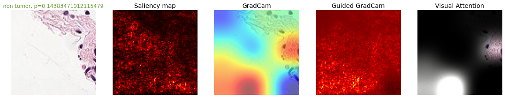
    


    <Figure size 432x288 with 0 Axes>


    

    


    <Figure size 432x288 with 0 Axes>


    
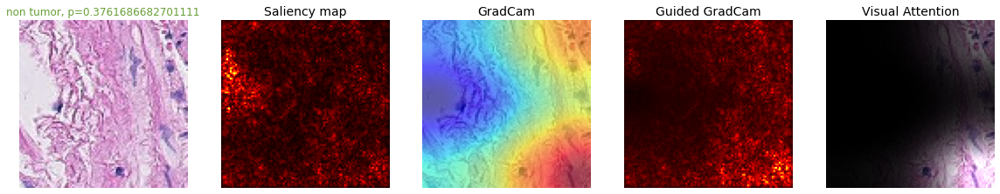
    


    <Figure size 432x288 with 0 Axes>


    
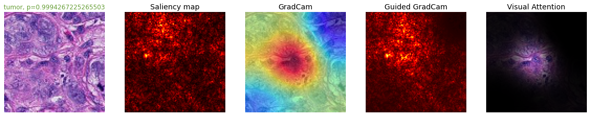
    


    <Figure size 432x288 with 0 Axes>


    
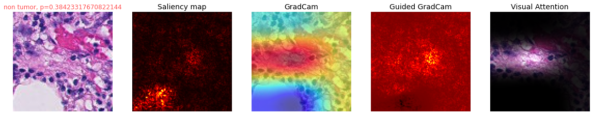
    


    <Figure size 432x288 with 0 Axes>


    
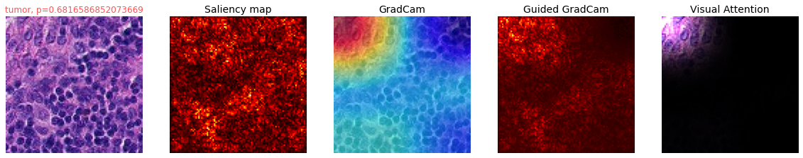
    


    <Figure size 432x288 with 0 Axes>


    
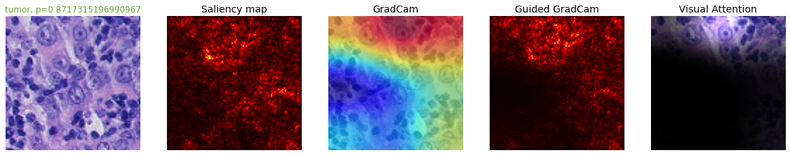
    


    <Figure size 432x288 with 0 Axes>


    
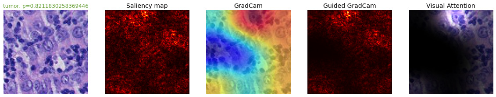
    


    <Figure size 432x288 with 0 Axes>


    
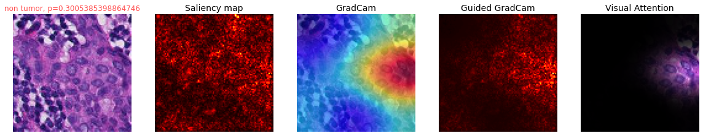
    


    <Figure size 432x288 with 0 Axes>


    
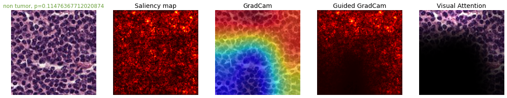
    


    <Figure size 432x288 with 0 Axes>


    

    


    <Figure size 432x288 with 0 Axes>


    
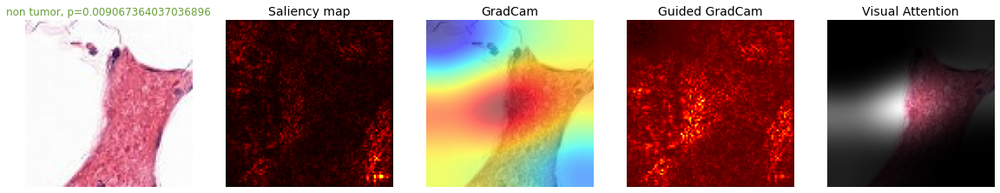
    


    <Figure size 432x288 with 0 Axes>


    
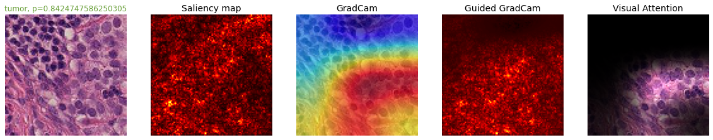
    


    <Figure size 432x288 with 0 Axes>


    
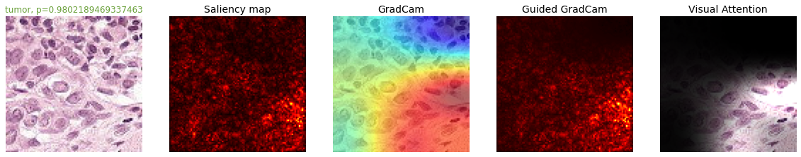
    


    <Figure size 432x288 with 0 Axes>


    
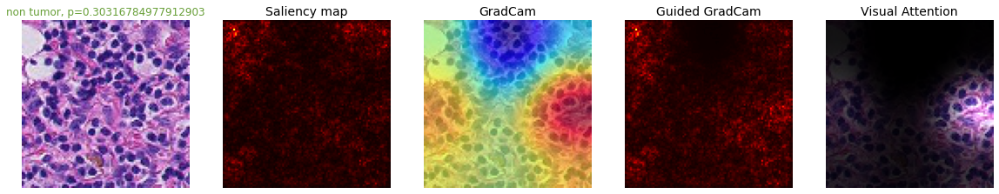
    


    <Figure size 432x288 with 0 Axes>


    
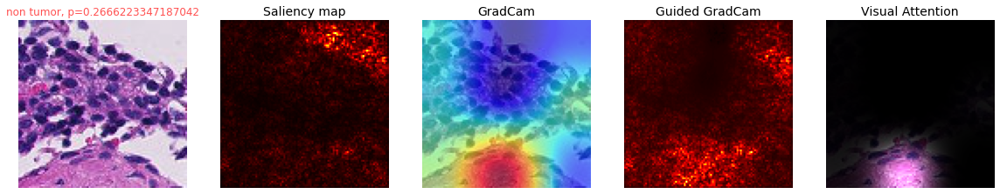
    


    <Figure size 432x288 with 0 Axes>


    
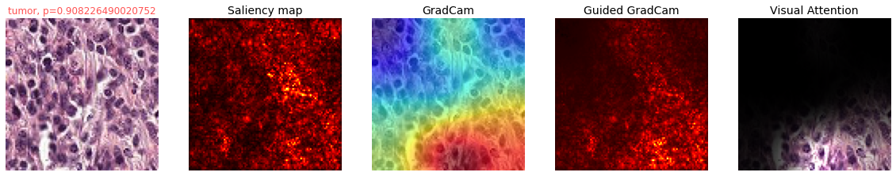
    


    <Figure size 432x288 with 0 Axes>


    
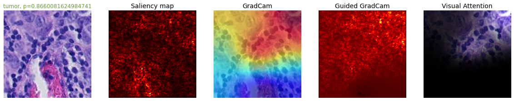
    


    <Figure size 432x288 with 0 Axes>


    
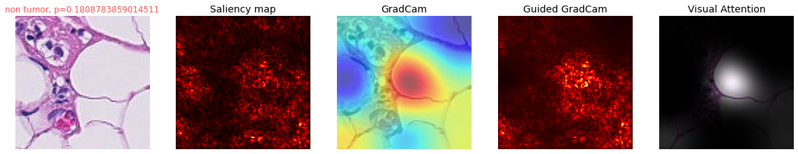
    


    <Figure size 432x288 with 0 Axes>


    
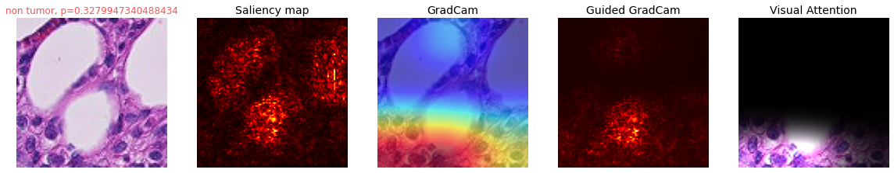
    


    <Figure size 432x288 with 0 Axes>


    
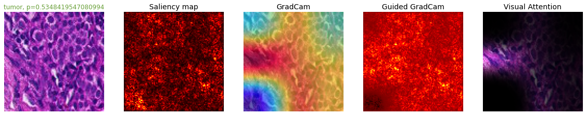
    


    <Figure size 432x288 with 0 Axes>


    
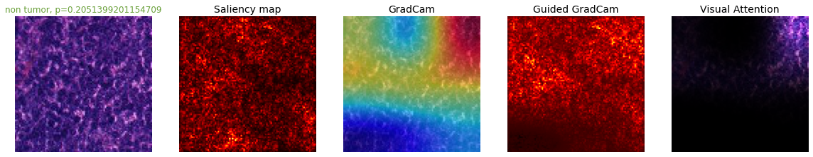
    


    <Figure size 432x288 with 0 Axes>


    
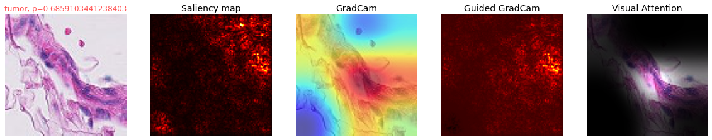
    


    <Figure size 432x288 with 0 Axes>


    
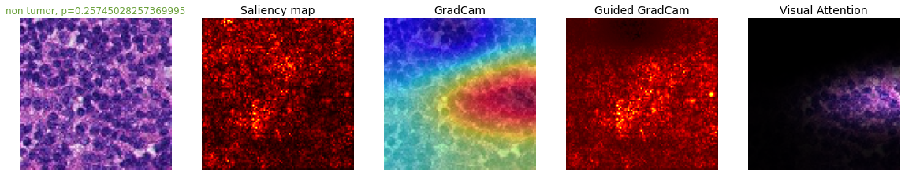
    


    <Figure size 432x288 with 0 Axes>


    
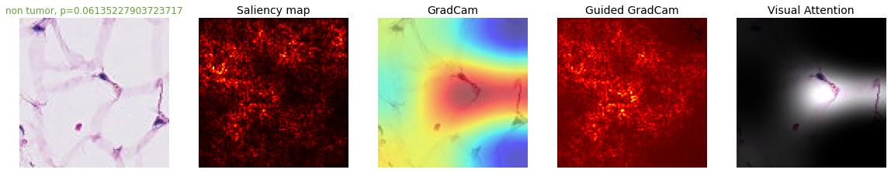
    


    <Figure size 432x288 with 0 Axes>


    
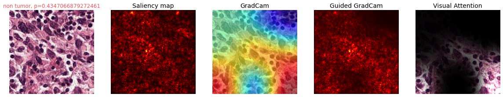
    


    <Figure size 432x288 with 0 Axes>


    
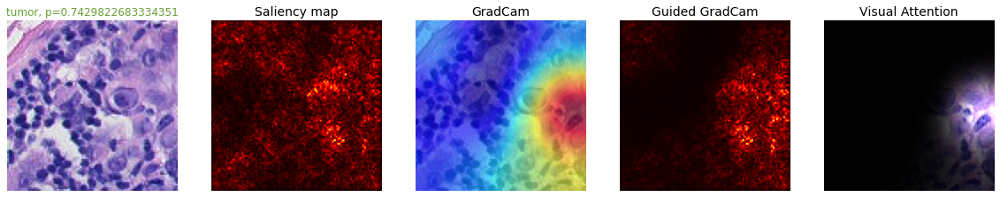
    


    <Figure size 432x288 with 0 Axes>


    
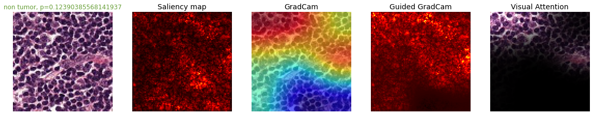
    


    <Figure size 432x288 with 0 Axes>


    
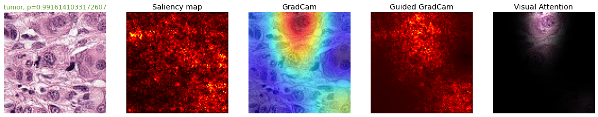
    


    <Figure size 432x288 with 0 Axes>


    
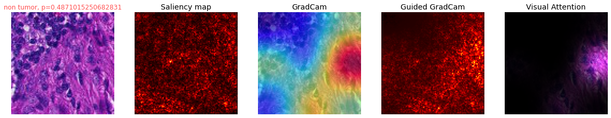
    


    <Figure size 432x288 with 0 Axes>


    
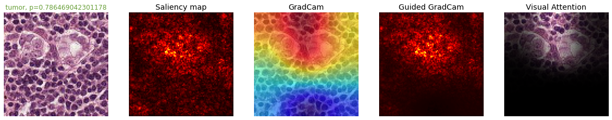
    


    <Figure size 432x288 with 0 Axes>


    
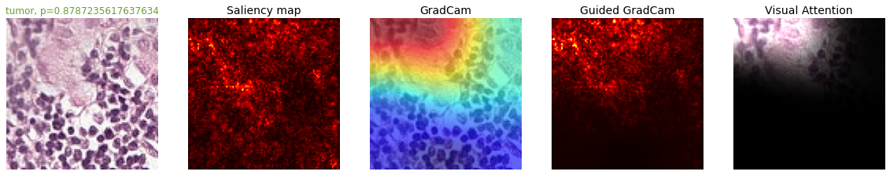
    


    <Figure size 432x288 with 0 Axes>


    
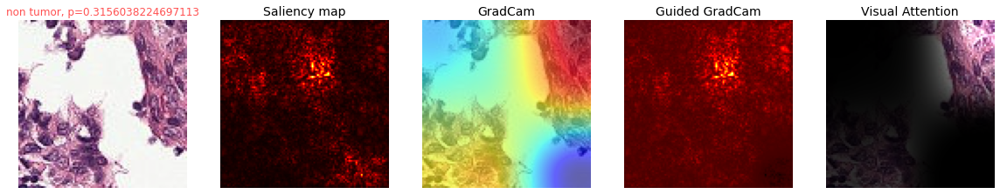
    


    <Figure size 432x288 with 0 Axes>


    
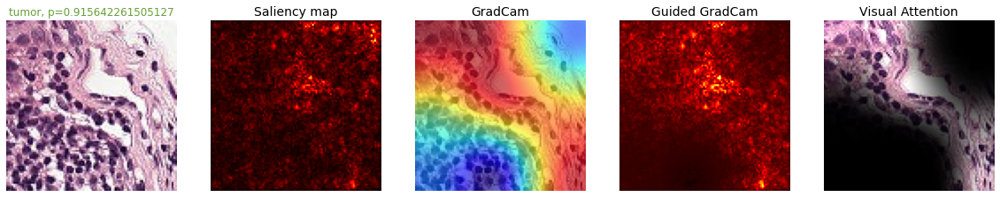
    


    <Figure size 432x288 with 0 Axes>


    
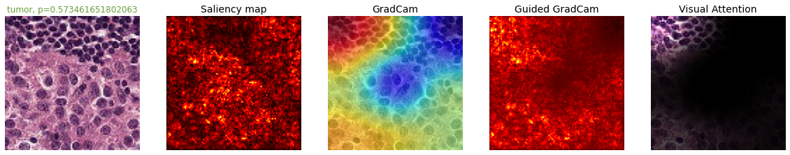
    


    <Figure size 432x288 with 0 Axes>


    
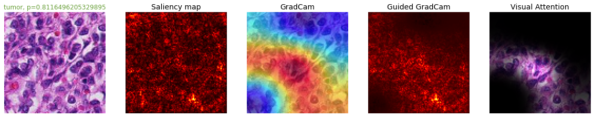
    


    <Figure size 432x288 with 0 Axes>


    
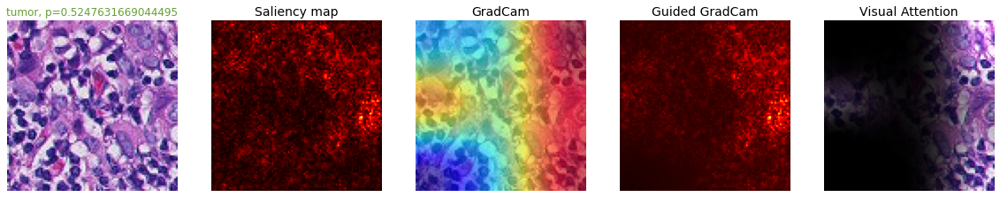
    


    <Figure size 432x288 with 0 Axes>


    
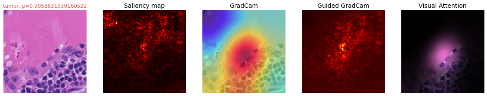
    


    <Figure size 432x288 with 0 Axes>


    
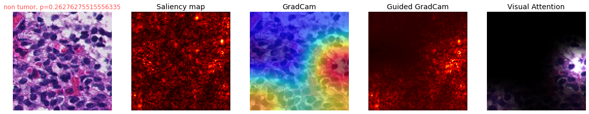
    


    <Figure size 432x288 with 0 Axes>


    
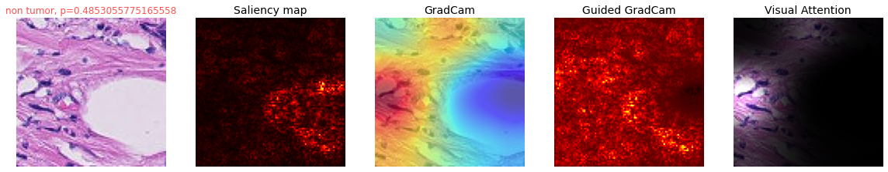
    


    <Figure size 432x288 with 0 Axes>


    

    


    <Figure size 432x288 with 0 Axes>


    
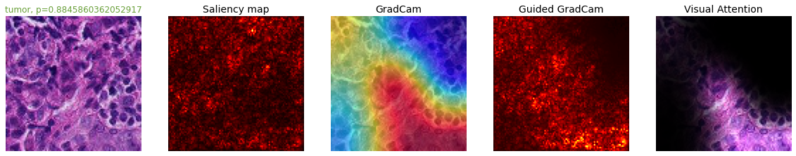
    


    <Figure size 432x288 with 0 Axes>


    

    


    <Figure size 432x288 with 0 Axes>


    

    


    <Figure size 432x288 with 0 Axes>


    
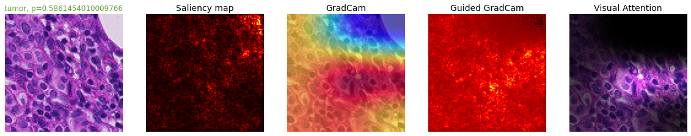
    


    <Figure size 432x288 with 0 Axes>


    
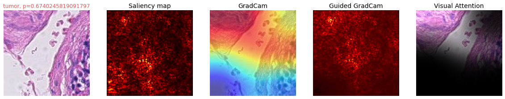
    


    <Figure size 432x288 with 0 Axes>


    
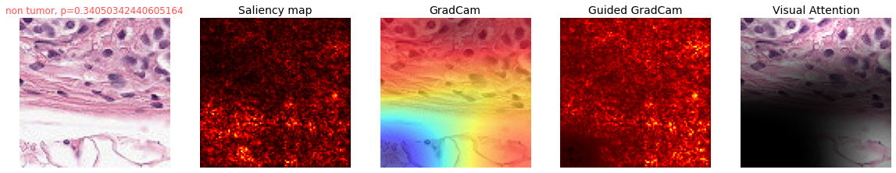
    


    <Figure size 432x288 with 0 Axes>


    
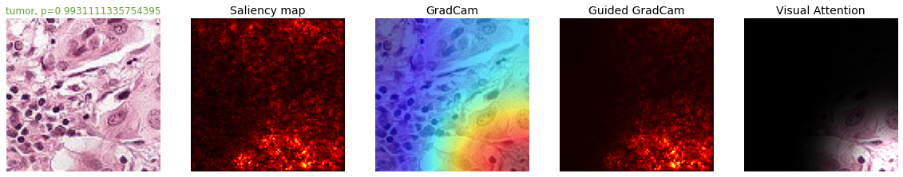
    


    <Figure size 432x288 with 0 Axes>


    
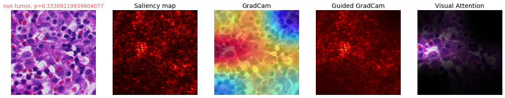
    


    <Figure size 432x288 with 0 Axes>


    
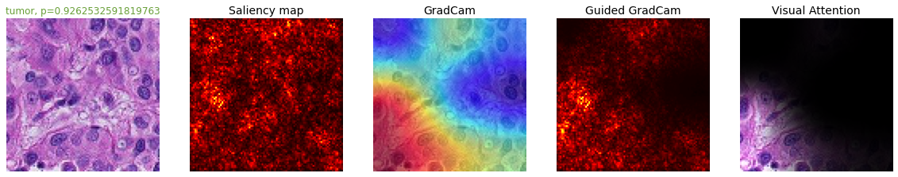
    


    <Figure size 432x288 with 0 Axes>


```python

```
