# Compte rendu Projet analyse de donnée MNIST
## Etudiant : *Mounib Benimam*

Dans ce projet, nous allons contruire un model performant pour predire la classe d'un chiffre manuscrit.

Pour en arriver, nous devons experimenter avec plusieurs models (et plusieurs parametres et methodes
d'entrainement, et de processing).
On utilisera notamment : PCA, KNN, Decision tree, Random forest, Logistic regression , mlp

# Chargement des librairies


```python
import numpy as np # Bibliotheque d'algébre lineaire
from PIL import Image # bibliotheque de manipulation d'images
import matplotlib.pyplot as plt # bibliotheque de visualisation
import pandas as pd # bibliotheque d'analyse de données
import seaborn
from sklearn import decomposition # PCA pour la reduction de dimensionalité et visualisation
from mpl_toolkits import mplot3d
from matplotlib import cm
```


```python
import sys
sys.path.append("./")

%load_ext autoreload

%autoreload 2

import iads as iads
# importation de Classifiers
from iads import Classifiers as cl

# importation de utils
from iads import utils as ut

# importation de evaluation
from iads import evaluation as ev
```

    The autoreload extension is already loaded. To reload it, use:
      %reload_ext autoreload


```python
from IPython.display import display, HTML

%matplotlib inline

### Stylisation des output

display(HTML("""
    <style>
        .output{
            display: table-cell;
            text-align: center;
            vertical-align: middle;
        }
    </style>
"""));
```


<style>
    .output{
        display: table-cell;
        text-align: center;
        vertical-align: middle;
    }
</style>


# Chargement des données


```python
# lecture des fichiers csv
train_set = pd.read_csv("data/train.csv", sep=';', header=None)
test_set = pd.read_csv("data/test.csv", sep=';', header=None)
eval_set = pd.read_csv("data/eval.csv", sep=';', header=None)

# fichier contenant les noms des columns
names = pd.read_csv("data/names.csv", sep=';')
```


```python
# ajout des labels de column au sets
train_set.columns = names.columns
test_set.columns = names.columns
eval_set.columns = names.columns
# creation d'index pour optimisation
train_set.set_index("ident", inplace=True);
test_set.set_index("ident", inplace=True);
eval_set.set_index("ident", inplace=True);
```


```python
# variable utile plustard
mean_train = train_set.iloc[:, :-1].mean(axis=0).values.reshape(1, -1)
var_train  = train_set.iloc[:, :-1].var(axis=0).values.reshape(1, -1) + 1e-8

x_normal = (train_set.iloc[:, :-1].values - mean_train) / np.sqrt(var_train)


liste_models = [] # contiendra des tuple ("nom model", "accuray test")

print(var_train.shape)
```

    (1, 784)


```python
def getcopy_dataframe(dataset="train", categoriel=False, normaliser=False, pca=0, proba=False):
    """
        retourner une copie des data_frame
        
        @param dataset ["train", "test", "eval"]
        @param categoriel Binariser les images de [0 - 255] => ["on", "off"]
        @param normaliser Centrer les image en 0, et la variance à 1
        @param proba label 0 ou 1
        @param pca Projection dans une dimension inferieur
    """
    
    data = train_set if dataset == "train" else (test_set if dataset == "test" else eval_set)
    
    # copie de Données brut 
    x, y = data.iloc[:, :-1].copy(), data["label"].copy()
    
    
    if categoriel: 
        
        x = x.astype(str)

        x[x != "0"] = "on"
        x[x == "0"] = "off"

        x = x.values
        y = y.values

        return x, y
    
    if normaliser == True:
        
        # on normalise en utilisant la moyenne et la variance du train set

        x = x.values
        y = y.values

        x = (x - mean_train)/np.sqrt(var_train)

        if proba:
            #print(f"proba {y.shape}")
            y[y == -1] = 0
            y = y.reshape(-1, 1)
            
        if pca > 0:
            
            pca_train = decomposition.PCA(pca)
            pca_train.fit(x_normal)
            
            x = pca_train.transform(x)
            
            return x, y, pca_train.components_
        
        return x, y
    
    return x.values, y.values
        
    
```


```python
def eval(model, eval_df, x_transformed, filename="resultats.csv"):
    """
        Evaluer un model et produire un fichier csv.
    """
    
    out = eval_df[["label"]].copy()
    
    labels = model.predict(x_transformed)
    
    labels[labels == 0] = -1 # le cas echeant
    
    out["label"] = labels.astype(int)
    
    out.to_csv(filename, sep=";")
```

# Exploration de données


```python
train_set.head()
```


<div>
<style scoped>
    .dataframe tbody tr th:only-of-type {
        vertical-align: middle;
    }

    .dataframe tbody tr th {
        vertical-align: top;
    }

    .dataframe thead th {
        text-align: right;
    }
</style>
<table border="1" class="dataframe">
  <thead>
    <tr style="text-align: right;">
      <th></th>
      <th>1x1</th>
      <th>1x2</th>
      <th>1x3</th>
      <th>1x4</th>
      <th>1x5</th>
      <th>1x6</th>
      <th>1x7</th>
      <th>1x8</th>
      <th>1x9</th>
      <th>1x10</th>
      <th>...</th>
      <th>28x20</th>
      <th>28x21</th>
      <th>28x22</th>
      <th>28x23</th>
      <th>28x24</th>
      <th>28x25</th>
      <th>28x26</th>
      <th>28x27</th>
      <th>28x28</th>
      <th>label</th>
    </tr>
    <tr>
      <th>ident</th>
      <th></th>
      <th></th>
      <th></th>
      <th></th>
      <th></th>
      <th></th>
      <th></th>
      <th></th>
      <th></th>
      <th></th>
      <th></th>
      <th></th>
      <th></th>
      <th></th>
      <th></th>
      <th></th>
      <th></th>
      <th></th>
      <th></th>
      <th></th>
      <th></th>
    </tr>
  </thead>
  <tbody>
    <tr>
      <th>10001</th>
      <td>0</td>
      <td>0</td>
      <td>0</td>
      <td>0</td>
      <td>0</td>
      <td>0</td>
      <td>0</td>
      <td>0</td>
      <td>0</td>
      <td>0</td>
      <td>...</td>
      <td>0</td>
      <td>0</td>
      <td>0</td>
      <td>0</td>
      <td>0</td>
      <td>0</td>
      <td>0</td>
      <td>0</td>
      <td>0</td>
      <td>-1</td>
    </tr>
    <tr>
      <th>10002</th>
      <td>0</td>
      <td>0</td>
      <td>0</td>
      <td>0</td>
      <td>0</td>
      <td>0</td>
      <td>0</td>
      <td>0</td>
      <td>0</td>
      <td>0</td>
      <td>...</td>
      <td>0</td>
      <td>0</td>
      <td>0</td>
      <td>0</td>
      <td>0</td>
      <td>0</td>
      <td>0</td>
      <td>0</td>
      <td>0</td>
      <td>-1</td>
    </tr>
    <tr>
      <th>10003</th>
      <td>0</td>
      <td>0</td>
      <td>0</td>
      <td>0</td>
      <td>0</td>
      <td>0</td>
      <td>0</td>
      <td>0</td>
      <td>0</td>
      <td>0</td>
      <td>...</td>
      <td>0</td>
      <td>0</td>
      <td>0</td>
      <td>0</td>
      <td>0</td>
      <td>0</td>
      <td>0</td>
      <td>0</td>
      <td>0</td>
      <td>-1</td>
    </tr>
    <tr>
      <th>10004</th>
      <td>0</td>
      <td>0</td>
      <td>0</td>
      <td>0</td>
      <td>0</td>
      <td>0</td>
      <td>0</td>
      <td>0</td>
      <td>0</td>
      <td>0</td>
      <td>...</td>
      <td>0</td>
      <td>0</td>
      <td>0</td>
      <td>0</td>
      <td>0</td>
      <td>0</td>
      <td>0</td>
      <td>0</td>
      <td>0</td>
      <td>-1</td>
    </tr>
    <tr>
      <th>10005</th>
      <td>0</td>
      <td>0</td>
      <td>0</td>
      <td>0</td>
      <td>0</td>
      <td>0</td>
      <td>0</td>
      <td>0</td>
      <td>0</td>
      <td>0</td>
      <td>...</td>
      <td>0</td>
      <td>0</td>
      <td>0</td>
      <td>0</td>
      <td>0</td>
      <td>0</td>
      <td>0</td>
      <td>0</td>
      <td>0</td>
      <td>-1</td>
    </tr>
  </tbody>
</table>
<p>5 rows × 785 columns</p>
</div>


```python
eval_set.head()
```


<div>
<style scoped>
    .dataframe tbody tr th:only-of-type {
        vertical-align: middle;
    }

    .dataframe tbody tr th {
        vertical-align: top;
    }

    .dataframe thead th {
        text-align: right;
    }
</style>
<table border="1" class="dataframe">
  <thead>
    <tr style="text-align: right;">
      <th></th>
      <th>1x1</th>
      <th>1x2</th>
      <th>1x3</th>
      <th>1x4</th>
      <th>1x5</th>
      <th>1x6</th>
      <th>1x7</th>
      <th>1x8</th>
      <th>1x9</th>
      <th>1x10</th>
      <th>...</th>
      <th>28x20</th>
      <th>28x21</th>
      <th>28x22</th>
      <th>28x23</th>
      <th>28x24</th>
      <th>28x25</th>
      <th>28x26</th>
      <th>28x27</th>
      <th>28x28</th>
      <th>label</th>
    </tr>
    <tr>
      <th>ident</th>
      <th></th>
      <th></th>
      <th></th>
      <th></th>
      <th></th>
      <th></th>
      <th></th>
      <th></th>
      <th></th>
      <th></th>
      <th></th>
      <th></th>
      <th></th>
      <th></th>
      <th></th>
      <th></th>
      <th></th>
      <th></th>
      <th></th>
      <th></th>
      <th></th>
    </tr>
  </thead>
  <tbody>
    <tr>
      <th>90001</th>
      <td>0</td>
      <td>0</td>
      <td>0</td>
      <td>0</td>
      <td>0</td>
      <td>0</td>
      <td>0</td>
      <td>0</td>
      <td>0</td>
      <td>0</td>
      <td>...</td>
      <td>0</td>
      <td>0</td>
      <td>0</td>
      <td>0</td>
      <td>0</td>
      <td>0</td>
      <td>0</td>
      <td>0</td>
      <td>0</td>
      <td>0</td>
    </tr>
    <tr>
      <th>90002</th>
      <td>0</td>
      <td>0</td>
      <td>0</td>
      <td>0</td>
      <td>0</td>
      <td>0</td>
      <td>0</td>
      <td>0</td>
      <td>0</td>
      <td>0</td>
      <td>...</td>
      <td>0</td>
      <td>0</td>
      <td>0</td>
      <td>0</td>
      <td>0</td>
      <td>0</td>
      <td>0</td>
      <td>0</td>
      <td>0</td>
      <td>0</td>
    </tr>
    <tr>
      <th>90003</th>
      <td>0</td>
      <td>0</td>
      <td>0</td>
      <td>0</td>
      <td>0</td>
      <td>0</td>
      <td>0</td>
      <td>0</td>
      <td>0</td>
      <td>0</td>
      <td>...</td>
      <td>0</td>
      <td>0</td>
      <td>0</td>
      <td>0</td>
      <td>0</td>
      <td>0</td>
      <td>0</td>
      <td>0</td>
      <td>0</td>
      <td>0</td>
    </tr>
    <tr>
      <th>90004</th>
      <td>0</td>
      <td>0</td>
      <td>0</td>
      <td>0</td>
      <td>0</td>
      <td>0</td>
      <td>0</td>
      <td>0</td>
      <td>0</td>
      <td>0</td>
      <td>...</td>
      <td>0</td>
      <td>0</td>
      <td>0</td>
      <td>0</td>
      <td>0</td>
      <td>0</td>
      <td>0</td>
      <td>0</td>
      <td>0</td>
      <td>0</td>
    </tr>
    <tr>
      <th>90005</th>
      <td>0</td>
      <td>0</td>
      <td>0</td>
      <td>0</td>
      <td>0</td>
      <td>0</td>
      <td>0</td>
      <td>0</td>
      <td>0</td>
      <td>0</td>
      <td>...</td>
      <td>0</td>
      <td>0</td>
      <td>0</td>
      <td>0</td>
      <td>0</td>
      <td>0</td>
      <td>0</td>
      <td>0</td>
      <td>0</td>
      <td>0</td>
    </tr>
  </tbody>
</table>
<p>5 rows × 785 columns</p>
</div>


```python
eval_set[["label"]].head()
```


<div>
<style scoped>
    .dataframe tbody tr th:only-of-type {
        vertical-align: middle;
    }

    .dataframe tbody tr th {
        vertical-align: top;
    }

    .dataframe thead th {
        text-align: right;
    }
</style>
<table border="1" class="dataframe">
  <thead>
    <tr style="text-align: right;">
      <th></th>
      <th>label</th>
    </tr>
    <tr>
      <th>ident</th>
      <th></th>
    </tr>
  </thead>
  <tbody>
    <tr>
      <th>90001</th>
      <td>0</td>
    </tr>
    <tr>
      <th>90002</th>
      <td>0</td>
    </tr>
    <tr>
      <th>90003</th>
      <td>0</td>
    </tr>
    <tr>
      <th>90004</th>
      <td>0</td>
    </tr>
    <tr>
      <th>90005</th>
      <td>0</td>
    </tr>
  </tbody>
</table>
</div>


```python
train_set.describe()
```


<div>
<style scoped>
    .dataframe tbody tr th:only-of-type {
        vertical-align: middle;
    }

    .dataframe tbody tr th {
        vertical-align: top;
    }

    .dataframe thead th {
        text-align: right;
    }
</style>
<table border="1" class="dataframe">
  <thead>
    <tr style="text-align: right;">
      <th></th>
      <th>1x1</th>
      <th>1x2</th>
      <th>1x3</th>
      <th>1x4</th>
      <th>1x5</th>
      <th>1x6</th>
      <th>1x7</th>
      <th>1x8</th>
      <th>1x9</th>
      <th>1x10</th>
      <th>...</th>
      <th>28x20</th>
      <th>28x21</th>
      <th>28x22</th>
      <th>28x23</th>
      <th>28x24</th>
      <th>28x25</th>
      <th>28x26</th>
      <th>28x27</th>
      <th>28x28</th>
      <th>label</th>
    </tr>
  </thead>
  <tbody>
    <tr>
      <th>count</th>
      <td>1000.0</td>
      <td>1000.0</td>
      <td>1000.0</td>
      <td>1000.0</td>
      <td>1000.0</td>
      <td>1000.0</td>
      <td>1000.0</td>
      <td>1000.0</td>
      <td>1000.0</td>
      <td>1000.0</td>
      <td>...</td>
      <td>1000.000000</td>
      <td>1000.00000</td>
      <td>1000.000000</td>
      <td>1000.000000</td>
      <td>1000.0</td>
      <td>1000.0</td>
      <td>1000.0</td>
      <td>1000.0</td>
      <td>1000.0</td>
      <td>1000.0000</td>
    </tr>
    <tr>
      <th>mean</th>
      <td>0.0</td>
      <td>0.0</td>
      <td>0.0</td>
      <td>0.0</td>
      <td>0.0</td>
      <td>0.0</td>
      <td>0.0</td>
      <td>0.0</td>
      <td>0.0</td>
      <td>0.0</td>
      <td>...</td>
      <td>0.071000</td>
      <td>0.25200</td>
      <td>0.253000</td>
      <td>0.050000</td>
      <td>0.0</td>
      <td>0.0</td>
      <td>0.0</td>
      <td>0.0</td>
      <td>0.0</td>
      <td>0.0000</td>
    </tr>
    <tr>
      <th>std</th>
      <td>0.0</td>
      <td>0.0</td>
      <td>0.0</td>
      <td>0.0</td>
      <td>0.0</td>
      <td>0.0</td>
      <td>0.0</td>
      <td>0.0</td>
      <td>0.0</td>
      <td>0.0</td>
      <td>...</td>
      <td>2.245217</td>
      <td>7.96894</td>
      <td>8.000562</td>
      <td>1.581139</td>
      <td>0.0</td>
      <td>0.0</td>
      <td>0.0</td>
      <td>0.0</td>
      <td>0.0</td>
      <td>1.0005</td>
    </tr>
    <tr>
      <th>min</th>
      <td>0.0</td>
      <td>0.0</td>
      <td>0.0</td>
      <td>0.0</td>
      <td>0.0</td>
      <td>0.0</td>
      <td>0.0</td>
      <td>0.0</td>
      <td>0.0</td>
      <td>0.0</td>
      <td>...</td>
      <td>0.000000</td>
      <td>0.00000</td>
      <td>0.000000</td>
      <td>0.000000</td>
      <td>0.0</td>
      <td>0.0</td>
      <td>0.0</td>
      <td>0.0</td>
      <td>0.0</td>
      <td>-1.0000</td>
    </tr>
    <tr>
      <th>25%</th>
      <td>0.0</td>
      <td>0.0</td>
      <td>0.0</td>
      <td>0.0</td>
      <td>0.0</td>
      <td>0.0</td>
      <td>0.0</td>
      <td>0.0</td>
      <td>0.0</td>
      <td>0.0</td>
      <td>...</td>
      <td>0.000000</td>
      <td>0.00000</td>
      <td>0.000000</td>
      <td>0.000000</td>
      <td>0.0</td>
      <td>0.0</td>
      <td>0.0</td>
      <td>0.0</td>
      <td>0.0</td>
      <td>-1.0000</td>
    </tr>
    <tr>
      <th>50%</th>
      <td>0.0</td>
      <td>0.0</td>
      <td>0.0</td>
      <td>0.0</td>
      <td>0.0</td>
      <td>0.0</td>
      <td>0.0</td>
      <td>0.0</td>
      <td>0.0</td>
      <td>0.0</td>
      <td>...</td>
      <td>0.000000</td>
      <td>0.00000</td>
      <td>0.000000</td>
      <td>0.000000</td>
      <td>0.0</td>
      <td>0.0</td>
      <td>0.0</td>
      <td>0.0</td>
      <td>0.0</td>
      <td>0.0000</td>
    </tr>
    <tr>
      <th>75%</th>
      <td>0.0</td>
      <td>0.0</td>
      <td>0.0</td>
      <td>0.0</td>
      <td>0.0</td>
      <td>0.0</td>
      <td>0.0</td>
      <td>0.0</td>
      <td>0.0</td>
      <td>0.0</td>
      <td>...</td>
      <td>0.000000</td>
      <td>0.00000</td>
      <td>0.000000</td>
      <td>0.000000</td>
      <td>0.0</td>
      <td>0.0</td>
      <td>0.0</td>
      <td>0.0</td>
      <td>0.0</td>
      <td>1.0000</td>
    </tr>
    <tr>
      <th>max</th>
      <td>0.0</td>
      <td>0.0</td>
      <td>0.0</td>
      <td>0.0</td>
      <td>0.0</td>
      <td>0.0</td>
      <td>0.0</td>
      <td>0.0</td>
      <td>0.0</td>
      <td>0.0</td>
      <td>...</td>
      <td>71.000000</td>
      <td>252.00000</td>
      <td>253.000000</td>
      <td>50.000000</td>
      <td>0.0</td>
      <td>0.0</td>
      <td>0.0</td>
      <td>0.0</td>
      <td>0.0</td>
      <td>1.0000</td>
    </tr>
  </tbody>
</table>
<p>8 rows × 785 columns</p>
</div>


```python
train_set.info()
```

    <class 'pandas.core.frame.DataFrame'>
    Int64Index: 1000 entries, 10001 to 11000
    Columns: 785 entries, 1x1 to label
    dtypes: int64(785)
    memory usage: 6.0 MB


```python
print("Nombre d'instance pour chaque classe")
print(train_set["label"].value_counts())
```

    Nombre d'instance pour chaque classe
     1    500
    -1    500
    Name: label, dtype: int64


### Informations aquises dans cette premiere manoeuvre
- les données sont équilibrées dans chaque set
- On compte 1000 instance dans chaque set
- le probleme est un probleme de classification binaire 1 -1
- dimension des features 784

# Visualisation


```python
#afficher les 25 premieres images
def plot_images(df_images, nrows=5, ncols=5, title="title"):
    """
        creer une figure contenant rows / cols subplots
        affichant les images et leurs labels
    """
    fig = plt.figure(figsize=(10, 10))
    fig.suptitle(title, fontsize=12)
    # pour chaque lignes
    for i in range(nrows):
        for j in range(ncols):
            
            current_image = df_images.iloc[i*ncols + j]
            
            label = current_image[-1]
            image = current_image[:-1].values.reshape(28, 28)
            
            ax = plt.subplot(nrows, ncols, i*ncols + j + 1)
            
            ax.set_title(label)
            ax.axis("off")
            
            ax.imshow(image, cmap="gray")
            
            

### iamges positive
positive = train_set[train_set["label"] == 1].sample(frac=1)
plot_images(positive.iloc[:36], 6, 6, "Positive samples")
### images negative
negative = train_set[train_set["label"] == -1].sample(frac=1)
plot_images(negative.iloc[:36], 6, 6, "Negative samples")
plt.show()
```


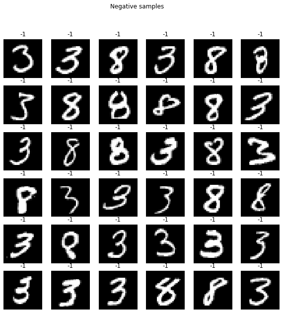


```python
corr = train_set.corr()
print(corr.shape)
corr = np.nan_to_num(corr)
plt.figure(figsize=(10, 10))
#seaborn.heatmap(corr)
plt.axis("off")
plt.imshow(corr[-1:0:-1, :])
```

    (785, 785)


    <matplotlib.image.AxesImage at 0x7f91e4bb1490>


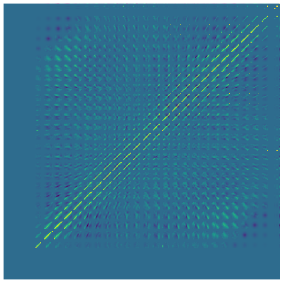


### Information aquise
- les données semble être des images de (5 ou 9) pour la classe 1, (3 ou 8) pour la classe -1

### Principal Components


```python
# from sklearn import decomposition
# pca = decomposition.PCA()
#x, y = train_set.iloc[:, :-1].values, train_set["label"].values
#normaliser les données
# x = (x-x.mean())/x.var()
# pca.n_components = 100
# x = pca.fit_transform(x)
x, y, pca = getcopy_dataframe("train", normaliser=True, pca=100)
```


```python
fig, axes = plt.subplots(nrows=6, ncols=6, figsize=(20, 20))

for i, ax in enumerate(axes.flat, start=1):
    ax.set_title(f"Top Eigenvector {i}")
    ax.imshow(pca[i-1, :].reshape(28, 28))
    
fig.tight_layout()
plt.show()
```


```python
from mpl_toolkits.mplot3d import Axes3D

colors = np.array(['g', 'r', 'b'])

xs = x[:, 0]
ys = x[:, 1]
zs = x[:, 2]
# print(xs.max(), xs.min())
# print(ys.max(), ys.min())

scalex = 1.0/(xs.max() - xs.min())
scaley = 1.0/(ys.max() - ys.min())
scalez = 1.0/(zs.max() - zs.min())

fig = plt.figure(figsize=(10, 10))
#ax = fig.add_subplot(111, projection='3d')
#ax.scatter(xs*scalex, ys*scaley, zs*scalez, c=colors[y])
plt.scatter(xs*scalex, ys*scaley, c=colors[y])
plt.show()

# plt.figure(figsize=(20, 20))
# for i in range(1, 25):
#     ax = plt.subplot(5, 5, i)
#     ax.scatter(x[:, i], x[:, i+1], c=colors[y])
# plt.show()
```


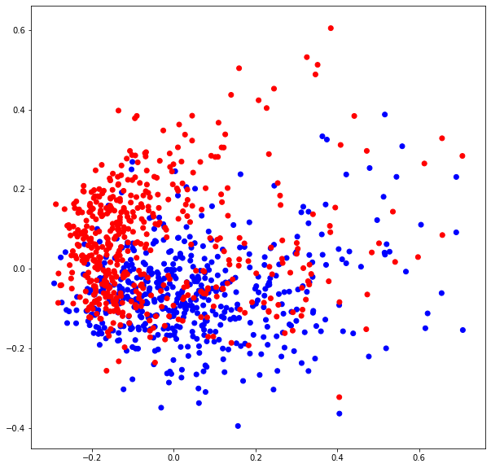


## Experimentation rapide


```python
# Experimentations primaires

models = [cl.ClassifierPerceptronKernel(x.shape[1]+1, 0.5, cl.KernelBias(), epochs=5),
          cl.ClassifierPerceptron(x.shape[1], 0.5, epochs=5),
          cl.ClassifierKNN(x.shape[1], 1),
          cl.ClassifierKNN(x.shape[1], 3),
          cl.ClassifierKNN(x.shape[1], 5)]

Resultats = ev.crossvalidation(models, [x, y], 10)


print("\n*****\nAffichage des résultats:")
for k in range(0,len(Resultats)):
    print("Classifieur ", k)
    print("\t(moyenne, std) pour apprentissage :", Resultats[k][0])
    print("\t(moyenne, std) pour test          :", Resultats[k][1])
```

    Il y a  5 classifieurs à comparer.
    
    *****
    Affichage des résultats:
    Classifieur  0
    	(moyenne, std) pour apprentissage : (0.924033988382153, 0.013279966685259003)
    	(moyenne, std) pour test          : (0.8630000000000001, 0.06588626564011653)
    Classifieur  1
    	(moyenne, std) pour apprentissage : (0.9223680632801878, 0.011781397838814815)
    	(moyenne, std) pour test          : (0.865, 0.04272001872658764)
    Classifieur  2
    	(moyenne, std) pour apprentissage : (1.0, 0.0)
    	(moyenne, std) pour test          : (0.905, 0.053712196007983125)
    Classifieur  3
    	(moyenne, std) pour apprentissage : (0.970191694475343, 0.0034441677180346887)
    	(moyenne, std) pour test          : (0.9110000000000001, 0.04346262762420146)
    Classifieur  4
    	(moyenne, std) pour apprentissage : (0.9655208256087009, 0.0028168928667025167)
    	(moyenne, std) pour test          : (0.905, 0.05852349955359812)


# model 1

### K nearest neighbor, données brut


```python
x_train, y_train = getcopy_dataframe("train")
x_test, y_test = getcopy_dataframe("test")

knn_raw = cl.ClassifierKNN(x.shape[1], 9)

knn_raw.train(x_train, y_train)

train_accuracy = knn_raw.accuracy(x_train, y_test)
test_accuracy = knn_raw.accuracy(x_test, y_test)

print(f"Model KNN k=9 raw data, Train_accuracy = {train_accuracy}; Test Accuracy = {test_accuracy}")
```

    Model KNN k=9 raw data, Train_accuracy = 0.962; Test Accuracy = 0.944


### Experimentation sur k


```python
model_2 = ut.k_linear_search(x_train, y_train, x_test, y_test)
```

    Best k = 0, accuracy = 0.5
    Best k = 1, accuracy = 0.935
    Best k = 2, accuracy = 0.939
    Best k = 3, accuracy = 0.943
    Best k = 4, accuracy = 0.948
    Model K-NN k= 4;  Train accuracy : 0.969; Test accuracy : 0.948


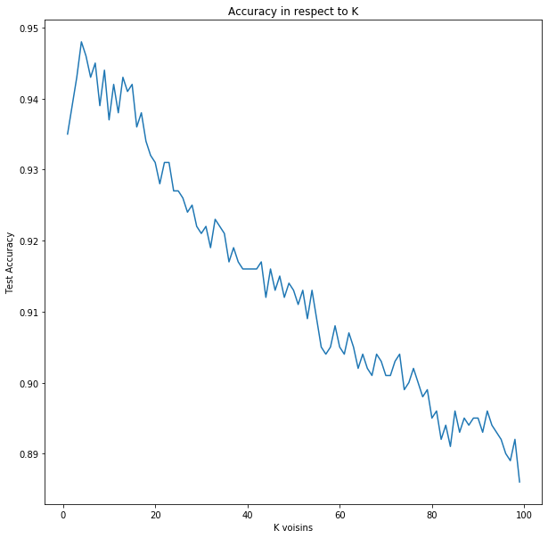


```python
x_eval, y_eval = getcopy_dataframe("eval")
eval(model_2, eval_set, x_eval, "resultat-knn-raw-0.948accuracy.csv")
liste_models.append((f"K-NN k={model_2.k}", model_2.accuracy(x_test, y_test)))
```

# Model 2

### K nearest neighbor en utilisant 20 PCA + normalisation 
l'avantage de cette methode c'est de reduire le temps de calcul de KNN tout en preservant une accuracy acceptable


```python
x_train, y_train, _ = getcopy_dataframe("train", normaliser=True, pca=20)
x_test, y_test, _ = getcopy_dataframe("test", normaliser=True, pca=20)

knn = cl.ClassifierKNN(x_train.shape[1], 3)
knn.train(x_train, y_train)
knn.accuracy(x_test, y_test)
```


    0.939


### Experientation hyperparametre


```python
model_1 = ut.k_linear_search(x_train, y_train, x_test, y_test)
```

    Best k = 0, accuracy = 0.5
    Best k = 1, accuracy = 0.926
    Best k = 3, accuracy = 0.939
    Model K-NN k= 3;  Train accuracy : 0.979; Test accuracy : 0.939


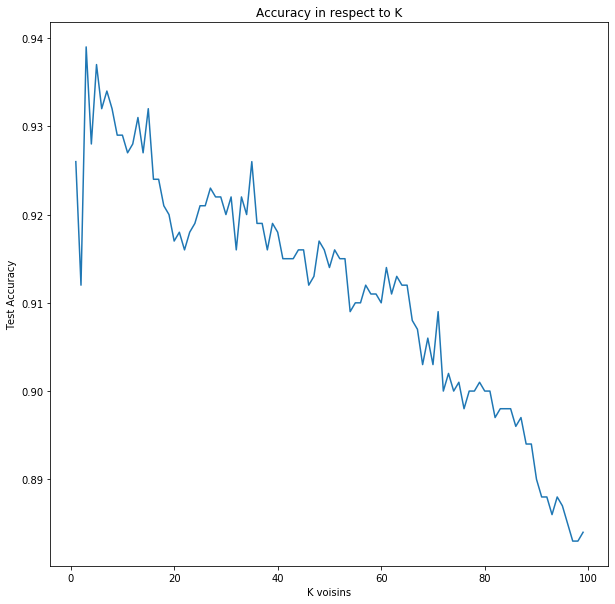


```python
x_eval, y_eval, _ = getcopy_dataframe("eval", normaliser=True, pca=20)
eval(model_1, eval_set, x_eval, "resultat-knn-pca20-0.939accuracy.csv")
liste_models.append((f"K-NN PCA=20 k={model_1.k}", model_1.accuracy(x_test, y_test)))
```

# model 3 
### Perceptron 

#### test avec normalisation et sans normalisation des données (moyenne 0 , variance 1)


```python
for norm in [True, False]:
    x_train, y_train = getcopy_dataframe("train", normaliser=norm)
    x_test, y_test = getcopy_dataframe("test", normaliser=norm)

    perceptron_raw = cl.ClassifierPerceptron(x_train.shape[1], learning_rate=0.5, epochs=5)

    perceptron_raw.train(x_train, y_train)

    train_accuracy = perceptron_raw.accuracy(x_train, y_train)
    test_accuracy = perceptron_raw.accuracy(x_test, y_test)

    print(f"Model Perceptron lr=0.5  Normalisation={norm} raw data, Train_accuracy = {train_accuracy}; Test Accuracy = {test_accuracy}")
```

    Model Perceptron lr=0.5  Normalisation=True raw data, Train_accuracy = 0.967; Test Accuracy = 0.872
    Model Perceptron lr=0.5  Normalisation=False raw data, Train_accuracy = 0.919; Test Accuracy = 0.866


### grid search du learning rate , et du nombre d'epochs (nombre d'iterations sur la dataset)


```python
x_train, y_train = getcopy_dataframe("train", normaliser=True)
x_test, y_test = getcopy_dataframe("test", normaliser=True)

accuracies =[]
best = None
best_accuracy = 0

best_i = 0
best_j = 0

input_size = x_train.shape[1]
# nous disposons de 2 parametres epoch, et lr

lr_space = np.linspace(0.01, 20, 100) #np.random.rand(50) * (10 - 0.1) 
epoch_space = np.arange(1, 101, 1)


xx, yy = np.meshgrid(lr_space, epoch_space)

z = np.zeros((100, 100))

print("shape : ", z.shape, xx.shape, yy.shape)
for j in range(100):
    
    #print(f"Learning rate {xx[0, j]}")
    lr = xx[0, j]
    perceptron = cl.ClassifierPerceptron(input_size, lr, epochs=1)
    
    for i in range(100):
        
        perceptron.train(x_train, y_train)
        
        accuracy = perceptron.accuracy(x_test, y_test)
        
        z[i, j] = accuracy
        
        
        if accuracy > best_accuracy:
            
            best_accuracy = accuracy
            best_i = i
            best_j = j
            best = perceptron
            print(f"WOW a new best : {best_accuracy}, lr={xx[i, j]}, epochs={yy[i, j]}")
            
            
```

    shape :  (100, 100) (100, 100) (100, 100)
    WOW a new best : 0.814, lr=0.01, epochs=1
    WOW a new best : 0.835, lr=0.01, epochs=2
    WOW a new best : 0.847, lr=0.01, epochs=3
    WOW a new best : 0.848, lr=0.01, epochs=4
    WOW a new best : 0.857, lr=0.01, epochs=5
    WOW a new best : 0.865, lr=0.01, epochs=6
    WOW a new best : 0.866, lr=0.01, epochs=10
    WOW a new best : 0.868, lr=0.01, epochs=13
    WOW a new best : 0.884, lr=0.21191919191919192, epochs=1
    WOW a new best : 0.892, lr=0.21191919191919192, epochs=7
    WOW a new best : 0.896, lr=0.41383838383838384, epochs=3
    WOW a new best : 0.897, lr=0.8176767676767677, epochs=3
    WOW a new best : 0.9, lr=2.6349494949494945, epochs=7
    WOW a new best : 0.905, lr=10.307878787878787, epochs=5


```python
print(f"Accuracy Perceptron lr={xx[best_i, best_j]} epoch={yy[best_i, best_j]}: {best_accuracy}")
#print(xx.shape, yy.shape)

fig = plt.figure(figsize=(10, 10))

ax = fig.gca(projection='3d')
ax.plot_surface(xx, yy, z, cmap=plt.get_cmap("viridis"))


ax.set_xlabel('learning_rate')
ax.set_ylabel('Epochs')
ax.set_zlabel('Test Accuracy')
#plt.show()
```

    Accuracy Perceptron lr=10.307878787878787 epoch=5: 0.905


    Text(0.5, 0, 'Test Accuracy')


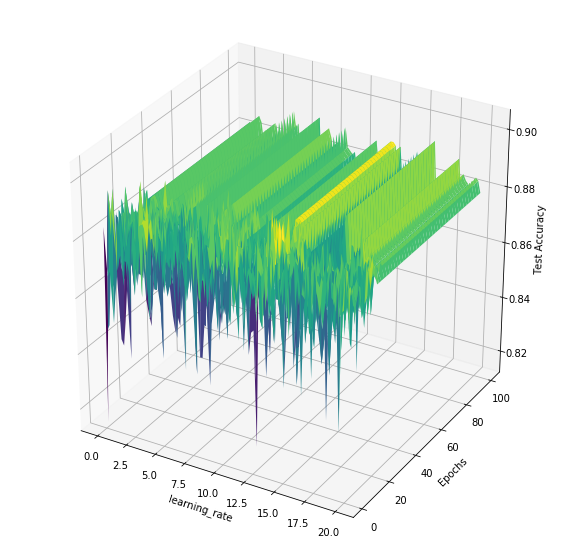


### visualisation de la convergence du model (sur le trainset et testset pour detecter un eventuelle overfitting/underfitting)


```python
model_3 = cl.ClassifierPerceptron(x_train.shape[1], xx[best_i, best_j], epochs=1)
ut.accuracy_over_epochs(model_3, x_train, y_train, x_test, y_test)
```


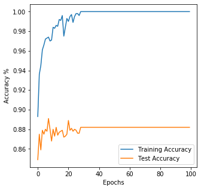


```python
# tester notre model par cross validation

model_3 = cl.ClassifierPerceptron(x_train.shape[1], xx[best_i, best_j], epochs=1)

models = [model_3]

Resultats = ev.crossvalidation(models, [x_train, y_train], 10)


print("\n*****\nAffichage des résultats:")
for k in range(0,len(Resultats)):
    print("Classifieur ", k)
    print("\t(moyenne, std) pour apprentissage :", Resultats[k][0])
    print("\t(moyenne, std) pour test          :", Resultats[k][1])
    
    
```

    Il y a  1 classifieurs à comparer.
    
    *****
    Affichage des résultats:
    Classifieur  0
    	(moyenne, std) pour apprentissage : (0.9142455815103201, 0.013853462335160216)
    	(moyenne, std) pour test          : (0.86, 0.05234500931320961)


```python
x_eval, _ = getcopy_dataframe("eval", normaliser=True)
eval(model_3_best, eval_set, x_eval, "resultat-perceptron_raw-0.90accuracy.csv")
liste_models.append((f"Perceptron lr={model_3_best.learning_rate}", model_3_best.accuracy(x_test, y_test)))
```

## Model 4
### Perceptron Kernel BIAS


```python
for norm in [True, False]:
    x_train, y_train = getcopy_dataframe("train", normaliser=norm)
    x_test, y_test = getcopy_dataframe("test", normaliser=norm)

    perceptron_raw = cl.ClassifierPerceptronKernel(x_train.shape[1]+1, learning_rate=0.5, kernel=cl.KernelBias(), epochs=5)

    perceptron_raw.train(x_train, y_train)

    train_accuracy = perceptron_raw.accuracy(x_train, y_train)
    test_accuracy = perceptron_raw.accuracy(x_test, y_test)

    print(f"Model Perceptron lr=0.5  Normalisation={norm} raw data, Train_accuracy = {train_accuracy}; Test Accuracy = {test_accuracy}")
```

    Model Perceptron lr=0.5  Normalisation=True raw data, Train_accuracy = 0.971; Test Accuracy = 0.88
    Model Perceptron lr=0.5  Normalisation=False raw data, Train_accuracy = 0.92; Test Accuracy = 0.867


```python
x_train, y_train = getcopy_dataframe("train", normaliser=True)
x_test, y_test = getcopy_dataframe("test", normaliser=True)

accuracies =[]
best = None
best_accuracy = 0

best_i = 0
best_j = 0

input_size = x_train.shape[1]
# nous disposons de 2 parametres epoch, et lr

lr_space = np.linspace(0.01, 20, 100) #np.random.rand(50) * (10 - 0.1) 
epoch_space = np.arange(1, 101, 1)


xx, yy = np.meshgrid(lr_space, epoch_space)

z = np.zeros((100, 100))

print("shape : ", z.shape, xx.shape, yy.shape)
for j in range(100):
    
    #print(f"Learning rate {xx[0, j]}")
    lr = xx[0, j]
    perceptron = cl.ClassifierPerceptronKernel(input_size+1, lr, cl.KernelBias(), epochs=1)
    
    for i in range(100):
        
        perceptron.train(x_train, y_train)
        
        accuracy = perceptron.accuracy(x_test, y_test)
        
        z[i, j] = accuracy
        
        
        if accuracy > best_accuracy:
            
            best_accuracy = accuracy
            best_i = i
            best_j = j
            best = perceptron
            print(f"WOW a new best : {best_accuracy}, lr={xx[i, j]}, epochs={yy[i, j]}")
            
            
```

    shape :  (100, 100) (100, 100) (100, 100)
    WOW a new best : 0.825, lr=0.01, epochs=1
    WOW a new best : 0.847, lr=0.01, epochs=2
    WOW a new best : 0.851, lr=0.01, epochs=3
    WOW a new best : 0.853, lr=0.01, epochs=4
    WOW a new best : 0.859, lr=0.01, epochs=5
    WOW a new best : 0.868, lr=0.01, epochs=6
    WOW a new best : 0.869, lr=0.01, epochs=9
    WOW a new best : 0.87, lr=0.01, epochs=10
    WOW a new best : 0.873, lr=0.01, epochs=11
    WOW a new best : 0.876, lr=0.01, epochs=17
    WOW a new best : 0.877, lr=0.01, epochs=32
    WOW a new best : 0.878, lr=0.01, epochs=33
    WOW a new best : 0.879, lr=0.01, epochs=38
    WOW a new best : 0.888, lr=0.21191919191919192, epochs=5
    WOW a new best : 0.89, lr=0.21191919191919192, epochs=10
    WOW a new best : 0.891, lr=0.21191919191919192, epochs=12
    WOW a new best : 0.895, lr=0.21191919191919192, epochs=26
    WOW a new best : 0.9, lr=3.8464646464646464, epochs=12
    WOW a new best : 0.902, lr=6.471414141414141, epochs=8
    WOW a new best : 0.904, lr=15.153939393939394, epochs=4
    WOW a new best : 0.908, lr=16.971212121212123, epochs=5


```python
model_4 = cl.ClassifierPerceptronKernel(x_train.shape[1]+1, xx[best_i, best_j], cl.KernelBias(), epochs=1)
ut.accuracy_over_epochs(model_4, x_train, y_train, x_test, y_test)
```


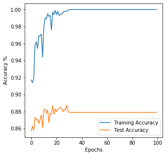


```python
# tester notre model par cross validation
model_4 = cl.ClassifierPerceptronKernel(x_train.shape[1]+1, xx[best_i, best_j], cl.KernelBias(), epochs=yy[best_i, best_j])

models = [model_4]

Resultats = ev.crossvalidation(models, [x_train, y_train], 10)


print("\n*****\nAffichage des résultats:")
for k in range(0,len(Resultats)):
    print("Classifieur ", k)
    print("\t(moyenne, std) pour apprentissage :", Resultats[k][0])
    print("\t(moyenne, std) pour test          :", Resultats[k][1])
```

    Il y a  1 classifieurs à comparer.
    
    *****
    Affichage des résultats:
    Classifieur  0
    	(moyenne, std) pour apprentissage : (0.9612939068100358, 0.005843525624917312)
    	(moyenne, std) pour test          : (0.8699999999999999, 0.051768716422179145)


```python
x_eval, _ = getcopy_dataframe("eval", normaliser=True)
eval(best, eval_set, x_eval, "resultat-perceptron_kernelbias-0.905accuracy.csv")
liste_models.append((f"Perceptron Kernel Bias lr={best.learning_rate}", best.accuracy(x_test, y_test)))
```

# model 5
### Decision tree , avec binarisation des images (model categoriel on-off) 

Adaptation du decision tree categoriel a notre probleme numerique en binarisant les pixels de l'image


```python
import graphviz as gv

x_train, y_train = getcopy_dataframe("train", categoriel=True)
x_test, y_test = getcopy_dataframe("test", categoriel=True)

labels = ["Pixel_"+i for i in train_set.columns[:-1]]

model_5 = ut.epsilon_linear_search(x_train, y_train, x_test, y_test, labels)
```

    Test epsilon :  0.0
    new best 0.872
    Test epsilon :  0.020202020202020204
    Test epsilon :  0.04040404040404041
    Test epsilon :  0.06060606060606061
    Test epsilon :  0.08080808080808081
    Test epsilon :  0.10101010101010102
    Test epsilon :  0.12121212121212122
    new best 0.879
    Test epsilon :  0.14141414141414144
    Test epsilon :  0.16161616161616163
    Test epsilon :  0.18181818181818182
    Test epsilon :  0.20202020202020204
    Test epsilon :  0.22222222222222224
    Test epsilon :  0.24242424242424243
    Test epsilon :  0.26262626262626265
    Test epsilon :  0.2828282828282829
    new best 0.88
    Test epsilon :  0.30303030303030304
    Test epsilon :  0.32323232323232326
    Test epsilon :  0.3434343434343435
    Test epsilon :  0.36363636363636365
    Test epsilon :  0.38383838383838387
    Test epsilon :  0.4040404040404041
    Test epsilon :  0.42424242424242425
    Test epsilon :  0.4444444444444445
    Test epsilon :  0.4646464646464647
    Test epsilon :  0.48484848484848486
    Test epsilon :  0.5050505050505051
    Test epsilon :  0.5252525252525253
    Test epsilon :  0.5454545454545455
    Test epsilon :  0.5656565656565657
    Test epsilon :  0.5858585858585859
    Test epsilon :  0.6060606060606061
    Test epsilon :  0.6262626262626263
    Test epsilon :  0.6464646464646465
    Test epsilon :  0.6666666666666667
    Test epsilon :  0.686868686868687
    Test epsilon :  0.7070707070707072
    Test epsilon :  0.7272727272727273
    Test epsilon :  0.7474747474747475
    Test epsilon :  0.7676767676767677
    Test epsilon :  0.787878787878788
    Test epsilon :  0.8080808080808082
    Test epsilon :  0.8282828282828284
    Test epsilon :  0.8484848484848485
    Test epsilon :  0.8686868686868687
    Test epsilon :  0.888888888888889
    Test epsilon :  0.9090909090909092
    Test epsilon :  0.9292929292929294
    Test epsilon :  0.9494949494949496
    Test epsilon :  0.9696969696969697
    Test epsilon :  0.98989898989899
    Test epsilon :  1.0101010101010102
    Test epsilon :  1.0303030303030305
    Test epsilon :  1.0505050505050506
    Test epsilon :  1.0707070707070707
    Test epsilon :  1.090909090909091
    Test epsilon :  1.1111111111111112
    Test epsilon :  1.1313131313131315
    Test epsilon :  1.1515151515151516
    Test epsilon :  1.1717171717171717
    Test epsilon :  1.191919191919192
    Test epsilon :  1.2121212121212122
    Test epsilon :  1.2323232323232325
    Test epsilon :  1.2525252525252526
    Test epsilon :  1.272727272727273
    Test epsilon :  1.292929292929293
    Test epsilon :  1.3131313131313131
    Test epsilon :  1.3333333333333335
    Test epsilon :  1.3535353535353536
    Test epsilon :  1.373737373737374
    Test epsilon :  1.393939393939394
    Test epsilon :  1.4141414141414144
    Test epsilon :  1.4343434343434345
    Test epsilon :  1.4545454545454546
    Test epsilon :  1.474747474747475
    Test epsilon :  1.494949494949495
    Test epsilon :  1.5151515151515154
    Test epsilon :  1.5353535353535355
    Test epsilon :  1.5555555555555556
    Test epsilon :  1.575757575757576
    Test epsilon :  1.595959595959596
    Test epsilon :  1.6161616161616164
    Test epsilon :  1.6363636363636365
    Test epsilon :  1.6565656565656568
    Test epsilon :  1.676767676767677
    Test epsilon :  1.696969696969697
    Test epsilon :  1.7171717171717173
    Test epsilon :  1.7373737373737375
    Test epsilon :  1.7575757575757578
    Test epsilon :  1.777777777777778
    Test epsilon :  1.7979797979797982
    Test epsilon :  1.8181818181818183
    Test epsilon :  1.8383838383838385
    Test epsilon :  1.8585858585858588
    Test epsilon :  1.878787878787879
    Test epsilon :  1.8989898989898992
    Test epsilon :  1.9191919191919193
    Test epsilon :  1.9393939393939394
    Test epsilon :  1.9595959595959598
    Test epsilon :  1.97979797979798
    Test epsilon :  2.0
    Best model eps = 0.2828282828282829, test accuracy : 0.88


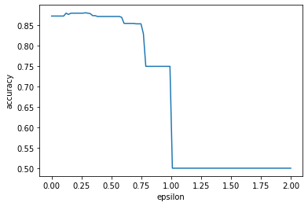


```python
# Construction de la représentation graphique (affichage)
graphe_arbre = gv.Digraph(format='png')
model_5.affiche(graphe_arbre)

# Affichage du graphe obtenu:
graphe_arbre.graph_attr.update(size="10,10")
graphe_arbre
```


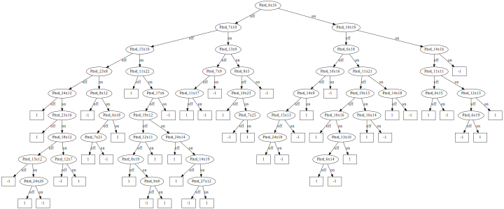


```python
x_eval, _ = getcopy_dataframe("eval", categoriel=True)
eval(model_5, eval_set, x_eval, "resultat-decision_tree-0.88accuracy.csv")
liste_models.append((f"Decision Tree eps={model_5.epsilon}", model_5.accuracy(x_test, y_test)))
```

# model 6

### Regression logistique
La difference de ce model par rapport au perceptron c'est la fonction d'erreur qu'il minimise (Entropie binaire croisé)
on utilise aussi la moyenne du gradient de la batch (pour lisser le mouvement du gradient).


```python
x_train, y_train = getcopy_dataframe("train", normaliser=True, proba=True)
x_test, y_test = getcopy_dataframe("test", normaliser=True, proba=True)
#print(f"y shape : {y_train.shape}")

accuracies =[]
best = None
best_accuracy = 0

best_i = 0
best_j = 0

input_size = x_train.shape[1]
# nous disposons de 2 parametres epoch, et lr

lr_space = np.linspace(0.01, 10, 50) #np.random.rand(50) * (10 - 0.1) 
epoch_space = np.arange(1, 101, 1)


xx, yy = np.meshgrid(lr_space, epoch_space)

z = np.zeros((100, 50))

print("shape : ", z.shape, xx.shape, yy.shape)
for j in range(50):
    
    #print(f"Learning rate {xx[0, j]}")

    logistic = cl.ClassifierLogistic(x_train.shape[1], alpha=xx[i, j], epochs=1, minibatch_size=64)
    
    for i in range(100):
        
        logistic.train(x_train, y_train)
        
        accuracy = logistic.accuracy(x_test, y_test)
        
        z[i, j] = accuracy
        
        
        if accuracy > best_accuracy:
            
            best_accuracy = accuracy
            best_i = i
            best_j = j
            best = logistic
            print(f"WOW a new best : {best_accuracy}, lr={xx[i, j]}, epochs={yy[i, j]}")
            
```

    shape :  (100, 50) (100, 50) (100, 50)
    WOW a new best : 0.874, lr=0.01, epochs=1
    WOW a new best : 0.88, lr=0.01, epochs=3
    WOW a new best : 0.889, lr=0.01, epochs=5
    WOW a new best : 0.895, lr=0.01, epochs=7
    WOW a new best : 0.899, lr=0.01, epochs=10
    WOW a new best : 0.9, lr=0.01, epochs=23
    WOW a new best : 0.902, lr=0.01, epochs=24
    WOW a new best : 0.903, lr=0.01, epochs=39
    WOW a new best : 0.906, lr=0.01, epochs=52
    WOW a new best : 0.907, lr=0.21387755102040817, epochs=2
    WOW a new best : 0.908, lr=0.21387755102040817, epochs=3
    WOW a new best : 0.911, lr=0.21387755102040817, epochs=4


    /media/mounib/Mounib  2Tb/stuff/study/3I026/Mnist-benchmark/iads/utils.py:352: RuntimeWarning: overflow encountered in exp
      A = 1./(1+np.exp(-Z))


```python
print(f"Accuracy Logistic lr={xx[best_i, best_j]} epoch={yy[best_i, best_j]}: {best_accuracy}")

fig = plt.figure(figsize=(10, 10))

ax = fig.gca(projection='3d')
ax.plot_surface(xx, yy, z, cmap=plt.get_cmap("viridis"))


ax.set_xlabel('learning_rate')
ax.set_ylabel('Epochs')
ax.set_zlabel('Test Accuracy')
#plt.show()
```

    Accuracy Logistic lr=0.21387755102040817 epoch=4: 0.911


    Text(0.5, 0, 'Test Accuracy')


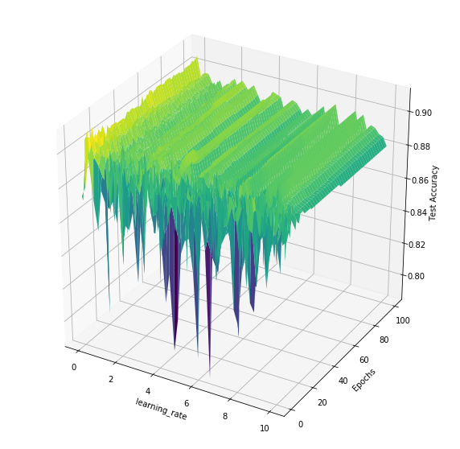


```python
logistic = cl.ClassifierLogistic(x_train.shape[1], alpha=xx[best_i, best_j], epochs=1, minibatch_size=64)
ut.accuracy_loss_over_epochs(logistic, x_train, y_train, x_test, y_test)
```


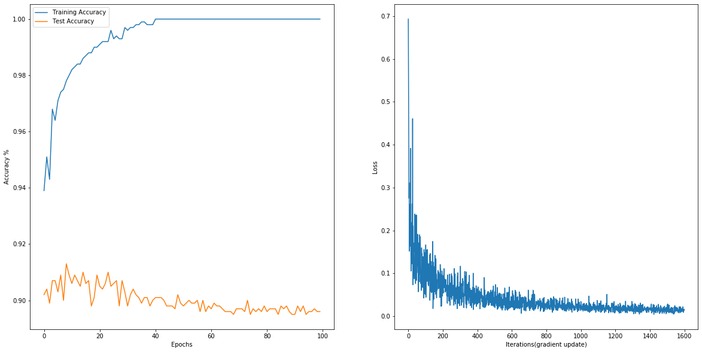


```python
x_train, y_train = getcopy_dataframe("train", normaliser=True, proba=True)
x_test, y_test = getcopy_dataframe("test", normaliser=True, proba=True)
best = cl.ClassifierLogistic(x_train.shape[1], alpha=0.213, epochs=4)
best.train(x_train, y_train)
best.accuracy(x_test, y_test)
```


    0.894


```python
x_eval, _ = getcopy_dataframe("eval", normaliser=True, proba=True)
eval(best, eval_set, x_eval, "resultat-Logistic-0.91accuracy.csv")
liste_models.append((f"Logistic lr=0.213", best.accuracy(x_test, y_test)))
```


```python

```


```python

```

## Model 7 
### Multilayer Neural net (2 hidden layers)

Ce model est un reseaux de neurone à 2 couches (activation ReLu pour casser la linéarité), et une derniere couche output Sigmoid (pour avoir des probabilité 0 et 1).

Plusieurs Methodes d'entrainement ont été utilisé: 

* Dropout(pour limiter l'overfitting, et permettre au reseaux de ne pas dependre sur quelque neurone seulments)
* RMSPROP, algorithme d'optimisation qui utilise les notions de minibatch(pour lisser le pas du gradient, en effectuant une moyenne sur la batch), et le momentum qui permet d'accélérer le training (il evite de faire des mouvement de gradient trés brusque en effectuant la moyenne sur les 10 derniers pas de gradient)
* Initialisation de Xavier (intialiser les poids à partir d'une distribution gaussienne et ayant comme variance sqrt(2/(in+out))), elle permet d'accelerer le training, en s'assurant que l'apprentissage soit equilibré sur les neurones et que les valeurs ne sont ni trop grande ni trop petite.


```python
x_train, y_train = getcopy_dataframe("train", normaliser=True, proba=True)
x_test, y_test = getcopy_dataframe("test", normaliser=True, proba=True)
#print(f"y shape : {y_train.shape}")


accuracies =[]
best = None
best_accuracy = 0

best_i = 0
best_j = 0

input_size = x_train.shape[1]
# nous disposons de 2 parametres epoch, et lr

hidden1 = np.linspace(150, 320, 5)
hidden2 = np.linspace(80, 130, 5)


xx, yy = np.meshgrid(hidden1, hidden2)

z = np.zeros((5, 5))

print("shape : ", z.shape, xx.shape, yy.shape)

for i in range(5):
    for j in range(5):
        
        print(f"Hidden 1 {int(xx[i, j])}, Hidden 2 {int(yy[i, j])}")
        
        mlp = cl.ClassifierMLP(x_train.shape[1], n_hidden1=int(xx[i, j]), n_hidden2=int(yy[i, j]), alpha=0.01, epochs=150, minibatch_size=32, keep_prob=0.4, beta=0.9)
        mlp.train(x_train, y_train, x_test, y_test)
        
        mlp.load_best()
        accuracy = mlp.accuracy(x_test, y_test)
        
        z[i, j] = accuracy
        
        if accuracy > best_accuracy:
            
            best_accuracy = accuracy
            best_i = i
            best_j = j
            #best = perceptron
            print(f"WOW a new best : {best_accuracy}, hidden1={int(xx[i, j])}, hidden2={int(yy[i, j])}")
            

# mlp = cl.ClassifierMLP(x_train.shape[1], n_hidden1=300, n_hidden2=100, alpha=0.01, epochs=500, minibatch_size=32, keep_prob=0.4, beta=0.9)
# losses = mlp.train(x_train, y_train, x_test, y_test, print_every=200)
# print(f"Accuracy = {mlp.accuracy(x_test, y_test)}")
# plt.plot(losses)                            
```

    shape :  (5, 5) (5, 5) (5, 5)
    Hidden 1 150, Hidden 2 80
    WOW a new best : 0.933, hidden1=150, hidden2=80
    Hidden 1 192, Hidden 2 80
    Hidden 1 235, Hidden 2 80
    Hidden 1 277, Hidden 2 80
    Hidden 1 320, Hidden 2 80
    WOW a new best : 0.938, hidden1=320, hidden2=80
    Hidden 1 150, Hidden 2 92
    Hidden 1 192, Hidden 2 92
    Hidden 1 235, Hidden 2 92
    Hidden 1 277, Hidden 2 92
    Hidden 1 320, Hidden 2 92
    WOW a new best : 0.943, hidden1=320, hidden2=92
    Hidden 1 150, Hidden 2 105
    Hidden 1 192, Hidden 2 105
    Hidden 1 235, Hidden 2 105
    Hidden 1 277, Hidden 2 105
    Hidden 1 320, Hidden 2 105
    Hidden 1 150, Hidden 2 117
    Hidden 1 192, Hidden 2 117
    Hidden 1 235, Hidden 2 117
    Hidden 1 277, Hidden 2 117
    Hidden 1 320, Hidden 2 117
    Hidden 1 150, Hidden 2 130
    Hidden 1 192, Hidden 2 130
    Hidden 1 235, Hidden 2 130
    Hidden 1 277, Hidden 2 130
    Hidden 1 320, Hidden 2 130


```python
print(f"Accuracy MLP hidden1={xx[best_i, best_j]} hidden2={yy[best_i, best_j]}: {best_accuracy}")

fig = plt.figure(figsize=(10, 10))

ax = fig.gca(projection='3d')
ax.plot_surface(xx, yy, z, cmap=plt.get_cmap("viridis"))


ax.set_xlabel('Hidden 1')
ax.set_ylabel('Hidden 2')
ax.set_zlabel('Test Accuracy')
#plt.show()
```

    Accuracy MLP hidden1=320.0 hidden2=92.5: 0.943


    Text(0.5, 0, 'Test Accuracy')


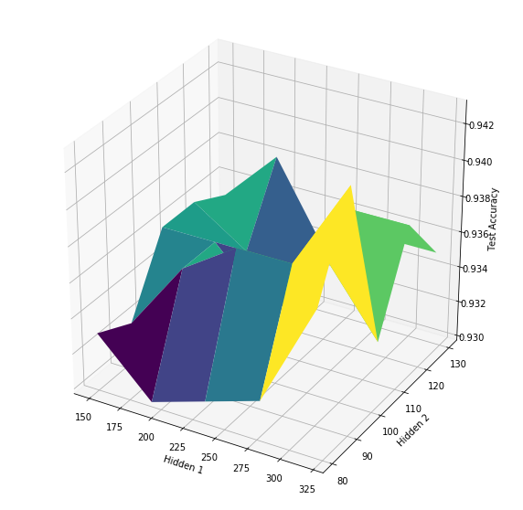


```python
mlp = cl.ClassifierMLP(x_train.shape[1], n_hidden1=300, n_hidden2=100, alpha=0.01, epochs=1, minibatch_size=32, keep_prob=0.6, beta=0.9)
#mlp.train(x_train, y_train, x_test, y_test)
ut.accuracy_loss_over_epochs(mlp, x_train, y_train, x_test, y_test, epochs=200)
```


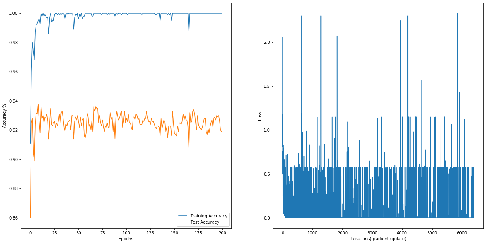


```python
mlp = cl.ClassifierMLP(x_train.shape[1], n_hidden1=300, n_hidden2=100, alpha=0.01, epochs=200, minibatch_size=64, keep_prob=0.6, beta=0.9)
mlp.train(x_train, y_train, x_test, y_test)
```


```python
mlp.load_best()
print(f"Mlp accuracy = {mlp.accuracy(x_test, y_test)}")
```

    Mlp accuracy = 0.947


```python
#Visualisation des poids appris
fig, axes = plt.subplots(nrows=4, ncols=5, figsize=(15, 15))

for i, ax in enumerate(axes.flat, start=1):
    ax.set_title(f"W {i}")
    ax.imshow(mlp.w1[:, i-1].reshape(28, 28))
    
fig.tight_layout()
fig.suptitle("Feature map de la premiere layer")
plt.show()
```


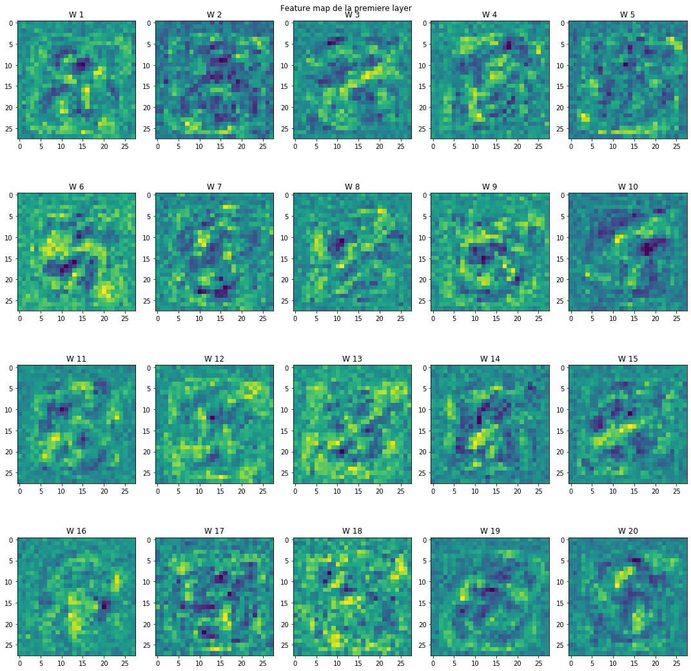


```python
x_eval, _ = getcopy_dataframe("eval", normaliser=True, proba=True)
eval(mlp, eval_set, x_eval, "resultat-MLP-0.947accuracy.csv")
liste_models.append((f"Mlp lr=0.01", mlp.accuracy(x_test, y_test)))
```

    /media/mounib/Mounib  2Tb/stuff/study/3I026/Mnist-benchmark/iads/utils.py:352: RuntimeWarning: overflow encountered in exp
      A = 1./(1+np.exp(-Z))


# Methode d'ensemble
entrainer plusieurs models sur des echantillions different du train set, et predire en votant les models

# model 8 

### Bagging Arbre de decisions (toujours en binarisant les images)


```python
x_train, y_train = getcopy_dataframe("train", categoriel=True)
x_test, y_test = getcopy_dataframe("test", categoriel=True)

nb_models = 10

accuracies = []
best = None
best_accuracy = 0
best_eps = 0

eps_space = np.linspace(0, 0.5, 10)

for eps in eps_space:
    print("Test epsilon : ", eps)


    models = [cl.ClassifierArbreDecision(x_train.shape[1], eps, labels) for i in  range(nb_models)]
    # varier epsilon et keep_percent
    tree_bag = cl.ClassifierBag(models, keep_percent=0.7)
    #train
    tree_bag.train(x_train, y_train)
    #test
    accuracy = tree_bag.accuracy(x_test, y_test)

    accuracies.append(accuracy)

    if accuracy > best_accuracy:
        print(f"new best {accuracy}")
        best_accuracy = accuracy
        best = tree_bag
        best_eps = eps

print(f"Best model eps = {best_eps}, test accuracy : {best_accuracy}")
plt.plot(eps_space, accuracies)
plt.xlabel("epsilon")
plt.ylabel("accuracy")
plt.show()
```

    Test epsilon :  0.0
    Training model 0
    Training model 1
    Training model 2
    Training model 3
    Training model 4
    Training model 5
    Training model 6
    Training model 7
    Training model 8
    Training model 9
    new best 0.909
    Test epsilon :  0.05555555555555555
    Training model 0
    Training model 1
    Training model 2
    Training model 3
    Training model 4
    Training model 5
    Training model 6
    Training model 7
    Training model 8
    Training model 9
    Test epsilon :  0.1111111111111111
    Training model 0
    Training model 1
    Training model 2
    Training model 3
    Training model 4
    Training model 5
    Training model 6
    Training model 7
    Training model 8
    Training model 9
    new best 0.912
    Test epsilon :  0.16666666666666666
    Training model 0
    Training model 1
    Training model 2
    Training model 3
    Training model 4
    Training model 5
    Training model 6
    Training model 7
    Training model 8
    Training model 9
    Test epsilon :  0.2222222222222222
    Training model 0
    Training model 1
    Training model 2
    Training model 3
    Training model 4
    Training model 5
    Training model 6
    Training model 7
    Training model 8
    Training model 9
    Test epsilon :  0.2777777777777778
    Training model 0
    Training model 1
    Training model 2
    Training model 3
    Training model 4
    Training model 5
    Training model 6
    Training model 7
    Training model 8
    Training model 9
    Test epsilon :  0.3333333333333333
    Training model 0
    Training model 1
    Training model 2
    Training model 3
    Training model 4
    Training model 5
    Training model 6
    Training model 7
    Training model 8
    Training model 9
    Test epsilon :  0.38888888888888884
    Training model 0
    Training model 1
    Training model 2
    Training model 3
    Training model 4
    Training model 5
    Training model 6
    Training model 7
    Training model 8
    Training model 9
    Test epsilon :  0.4444444444444444
    Training model 0
    Training model 1
    Training model 2
    Training model 3
    Training model 4
    Training model 5
    Training model 6
    Training model 7
    Training model 8
    Training model 9
    Test epsilon :  0.5
    Training model 0
    Training model 1
    Training model 2
    Training model 3
    Training model 4
    Training model 5
    Training model 6
    Training model 7
    Training model 8
    Training model 9
    Best model eps = 0.1111111111111111, test accuracy : 0.912


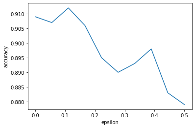


```python
x_eval, _ = getcopy_dataframe("eval", categoriel=True)
eval(best, eval_set, x_eval, "resultat-decision_tree_bagging-0.912accuracy.csv")
liste_models.append(("Bag 10 decision trees", best.accuracy(x_test, y_test)))
```

## Model 7 
### Bagging KNN


```python
x_train, y_train = getcopy_dataframe("train", normaliser=True)
x_test, y_test = getcopy_dataframe("test", normaliser=True)

nb_models = 10

accuracies = []
best = None
best_accuracy = 0
best_k = 0

k_space = np.arange(0, 21, 1)

for k in k_space:
    print("Test k: ", k)


    models = [cl.ClassifierKNN(x.shape[1], k) for i in  range(nb_models)]
    # varier k et keep_percent
    knn_bag = cl.ClassifierBag(models, keep_percent=0.7)
    #train
    knn_bag.train(x_train, y_train)
    #test
    accuracy = knn_bag.accuracy(x_test, y_test)

    accuracies.append(accuracy)

    if accuracy > best_accuracy:
        print(f"new best {accuracy}")
        best_accuracy = accuracy
        best = knn_bag
        best_k = k
```

    Test k:  0
    Training model 0
    Training model 1
    Training model 2
    Training model 3
    Training model 4
    Training model 5
    Training model 6
    Training model 7
    Training model 8
    Training model 9
    new best 0.5
    Test k:  1
    Training model 0
    Training model 1
    Training model 2
    Training model 3
    Training model 4
    Training model 5
    Training model 6
    Training model 7
    Training model 8
    Training model 9
    new best 0.922
    Test k:  2
    Training model 0
    Training model 1
    Training model 2
    Training model 3
    Training model 4
    Training model 5
    Training model 6
    Training model 7
    Training model 8
    Training model 9
    Test k:  3
    Training model 0
    Training model 1
    Training model 2
    Training model 3
    Training model 4
    Training model 5
    Training model 6
    Training model 7
    Training model 8
    Training model 9
    new best 0.93
    Test k:  4
    Training model 0
    Training model 1
    Training model 2
    Training model 3
    Training model 4
    Training model 5
    Training model 6
    Training model 7
    Training model 8
    Training model 9
    Test k:  5
    Training model 0
    Training model 1
    Training model 2
    Training model 3
    Training model 4
    Training model 5
    Training model 6
    Training model 7
    Training model 8
    Training model 9
    Test k:  6
    Training model 0
    Training model 1
    Training model 2
    Training model 3
    Training model 4
    Training model 5
    Training model 6
    Training model 7
    Training model 8
    Training model 9
    Test k:  7
    Training model 0
    Training model 1
    Training model 2
    Training model 3
    Training model 4
    Training model 5
    Training model 6
    Training model 7
    Training model 8
    Training model 9
    new best 0.931
    Test k:  8
    Training model 0
    Training model 1
    Training model 2
    Training model 3
    Training model 4
    Training model 5
    Training model 6
    Training model 7
    Training model 8
    Training model 9
    Test k:  9
    Training model 0
    Training model 1
    Training model 2
    Training model 3
    Training model 4
    Training model 5
    Training model 6
    Training model 7
    Training model 8
    Training model 9
    Test k:  10
    Training model 0
    Training model 1
    Training model 2
    Training model 3
    Training model 4
    Training model 5
    Training model 6
    Training model 7
    Training model 8
    Training model 9
    Test k:  11
    Training model 0
    Training model 1
    Training model 2
    Training model 3
    Training model 4
    Training model 5
    Training model 6
    Training model 7
    Training model 8
    Training model 9
    Test k:  12
    Training model 0
    Training model 1
    Training model 2
    Training model 3
    Training model 4
    Training model 5
    Training model 6
    Training model 7
    Training model 8
    Training model 9
    Test k:  13
    Training model 0
    Training model 1
    Training model 2
    Training model 3
    Training model 4
    Training model 5
    Training model 6
    Training model 7
    Training model 8
    Training model 9
    Test k:  14
    Training model 0
    Training model 1
    Training model 2
    Training model 3
    Training model 4
    Training model 5
    Training model 6
    Training model 7
    Training model 8
    Training model 9
    Test k:  15
    Training model 0
    Training model 1
    Training model 2
    Training model 3
    Training model 4
    Training model 5
    Training model 6
    Training model 7
    Training model 8
    Training model 9
    Test k:  16
    Training model 0
    Training model 1
    Training model 2
    Training model 3
    Training model 4
    Training model 5
    Training model 6
    Training model 7
    Training model 8
    Training model 9
    Test k:  17
    Training model 0
    Training model 1
    Training model 2
    Training model 3
    Training model 4
    Training model 5
    Training model 6
    Training model 7
    Training model 8
    Training model 9
    Test k:  18
    Training model 0
    Training model 1
    Training model 2
    Training model 3
    Training model 4
    Training model 5
    Training model 6
    Training model 7
    Training model 8
    Training model 9
    Test k:  19
    Training model 0
    Training model 1
    Training model 2
    Training model 3
    Training model 4
    Training model 5
    Training model 6
    Training model 7
    Training model 8
    Training model 9
    Test k:  20
    Training model 0
    Training model 1
    Training model 2
    Training model 3
    Training model 4
    Training model 5
    Training model 6
    Training model 7
    Training model 8
    Training model 9


```python
print(f"Best model k = {best_k}, test accuracy : {best_accuracy}")
plt.plot(k_space, accuracies)
plt.xlabel("K")
plt.ylabel("accuracy")
plt.show()
```

    Best model k = 7, test accuracy : 0.931


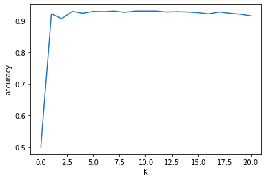


```python
x_eval, _ = getcopy_dataframe("eval", normaliser=True)
eval(best, eval_set, x_eval, "resultat-knn_bagging-0.931accuracy.csv")

liste_models.append((f"KNN bag k={best_k}", best.accuracy(x_test, y_test)))
```

# Conclusion


```python
liste_models_sorted = sorted(liste_models, key=lambda tup: tup[1]) # trier les models par accuracy
```


```python
liste_models_sorted
```


    [('Decision Tree eps=0.282828', 0.88),
     ('Perceptron lr=10.3078787', 0.905),
     ('Perceptron Kernel Bias lr=16.97121', 0.908),
     ('Logistic lr=0.213', 0.911),
     ('Bag 10 decision trees', 0.912),
     ('KNN bag k=7', 0.931),
     ('K-NN PCA=20 k=3', 0.939),
     ('Mlp lr=0.01', 0.947),
     ('K-NN k=4', 0.948)]


```python
xlabel, ylabel = zip(*liste_models_sorted)

ylabel_scaled = np.exp(np.exp(np.array(ylabel))) # pour montrer la difference on change l'echelle


cmap = plt.cm.tab10
colors = cmap(np.arange(len(xlabel)) % cmap.N)


plt.figure(figsize=(10, 10))

ax = plt.subplot(111)
ax.barh(xlabel, ylabel_scaled, color=colors)
ax.set_yticklabels(xlabel, rotation=45)
ax.set_xticklabels(ylabel)
ax.set_xlabel("Accuracy")
ax.set_ylabel("Nom du model")
ax.set_xlim(6)

for i, v in enumerate(ylabel_scaled):
    ax.text(v, i, '{:.2f}'.format(ylabel[i]*100)+"%", color='blue', fontweight='bold')
```


# Multiclass (optionel)

## Chargement des données


```python
# lecture des fichiers csv
train_set = pd.read_csv("data_multi/train_multi.csv", sep=';', header=None)
test_set = pd.read_csv("data_multi/test_multi.csv", sep=';', header=None)
eval_set = pd.read_csv("data_multi/eval_multi.csv", sep=';', header=None)

# fichier contenant les noms des columns
names = pd.read_csv("data_multi/names.csv", sep=';')

# ajout des labels de column au sets
train_set.columns = names.columns
test_set.columns = names.columns
eval_set.columns = names.columns
# creation d'index pour optimisation
train_set.set_index("ident", inplace=True);
test_set.set_index("ident", inplace=True);
eval_set.set_index("ident", inplace=True);

# variable utile plustard
mean_train = train_set.iloc[:, :-1].mean(axis=0).values.reshape(1, -1)
var_train  = train_set.iloc[:, :-1].var(axis=0).values.reshape(1, -1) + 1e-8
x_normal = (train_set.iloc[:, :-1].values - mean_train) / np.sqrt(var_train)
liste_models = [] # contiendra des tuple ("nom model", "accuray test")
```


```python
def getcopy_dataframe(dataset="train", categoriel=False, normaliser=False, pca=0, proba=False):
    """
        retourner une copie des data_frame
        
        @param dataset ["train", "test", "eval"]
        @param categoriel Binariser les images de [0 - 255] => ["on", "off"]
        @param normaliser Centrer les image en 0, et la variance à 1
        @param proba label 0 ou 1
        @param pca Projection dans une dimension inferieur
    """
    
    data = train_set if dataset == "train" else (test_set if dataset == "test" else eval_set)
    

    
    
    if categoriel: 
        
            # copie de Données brut 
        x, y = data.iloc[:, :-1].copy(), data["label"].copy()
        
        x = x.astype(str)

        x[x != "0"] = "on"
        x[x == "0"] = "off"

        x = x.values
        y = y.values

        return x, y
    
    if normaliser == True:
        
        d = ut.one_hot_encode(data, "label")
        x, y =  d.iloc[:, :784], d.iloc[:, 784:]
        # on normalise en utilisant la moyenne et la variance du train set
        x = x.values
        y = y.values
        
        
        #print(mean_train.shape, var_train.shape, x.shape)
        
        x = (x - mean_train)/np.sqrt(var_train)

        if proba == False:
            #print(f"proba {y.shape}")
            y[y == 0] = -1
            y = y.reshape(-1, 10)
            
        if pca > 0:
            
            pca_train = decomposition.PCA(pca)
            pca_train.fit(x_normal)
            
            x = pca_train.transform(x)
            
            return x, y, pca_train.components_
        
        return x, y
    
    x, y = data.iloc[:, :-1].copy(), data["label"].copy()
    return x.values, y.values
  
```


```python
def eval(model, eval_df, x_transformed, filename="resultats.csv"):
    """
        Evaluer un model et produire un fichier csv.
    """
    
    out = eval_df[["label"]].copy()
    
    labels = model.predict(x_transformed)
    
    #labels[labels == 0] = -1 # le cas echeant
    #print(type(labels))
    out["label"] = labels.astype(int)
    #print(out.head())
    out.to_csv(filename, sep=';')
#afficher les 25 premieres images
```


```python
def plot_images(nrows=10, ncols=10, title="title"):
    """
        creer une figure contenant rows / cols subplots
        affichant les images et leurs labels
    """
    
    fig, axes = plt.subplots(10, 20, True, True, figsize=(20, 10))
    fig.subplots_adjust(hspace=0, wspace=0)
                             
                    
    
    for k in range(10):
        ### iamges 
        positive = train_set[train_set["label"] == k].sample(frac=1)
        #plot_images(positive.iloc[:10], 1, 10, f"{i} samples")

        #fig.suptitle(title, fontsize=16)
        # pour chaque lignes
        for j in range(20):
            #for j in range(ncols):

            current_image = positive.iloc[j]

            label = current_image[-1]
            image = current_image[:-1].values.reshape(28, 28)

            #ax = plt.subplot(nrows, ncols, k*ncols + j + 1)

            #axes[k, j].set_title(label)
            axes[k, j].axis("off")
            axes[k, j].set_xticks([])
            axes[k, j].set_yticks([])
            axes[k, j].imshow(image, cmap="gray")
            
            

plot_images(title="Sample dataset")
```


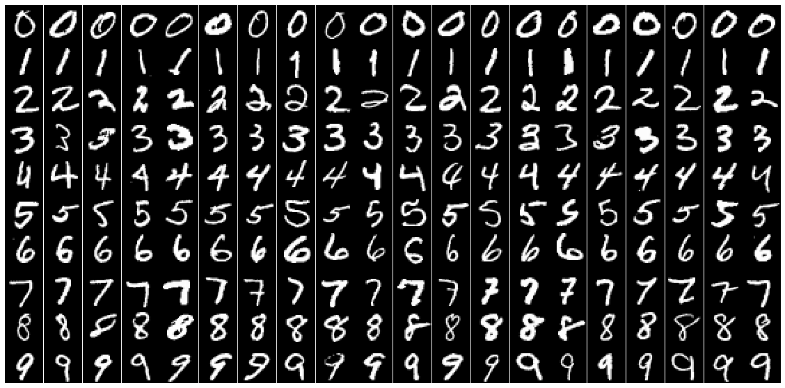


## Visualisation


```python
x, y, pca = getcopy_dataframe("train", normaliser=True, pca=50)
fig, axes = plt.subplots(nrows=6, ncols=6, figsize=(20, 20))

for i, ax in enumerate(axes.flat, start=1):
    ax.set_title(f"Top Eigenvector {i}")
    ax.imshow(pca[i-1, :].reshape(28, 28))
    
fig.tight_layout()
plt.show()
```

    ['label_0', 'label_1', 'label_2', 'label_3', 'label_4', 'label_5', 'label_6', 'label_7', 'label_8', 'label_9']


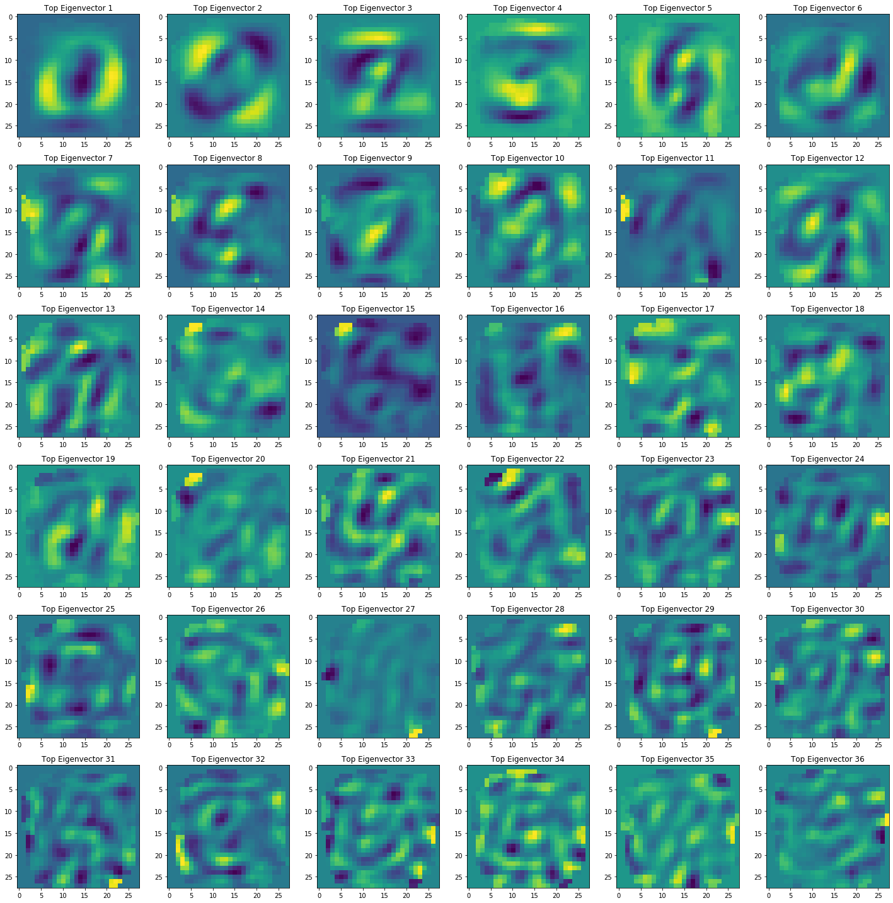


```python
x, y, pca = getcopy_dataframe("train", normaliser=True, pca=2)

cmap = plt.cm.tab10
colors = cmap(np.arange(10) % cmap.N)

xs = x[:, 0]
ys = x[:, 1]

scalex = 1.0/(xs.max() - xs.min())
scaley = 1.0/(ys.max() - ys.min())

fig = plt.figure(figsize=(10, 10))

plt.scatter(xs*scalex, ys*scaley, c=colors[np.argmax(y, axis=1)])
plt.show()
```

    ['label_0', 'label_1', 'label_2', 'label_3', 'label_4', 'label_5', 'label_6', 'label_7', 'label_8', 'label_9']


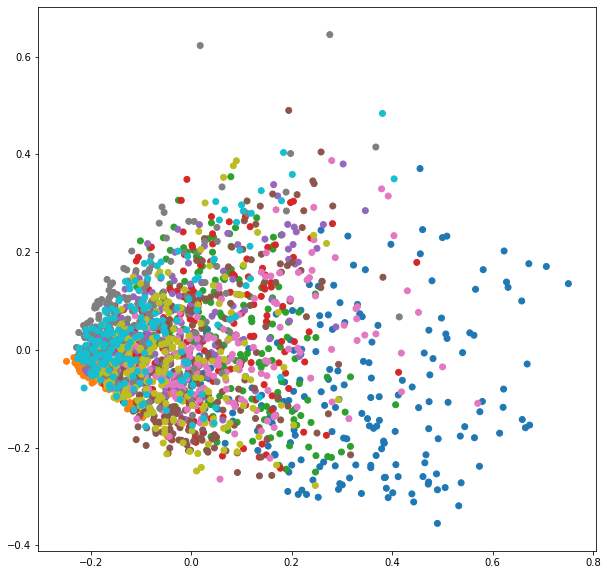


# Model 1 (Decision tree, toujours en utilisant des images binairisé)


```python
import graphviz as gv

x_train, y_train = getcopy_dataframe("train", categoriel=True)
x_test, y_test = getcopy_dataframe("test", categoriel=True)

labels = ["Pixel_"+i for i in train_set.columns[:784]]

#model_5 = ut.epsilon_linear_search(x_train, y_train, x_test, y_test, labels)
model_arbre = cl.ClassifierArbreDecision(x_train.shape[1], 0.21, labels)
model_arbre.train(x_train, y_train)
print("Accuracy = ", model_arbre.accuracy(x_test, y_test))


# Construction de la représentation graphique (affichage)
graphe_arbre = gv.Digraph(format='png')
model_arbre.affiche(graphe_arbre)

# Affichage du graphe obtenu:
graphe_arbre.graph_attr.update(size="10,10")
graphe_arbre


```

    Accuracy =  0.8795


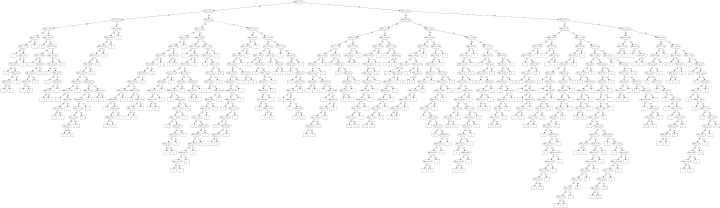


```python
x_eval, _ = getcopy_dataframe("eval", categoriel=True)
eval(model_arbre, eval_set, x_eval, "resultat_multi/resultat-decision_tree-0.87accuracy.csv")
liste_models.append((f"Decision Tree eps={0.21}", model_arbre.accuracy(x_test, y_test)))
```

# Model 2 (MLP )


```python
from iads import Classifiers as cl
x_train, y_train = getcopy_dataframe("train", normaliser=True, proba=True)
x_test, y_test = getcopy_dataframe("test", normaliser=True, proba=True)
#print(f"y shape : {y_train.shape}")
mlp = cl.ClassifierMLP(x_train.shape[1], n_hidden1=300, n_hidden2=100, alpha=0.01, epochs=150, minibatch_size=128, keep_prob=0.6, beta=0.9, output=10)
losses = mlp.train(x_train, y_train, x_test, y_test)
#plt.plot(losses)
mlp.load_best()
```

    ['label_0', 'label_1', 'label_2', 'label_3', 'label_4', 'label_5', 'label_6', 'label_7', 'label_8', 'label_9']
    ['label_0', 'label_1', 'label_2', 'label_3', 'label_4', 'label_5', 'label_6', 'label_7', 'label_8', 'label_9']
    New accuracy : 0.3065
    New accuracy : 0.5055
    New accuracy : 0.602
    New accuracy : 0.6315
    New accuracy : 0.7275
    New accuracy : 0.8
    New accuracy : 0.8175
    New accuracy : 0.8255
    New accuracy : 0.8425
    New accuracy : 0.8475
    New accuracy : 0.8495
    New accuracy : 0.8515
    New accuracy : 0.852
    New accuracy : 0.8625
    New accuracy : 0.871
    New accuracy : 0.877
    New accuracy : 0.8875
    New accuracy : 0.888
    New accuracy : 0.89
    New accuracy : 0.891
    New accuracy : 0.895
    New accuracy : 0.8955
    New accuracy : 0.8965
    New accuracy : 0.899
    New accuracy : 0.8995
    New accuracy : 0.902
    New accuracy : 0.9045
    New accuracy : 0.9065
    New accuracy : 0.907
    New accuracy : 0.908
    New accuracy : 0.9085
    New accuracy : 0.91
    New accuracy : 0.9105
    New accuracy : 0.9115
    New accuracy : 0.9145


```python
x_eval, _ = getcopy_dataframe("eval", normaliser=True, proba=True)
eval(mlp, eval_set, x_eval, "resultat_multi/resultat-MLP-0.914accuracy.csv")
liste_models.append((f"Mlp lr=0.01", mlp.accuracy(x_test, y_test)))
```

    ['label_0']


```python
#x_test, _ = getcopy_dataframe("test", normaliser=True, proba=True)
y_predicted = mlp.predict(x_test)
empty = np.zeros((28, 28))
y_real = np.argmax(y_test, axis=1)

x_test, _ = getcopy_dataframe("test")


## Construire une matrice vide
confusion_matrix = np.zeros((10, 10))
confusion_matrix_figure, axes = plt.subplots(10, 10, sharex=True,sharey=True, figsize=(20, 20))

confusion_matrix_figure.suptitle("Matrice de Confusion")
confusion_matrix_figure.subplots_adjust(hspace=0, wspace=0)

confusion_matrix_figure.text(0.5, 0.04, 'Actual label', ha='center')
confusion_matrix_figure.text(0.04, 0.5, 'Predicted', va='center', rotation='vertical')

for i in range(10):
    
    predicted_i_indices = (y_predicted == i)
    out = y_real[predicted_i_indices]
    elements, count = np.unique(out, return_counts=True)
    
    
    for element, c in zip(elements, count):
        confusion_matrix[i, element] = c
        
        #exemple of each to draw in the confusion figure
        mask = predicted_i_indices * (y_real==element)
        im = x_test[mask, :]

        axes[i, element].set_xticks([])
        axes[i, element].set_yticks([])
        if(len(im) > 0):
            axes[i, element].imshow(im[0, :].reshape(28, 28), cmap="gray")
        else:
            axes[i, element].imshow(empty, cmap="gray")
  
```

    ['label_0', 'label_1', 'label_2', 'label_3', 'label_4', 'label_5', 'label_6', 'label_7', 'label_8', 'label_9']


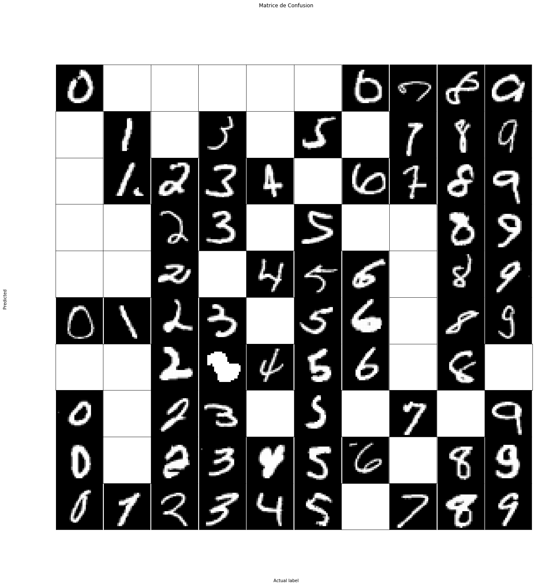


```python
          
import seaborn as sns            
plt.show()
midpoint = (confusion_matrix.max() - confusion_matrix.min()) / 2
plt.figure(figsize=(20, 20))
ax = sns.heatmap(confusion_matrix, cmap="coolwarm", annot_kws={'size':14}, fmt=".1f", center=midpoint, annot=True, square=True)
bottom, top = ax.get_ylim()
ax.set_ylim(bottom + 0.5, top - 0.5)
plt.show()
```


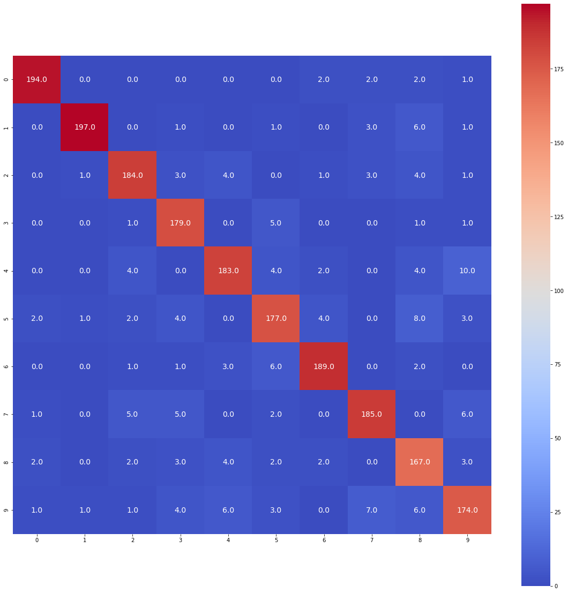


# Conclusion


```python
liste_models_sorted = sorted(liste_models, key=lambda tup: tup[1]) # trier les models par accuracy

liste_models_sorted

xlabel, ylabel = zip(*liste_models_sorted)

ylabel_scaled = np.exp(np.exp(np.array(ylabel))) # pour montrer la difference on change l'echelle


cmap = plt.cm.tab10
colors = cmap(np.arange(len(xlabel)) % cmap.N)


plt.figure(figsize=(10, 10))

ax = plt.subplot(111)
ax.barh(xlabel, ylabel_scaled, color=colors)
ax.set_yticklabels(xlabel, rotation=45)
ax.set_xticklabels(ylabel)
ax.set_xlabel("Accuracy")
ax.set_ylabel("Nom du model")
ax.set_xlim(6)

for i, v in enumerate(ylabel_scaled):
    ax.text(v, i, '{:.2f}'.format(ylabel[i]*100)+"%", color='blue', fontweight='bold')
```


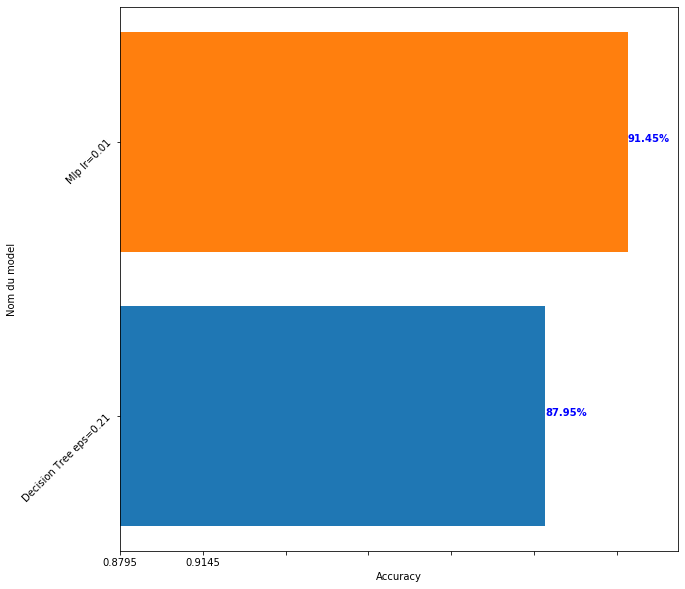


```python

```
