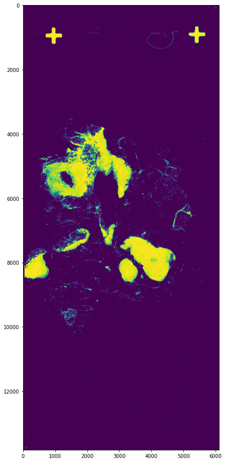
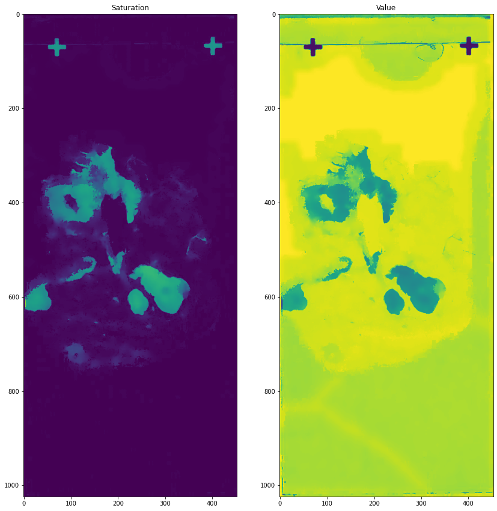
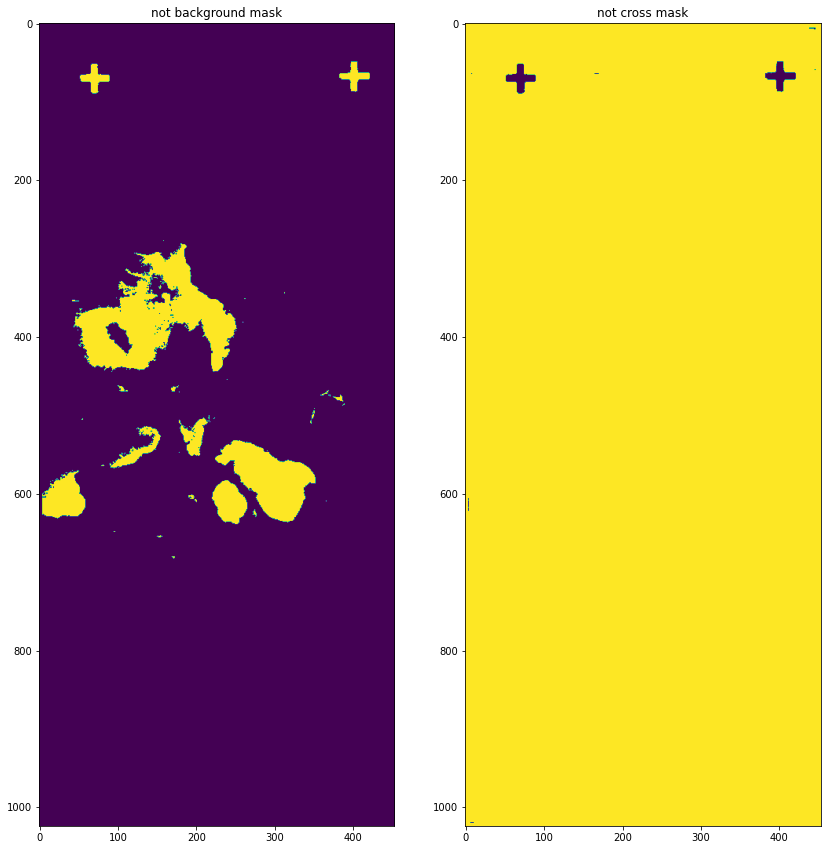
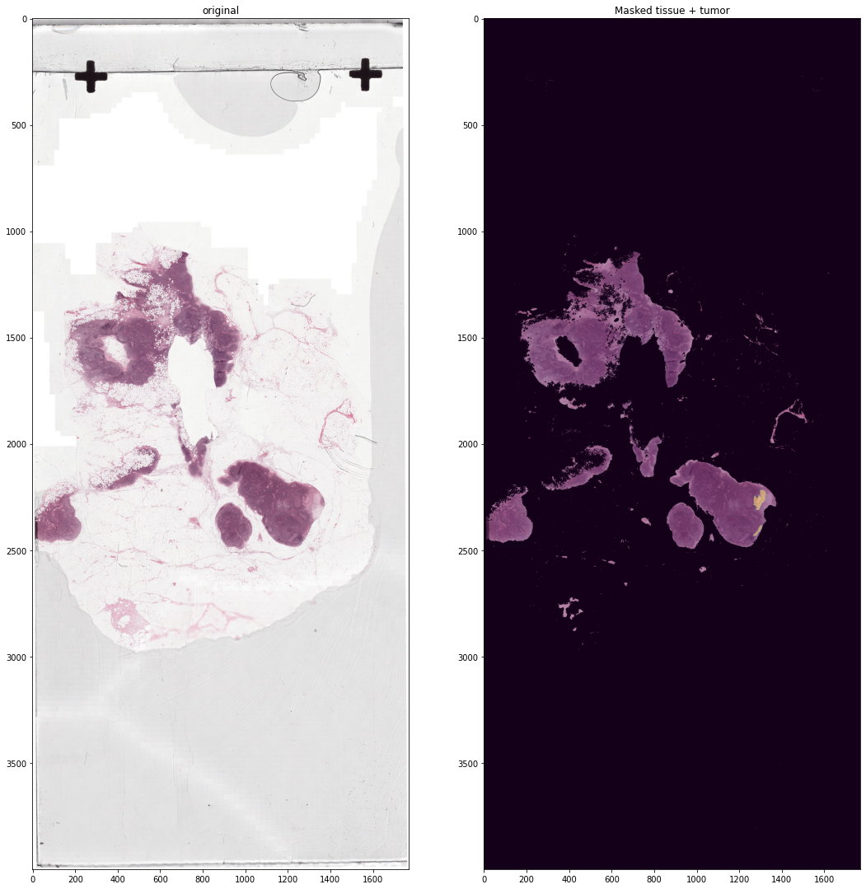
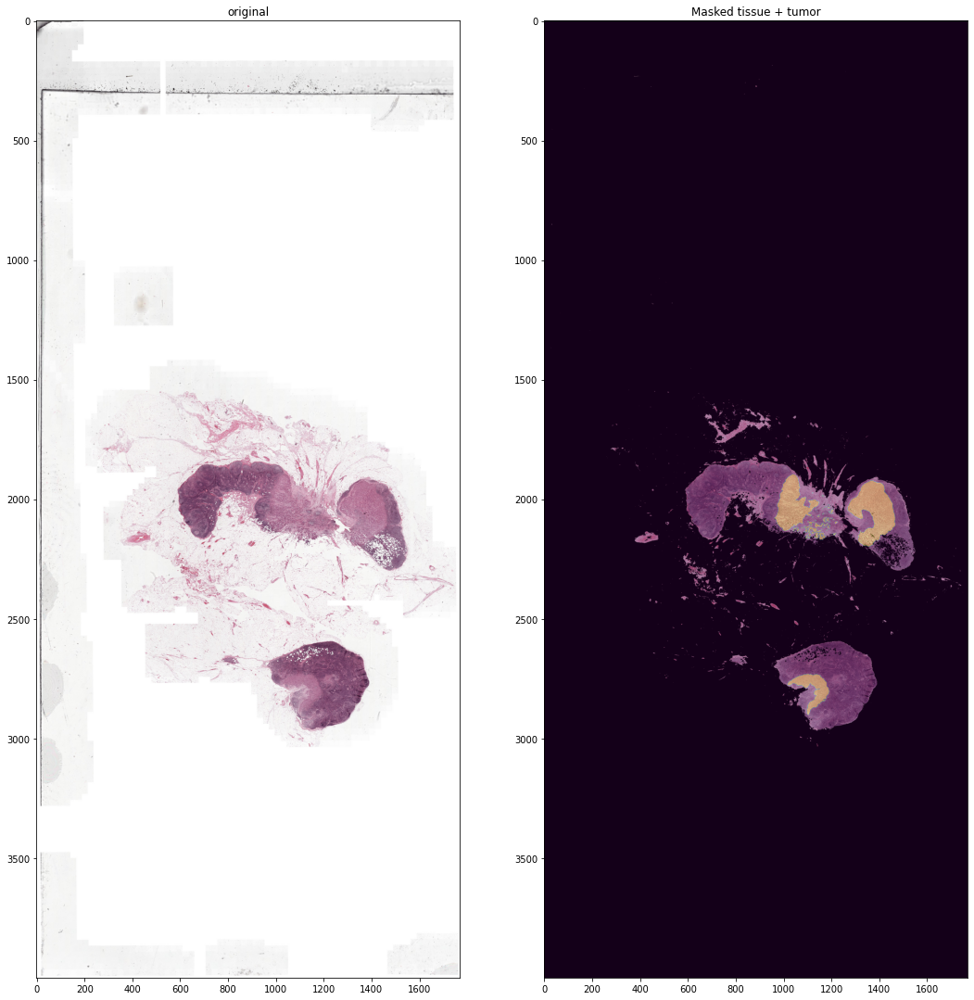
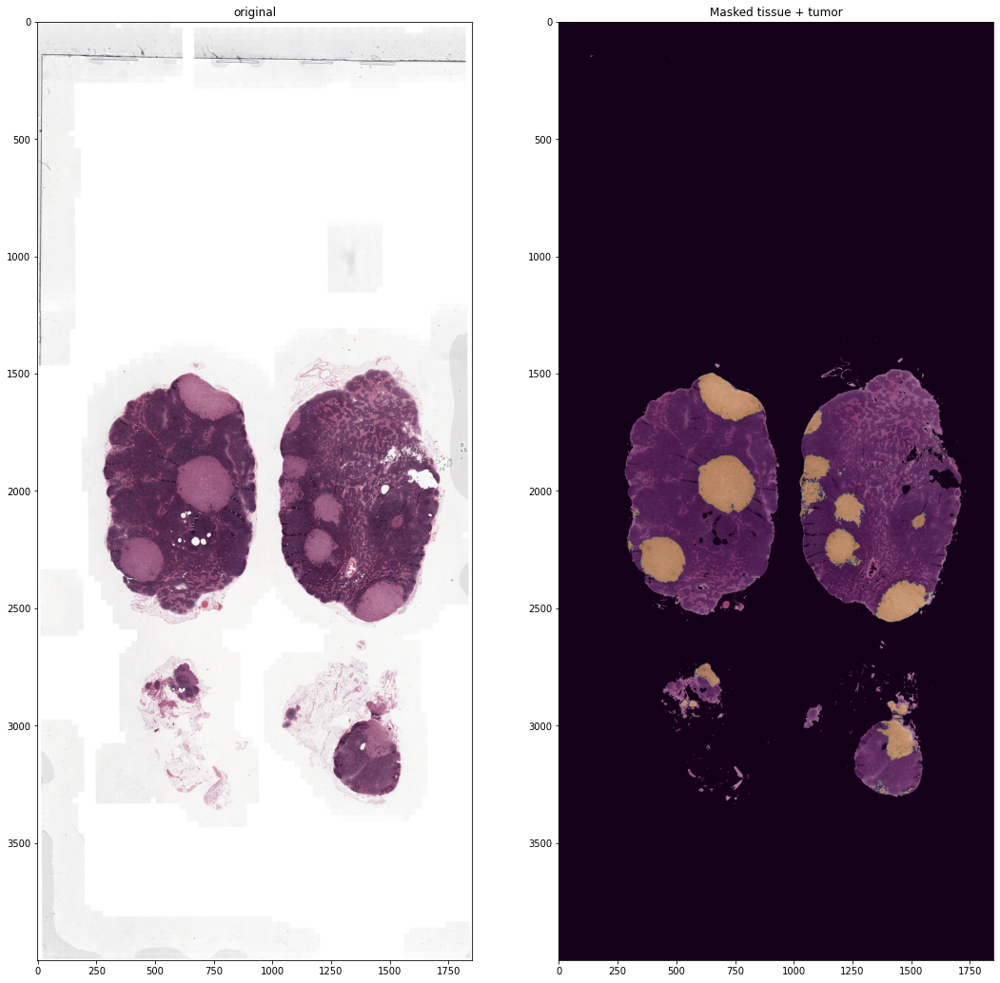
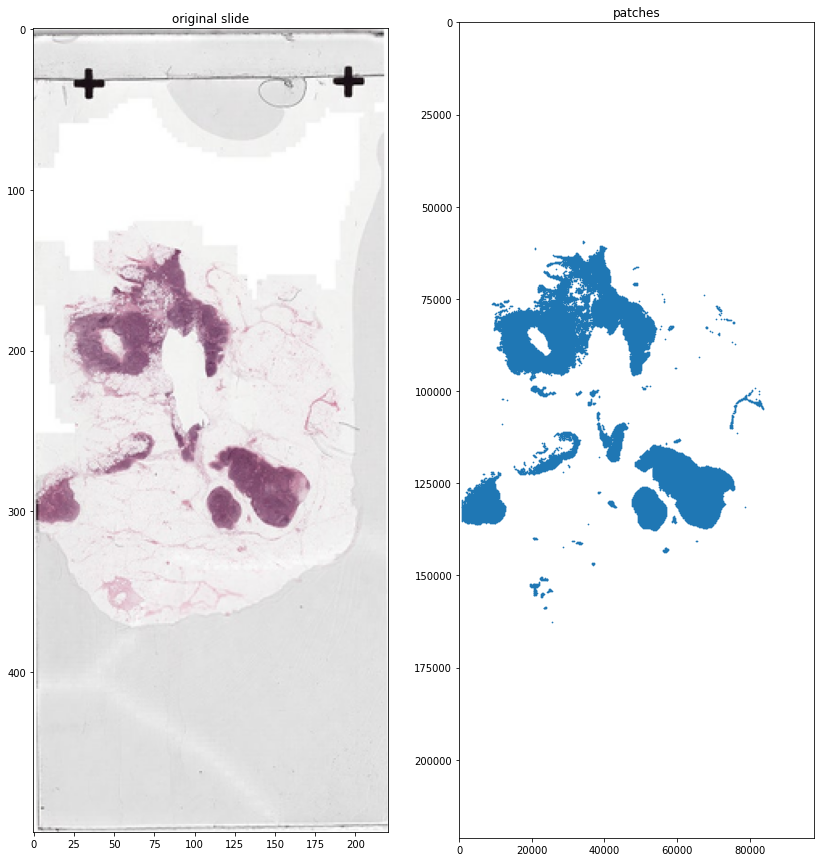

```python
import openslide as ops
import numpy as np
import matplotlib.pyplot as plt
import pandas as pd
import pytorch_lightning as pl
import cv2
from openslide.deepzoom import DeepZoomGenerator
import os
import wsiprocess as wp
import pymeanshift as pms
```


```python
def make_tissue_mask(slide, mask_level=4): 
    ''' make tissue mask using binary threshold and otsu threshold
        return tissue mask array which has tissue locations
    '''
    tissue_mask = slide.read_region((0,0), mask_level, slide.level_dimensions[mask_level])
    tissue_mask = cv2.cvtColor(np.array(tissue_mask), cv2.COLOR_RGBA2RGB)
    tissue_mask = cv2.cvtColor(tissue_mask, cv2.COLOR_RGB2HSV)
    tissue_mask = tissue_mask[:, :, 1]
    _, tissue_mask = cv2.threshold(tissue_mask, 0, 255, cv2.THRESH_BINARY+cv2.THRESH_OTSU)
    tissue_mask = np.array(tissue_mask)
    
    return tissue_mask
```


```python
slide = wp.slide("data/tumor/tumor_001.tif")
annotation = wp.annotation("data/tumor/tumor_001.xml")

annotation.make_masks(slide)

mask = make_tissue_mask(slide.slide)
mask.shape

plt.figure(figsize=(7, 17))
plt.imshow(mask>30)
```


    <matplotlib.image.AxesImage at 0x7fd38a8fbb20>


    

    


```python
mask.max(), mask.min(), mask.mean()
```


    (255, 0, 16.220633177787775)


```python
# annotation.export_thumb_masks('.')
annotation.export_thumb_masks("data")
slide.export_thumbnail()
```


```python
annotation.masks["foreground"].shape
```


    (221184, 97792)


```python
# (segmented_image, labels_image, number_regions) = pms.segment(slide.get_thumbnail(2048), 60, 10, 50)
image = cv2.cvtColor(np.array(slide.get_thumbnail(1024)), cv2.COLOR_RGB2HSV)
segmented = cv2.pyrMeanShiftFiltering(image, 7, 30)

plt.figure(figsize=(14, 17))
plt.subplot(121)
#plt.imshow(cv2.cvtColor(segmented, cv2.COLOR_HSV2RGB))
plt.imshow(segmented[:, :, 1])
plt.title("Saturation")
plt.subplot(122)
plt.imshow(segmented[:, :, 2])
plt.title("Value")
```


    Text(0.5, 1.0, 'Value')


    

    


```python
# remove lowest value
notcross= segmented[:, :, 2] >= 60
notbackground= segmented[:, :, 1] >= 40 # 

plt.figure(figsize=(14, 17))
plt.subplot(121)
#plt.imshow(cv2.cvtColor(segmented, cv2.COLOR_HSV2RGB))
plt.imshow(notbackground*1.0)
plt.title("not background mask")
plt.subplot(122)
plt.title("not cross mask")
plt.imshow(notcross*1.0)
```


    <matplotlib.image.AxesImage at 0x7fc635461fa0>


    

    


```python
def plot_tissue(slidename="tumor_011", size=2000):

    slide = wp.slide(f"data/tumor/{slidename}.tif")
    annotation = wp.annotation(f"data/tumor/{slidename}.xml")
    annotation.make_masks(slide, size=size, foreground=None)
    
    thumb = np.array(slide.get_thumbnail(size))

    thumb_hsv = cv2.cvtColor(thumb, cv2.COLOR_RGB2HSV)
    segmented = cv2.pyrMeanShiftFiltering(thumb_hsv, 7, 30)

    notcross= segmented[:, :, 2] >= 60
    notbackground= segmented[:, :, 1] >= 40 # 
    mask = notbackground*notcross

    annotation.export_thumb_masks("data", size)
    
    tumor_mask = np.zeros_like(mask)*0
    
    for key in annotation.masks.keys():
        h, w = mask.shape[:2]
        tumor_mask += cv2.resize(cv2.imread(f"data/{key}_thumb.png").max(2), [w, h])
    
    tumor_mask = (tumor_mask>0)*1.0
                        
    plt.figure(figsize=(18, 22))
    plt.subplot(121)
    plt.title("original")
    plt.imshow(thumb)
    plt.subplot(122)
    plt.title("Masked tissue + tumor")
    plt.imshow(mask[:, :, None]*thumb)

    
#     plt.subplot(133)
    plt.imshow(tumor_mask, alpha=0.3)
#     plt.subplot(133)
#     plt.title("Tumor mask")
#     plt.imshow(tumor_mask)
    plt.show()
    
    return mask, tumor_mask
```


```python
plot_tissue("tumor_001", size=4000)
```

    _0
    _1


    

    


```python
plot_tissue("tumor_011", size=4000)
```

    _0
    _1


    

    


```python
plot_tissue("tumor_047", size=4000)
```

    _0


    

    


```python
import gc
gc.collect()
```


    73553


```python
slide = wp.slide(f"data/tumor/tumor_001.tif")

mask, tumor_mask = plot_tissue("tumor_001", 4000)

w, h = slide.width, slide.height
w, h
```


```python
annotation = wp.annotation(f"data/tumor/tumor_001.xml")
annotation.make_masks(slide, foreground=None)

annotation.masks["foreground"] = cv2.resize(mask.astype(np.uint8), [w, h], interpolation=cv2.INTER_LINEAR)
annotation.export_thumb_mask("foreground", "data", size=4000)

annotation.dot_bbox_height = 1
annotation.dot_bbox_width = 1

patcher = wp.patcher(slide, "classification", annotation, patch_width=256, patch_height=256)
```


```python
patcher.get_patch_parallel(['foreground'])
```


```python

```


```python
annotation.masks["foreground"].shape
```


    (221184, 97792)


```python
x, y = zip(*[ tuple(map(int, os.path.splitext(name)[0].split("_")[:2])) for name in os.listdir("tumor_001/patches/foreground/")])
```


```python
plt.figure(figsize=(14, 15))
plt.subplot(121)
plt.title("original slide")
plt.imshow(slide.get_thumbnail())

plt.subplot(122)
plt.title("patches")
scatter = plt.scatter(x, y, s=0.5)
ax = scatter.axes
ax.set_xlim(0, w)
ax.set_ylim(0, h)
ax.invert_yaxis()
```


    

    


```python

```
